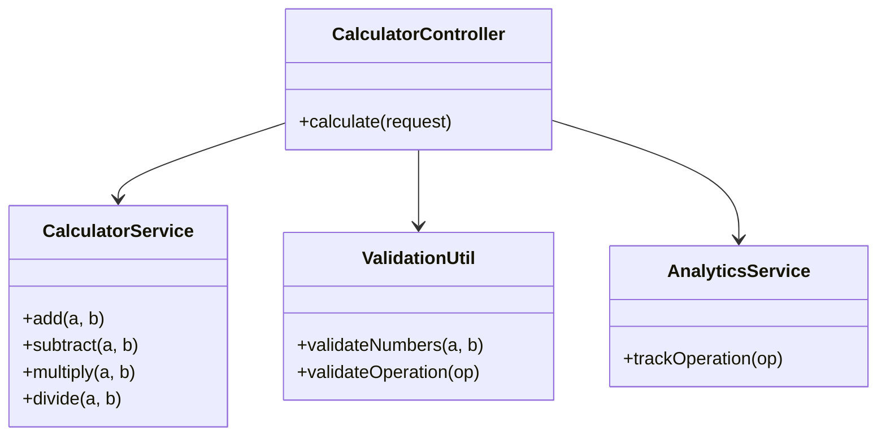
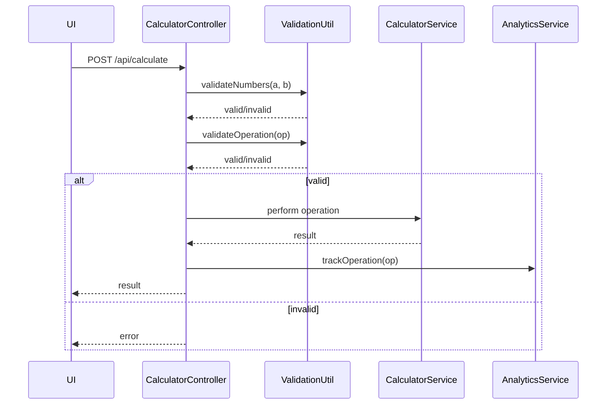
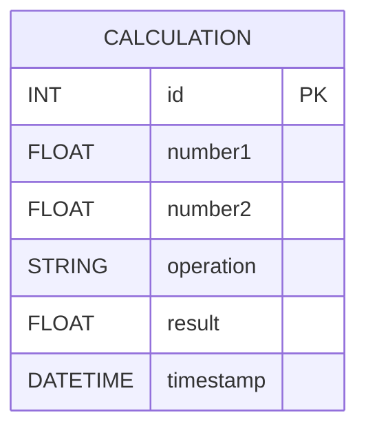

# For User Story Number [1]

1. Objective
The objective is to enable users to perform basic arithmetic operations (addition, subtraction, multiplication, division) on two numbers via an intuitive UI. The system must validate inputs, handle errors (such as division by zero), and display results instantly. The solution should be robust, user-friendly, and scalable for both desktop and mobile users.

2. API Model
  2.1 Common Components/Services
  - Input validation utility (numeric check, empty check, division by zero check)
  - Arithmetic operation service (add, subtract, multiply, divide)
  - Error handling component
  - Analytics tracker (for operation usage)

  2.2 API Details
| Operation   | REST Method | Type    | URL                | Request (JSON)                                  | Response (JSON)                                 |
|-------------|-------------|---------|--------------------|------------------------------------------------|-------------------------------------------------|
| Calculate   | POST        | Success | /api/calculate     | {"number1": 5, "number2": 2, "operation": "add"} | {"result": 7}                                   |
| Calculate   | POST        | Failure | /api/calculate     | {"number1": 5, "number2": 0, "operation": "divide"} | {"error": "Division by zero is not allowed."}    |

  2.3 Exceptions
| Exception Type         | Condition                          | Response                                      |
|-----------------------|------------------------------------|-----------------------------------------------|
| ValidationException   | Non-numeric or empty input          | {"error": "Input must be a valid number."}    |
| ArithmeticException   | Division by zero                    | {"error": "Division by zero is not allowed."} |
| GeneralException      | Any other system error              | {"error": "An unexpected error occurred."}    |

3 Functional Design
  3.1 Class Diagram

  3.2 UML Sequence Diagram

  3.3 Components
| Component Name      | Description                                         | Existing/New |
|--------------------|-----------------------------------------------------|--------------|
| CalculatorController | REST API controller for calculation requests        | New          |
| CalculatorService    | Handles arithmetic operations                      | New          |
| ValidationUtil       | Validates user inputs and operations                | New          |
| AnalyticsService     | Tracks operation usage for analytics                | New          |

  3.4 Service Layer Logic and Validations
| FieldName  | Validation                        | Error Message                        | ClassUsed        |
|------------|-----------------------------------|-------------------------------------|------------------|
| number1    | Must be numeric, not empty        | Input must be a valid number.        | ValidationUtil   |
| number2    | Must be numeric, not empty        | Input must be a valid number.        | ValidationUtil   |
| operation  | Must be one of add/sub/mul/div    | Invalid operation selected.          | ValidationUtil   |
| number2    | Not zero if operation is divide   | Division by zero is not allowed.     | ValidationUtil   |

4 Integrations
| SystemToBeIntegrated | IntegratedFor         | IntegrationType |
|----------------------|----------------------|-----------------|
| Analytics Platform   | Track operation usage | API             |

5 DB Details
  5.1 ER Model

  5.2 DB Validations
- Not required for basic calculator (stateless), unless analytics/history is persisted.

6 Non-Functional Requirements
  6.1 Performance
  - API response must be <0.5s.
  - Lightweight arithmetic logic, no heavy computation.

  6.2 Security
    6.2.1 Authentication
    - If backend is exposed, use JWT/OAuth2 for API protection.
    6.2.2 Authorization
    - No role-based restrictions for basic calculator.

  6.3 Logging
    6.3.1 Application Logging
    - INFO: Operation requests and responses
    - ERROR: Validation and system errors
    - DEBUG: Detailed input/output for troubleshooting (disabled in prod)
    6.3.2 Audit Log
    - Log each calculation event with timestamp for analytics

7 Dependencies
- ReactJS frontend for UI
- NodeJS backend (optional for API)
- Analytics service (optional)

8 Assumptions
- No persistent storage unless analytics/history is required
- All calculations are stateless unless otherwise specified
- API is only exposed to trusted frontend
