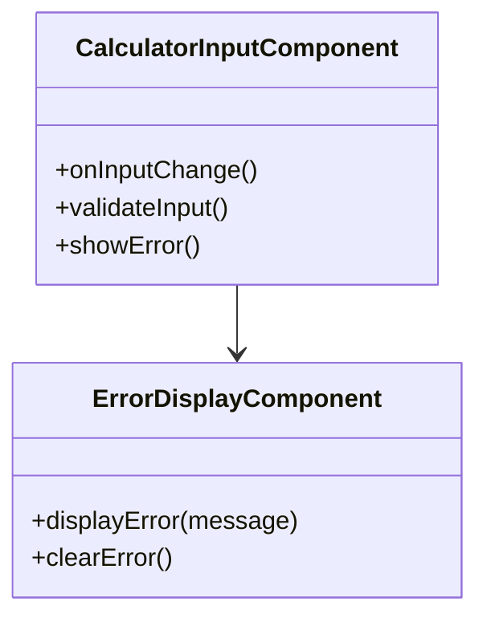
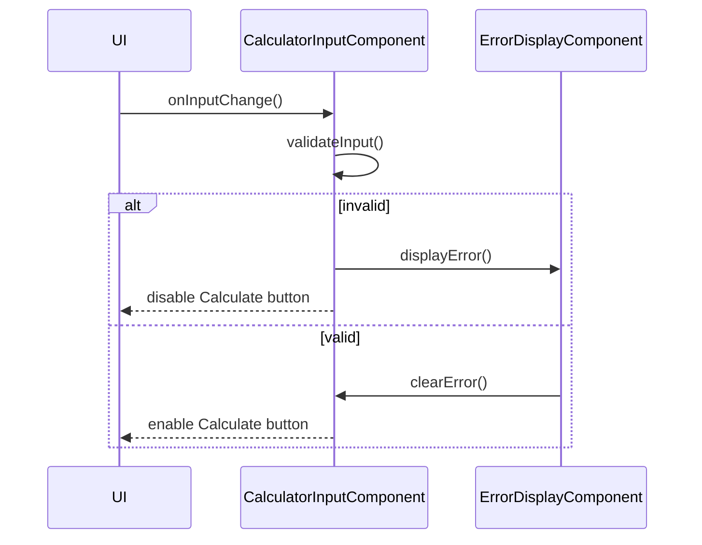

# For User Story Number [2]

1. Objective
The objective is to ensure that the calculator only accepts valid numeric input in both fields, providing real-time validation and clear error messages. This prevents calculation errors and enhances user experience by disabling the calculation feature until valid input is provided. The solution must be accessible, robust, and secure against invalid or malicious input.

2. API Model
  2.1 Common Components/Services
  - Input validation utility (numeric and empty check)
  - Error display component

  2.2 API Details
| Operation   | REST Method | Type    | URL                | Request (JSON)                                  | Response (JSON)                                 |
|-------------|-------------|---------|--------------------|------------------------------------------------|-------------------------------------------------|
| Validate    | N/A (Client)| Success | N/A (Client-side)  | {"number1": "12", "number2": "abc"}           | {"error": "Input must be a valid number."}      |

  2.3 Exceptions
| Exception Type         | Condition                          | Response                                      |
|-----------------------|------------------------------------|-----------------------------------------------|
| ValidationException   | Non-numeric or empty input          | {"error": "Input must be a valid number."}    |

3 Functional Design
  3.1 Class Diagram

  3.2 UML Sequence Diagram

  3.3 Components
| Component Name            | Description                                         | Existing/New |
|--------------------------|-----------------------------------------------------|--------------|
| CalculatorInputComponent | Handles input and validation logic                   | New          |
| ErrorDisplayComponent    | Displays error messages to the user                  | New          |

  3.4 Service Layer Logic and Validations
| FieldName  | Validation                        | Error Message                        | ClassUsed                |
|------------|-----------------------------------|-------------------------------------|--------------------------|
| number1    | Must be numeric, not empty        | Input must be a valid number.        | CalculatorInputComponent |
| number2    | Must be numeric, not empty        | Input must be a valid number.        | CalculatorInputComponent |

4 Integrations
| SystemToBeIntegrated | IntegratedFor         | IntegrationType |
|----------------------|----------------------|-----------------|
| N/A                 | N/A                  | N/A             |

5 DB Details
  5.1 ER Model
- Not applicable (no backend or persistence required).
  5.2 DB Validations
- Not applicable.

6 Non-Functional Requirements
  6.1 Performance
  - Validation must occur instantly (<0.2s).

  6.2 Security
    6.2.1 Authentication
    - Not applicable (client-side only).
    6.2.2 Authorization
    - Not applicable.

  6.3 Logging
    6.3.1 Application Logging
    - Not required for client-side validation.
    6.3.2 Audit Log
    - Not required.

7 Dependencies
- ReactJS frontend

8 Assumptions
- All validation is performed client-side
- No backend or persistent storage is required
- Accessibility standards (WCAG 2.1 AA) are followed
