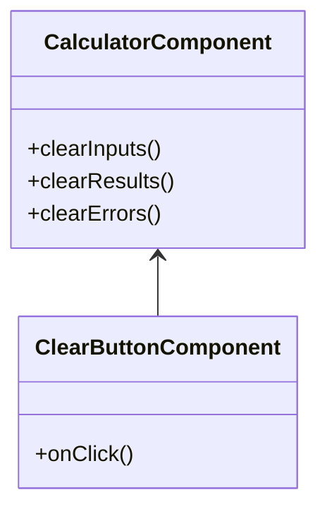
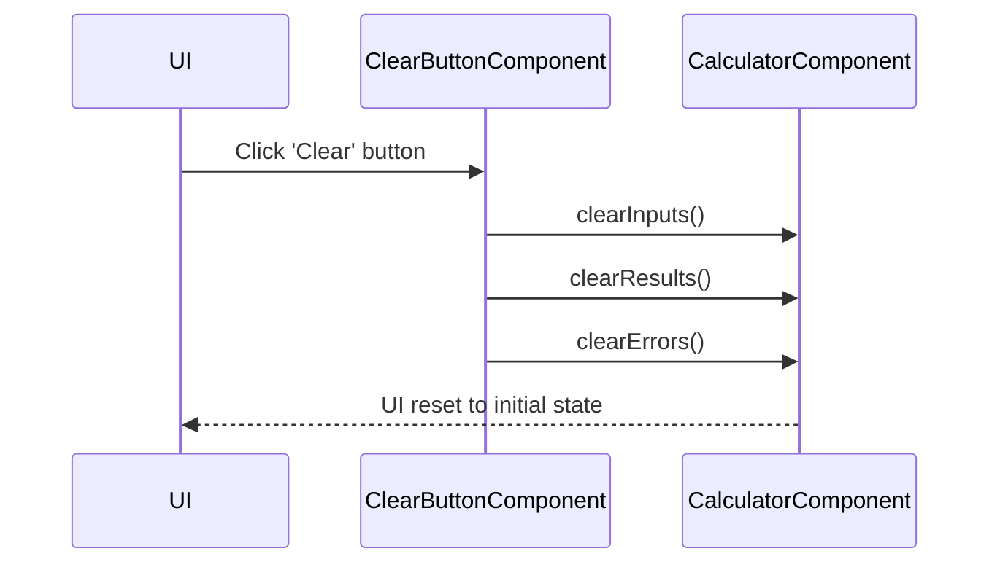

# For User Story Number [3]

1. Objective
The objective is to provide users with a 'Clear' or 'Reset' button that instantly removes all input values, results, and error messages from the calculator UI. This allows users to start a new calculation easily without refreshing the page. The reset functionality must be accessible, instantaneous, and not affect any other calculator features.

2. API Model
  2.1 Common Components/Services
  - Input and result state management
  - Error message state management

  2.2 API Details
| Operation   | REST Method | Type    | URL                | Request (JSON) | Response (JSON) |
|-------------|-------------|---------|--------------------|----------------|-----------------|
| Clear/Reset | N/A (Client)| Success | N/A (Client-side)  | N/A            | N/A             |

  2.3 Exceptions
| Exception Type         | Condition                          | Response                                      |
|-----------------------|------------------------------------|-----------------------------------------------|
| N/A                   | N/A                                | N/A                                           |

3 Functional Design
  3.1 Class Diagram

  3.2 UML Sequence Diagram

  3.3 Components
| Component Name            | Description                                         | Existing/New |
|--------------------------|-----------------------------------------------------|--------------|
| CalculatorComponent      | Manages input, result, and error states             | New          |
| ClearButtonComponent     | UI button to trigger clear/reset functionality      | New          |

  3.4 Service Layer Logic and Validations
| FieldName  | Validation                        | Error Message                        | ClassUsed            |
|------------|-----------------------------------|-------------------------------------|----------------------|
| inputs     | All fields emptied                | N/A                                 | CalculatorComponent  |
| results    | Result display cleared            | N/A                                 | CalculatorComponent  |
| errors     | Error messages removed            | N/A                                 | CalculatorComponent  |

4 Integrations
| SystemToBeIntegrated | IntegratedFor         | IntegrationType |
|----------------------|----------------------|-----------------|
| N/A                 | N/A                  | N/A             |

5 DB Details
  5.1 ER Model
- Not applicable (no backend or persistence required).
  5.2 DB Validations
- Not applicable.

6 Non-Functional Requirements
  6.1 Performance
  - Clear/reset must occur instantly (<0.2s).

  6.2 Security
    6.2.1 Authentication
    - Not applicable (client-side only).
    6.2.2 Authorization
    - Not applicable.

  6.3 Logging
    6.3.1 Application Logging
    - Not required for client-side reset.
    6.3.2 Audit Log
    - Not required.

7 Dependencies
- ReactJS frontend

8 Assumptions
- All clear/reset functionality is performed client-side
- No backend or persistent storage is required
- Button is accessible via keyboard and screen reader
