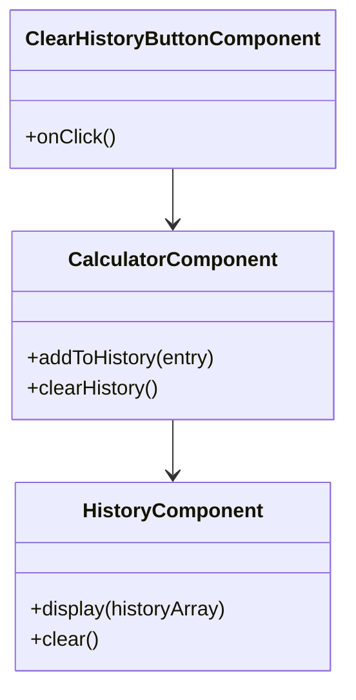
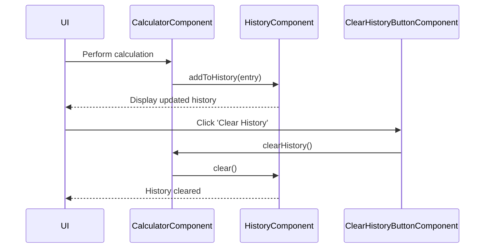

# For User Story Number [4]

1. Objective
The objective is to provide users with a session-based history of their last 10 calculations, displaying inputs, operation, and result in a scrollable area. Users should be able to clear the history at any time. The solution must be instant, accessible, and must not persist data beyond the session.

2. API Model
  2.1 Common Components/Services
  - History state management utility
  - History display component
  - Clear history button component

  2.2 API Details
| Operation      | REST Method | Type    | URL                | Request (JSON) | Response (JSON) |
|----------------|-------------|---------|--------------------|----------------|-----------------|
| Add to History | N/A (Client)| Success | N/A (Client-side)  | N/A            | N/A             |
| Clear History  | N/A (Client)| Success | N/A (Client-side)  | N/A            | N/A             |

  2.3 Exceptions
| Exception Type         | Condition                          | Response                                      |
|-----------------------|------------------------------------|-----------------------------------------------|
| N/A                   | N/A                                | N/A                                           |

3 Functional Design
  3.1 Class Diagram

  3.2 UML Sequence Diagram

  3.3 Components
| Component Name            | Description                                         | Existing/New |
|--------------------------|-----------------------------------------------------|--------------|
| CalculatorComponent      | Manages calculation and history state               | New          |
| HistoryComponent         | Displays history of calculations                    | New          |
| ClearHistoryButtonComponent | UI button to clear history                       | New          |

  3.4 Service Layer Logic and Validations
| FieldName  | Validation                        | Error Message                        | ClassUsed            |
|------------|-----------------------------------|-------------------------------------|----------------------|
| history    | Max 10 entries, session only      | N/A                                 | CalculatorComponent  |
| history    | Cleared on user action            | N/A                                 | CalculatorComponent  |

4 Integrations
| SystemToBeIntegrated | IntegratedFor         | IntegrationType |
|----------------------|----------------------|-----------------|
| N/A                 | N/A                  | N/A             |

5 DB Details
  5.1 ER Model
- Not applicable (no backend or persistence required).
  5.2 DB Validations
- Not applicable.

6 Non-Functional Requirements
  6.1 Performance
  - History updates must be instant (<0.2s).

  6.2 Security
    6.2.1 Authentication
    - Not applicable (client-side only).
    6.2.2 Authorization
    - Not applicable.

  6.3 Logging
    6.3.1 Application Logging
    - Not required for client-side history.
    6.3.2 Audit Log
    - Not required.

7 Dependencies
- ReactJS frontend

8 Assumptions
- All history management is performed client-side
- No backend or persistent storage is required
- History is lost on browser refresh
