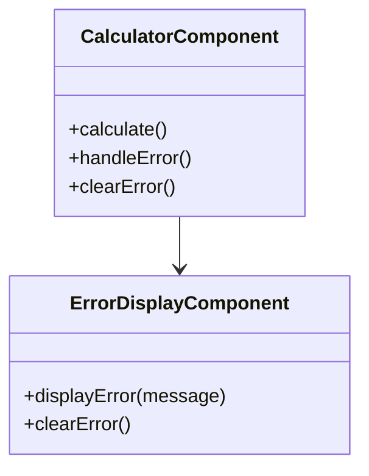
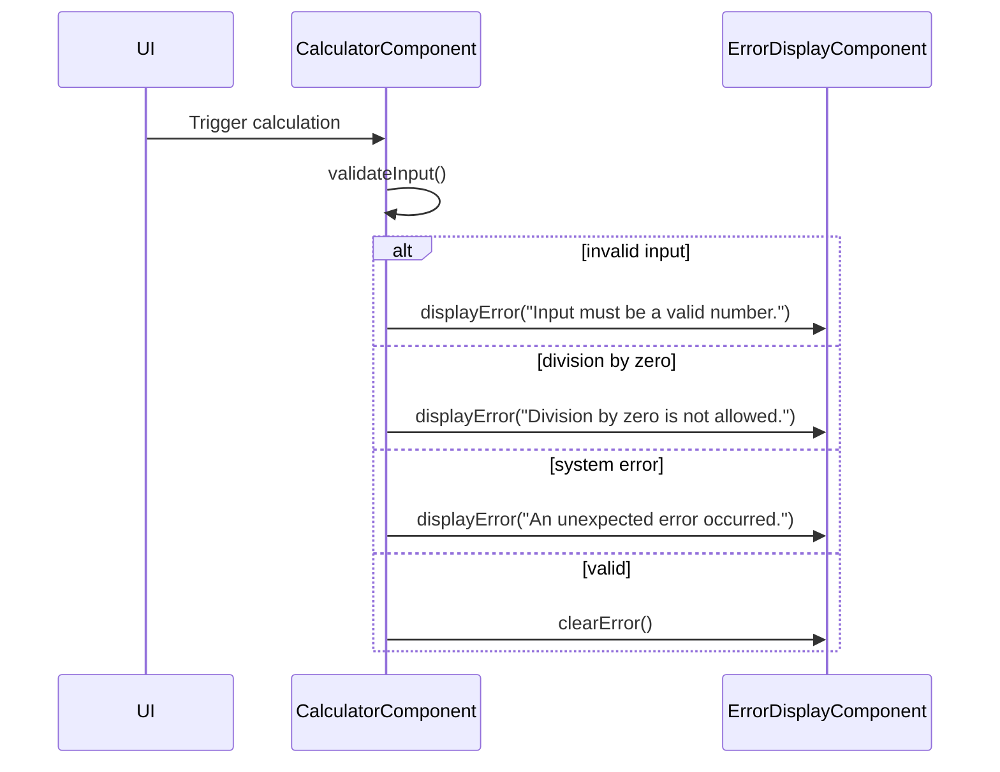

# For User Story Number [5]

1. Objective
The objective is to provide users with clear, actionable error messages for invalid input, division by zero, or system errors during calculator operations. Error messages should be prominent, disappear when the issue is resolved, and never expose sensitive technical details. The solution must be robust, accessible, and enhance user understanding of issues.

2. API Model
  2.1 Common Components/Services
  - Error handling and display component
  - Input validation utility
  - Calculation logic with error propagation

  2.2 API Details
| Operation   | REST Method | Type    | URL                | Request (JSON)                                  | Response (JSON)                                 |
|-------------|-------------|---------|--------------------|------------------------------------------------|-------------------------------------------------|
| Calculate   | N/A (Client)| Failure | N/A (Client-side)  | {"number1": "abc", "number2": 2, "operation": "add"} | {"error": "Input must be a valid number."}      |
| Calculate   | N/A (Client)| Failure | N/A (Client-side)  | {"number1": 5, "number2": 0, "operation": "divide"} | {"error": "Division by zero is not allowed."}    |
| Calculate   | N/A (Client)| Failure | N/A (Client-side)  | {"number1": 5, "number2": 2, "operation": "add"}   | {"error": "An unexpected error occurred."}       |

  2.3 Exceptions
| Exception Type         | Condition                          | Response                                      |
|-----------------------|------------------------------------|-----------------------------------------------|
| ValidationException   | Non-numeric or empty input          | {"error": "Input must be a valid number."}    |
| ArithmeticException   | Division by zero                    | {"error": "Division by zero is not allowed."} |
| GeneralException      | Any other system error              | {"error": "An unexpected error occurred."}    |

3 Functional Design
  3.1 Class Diagram

  3.2 UML Sequence Diagram

  3.3 Components
| Component Name            | Description                                         | Existing/New |
|--------------------------|-----------------------------------------------------|--------------|
| CalculatorComponent      | Handles calculation, validation, and error logic    | New          |
| ErrorDisplayComponent    | Displays error messages to the user                 | New          |

  3.4 Service Layer Logic and Validations
| FieldName  | Validation                        | Error Message                        | ClassUsed            |
|------------|-----------------------------------|-------------------------------------|----------------------|
| number1    | Must be numeric, not empty        | Input must be a valid number.        | CalculatorComponent  |
| number2    | Must be numeric, not empty        | Input must be a valid number.        | CalculatorComponent  |
| operation  | Must be valid operation           | Invalid operation selected.          | CalculatorComponent  |
| number2    | Not zero if operation is divide   | Division by zero is not allowed.     | CalculatorComponent  |
| system     | Any unexpected error              | An unexpected error occurred.        | CalculatorComponent  |

4 Integrations
| SystemToBeIntegrated | IntegratedFor         | IntegrationType |
|----------------------|----------------------|-----------------|
| N/A                 | N/A                  | N/A             |

5 DB Details
  5.1 ER Model
- Not applicable (no backend or persistence required).
  5.2 DB Validations
- Not applicable.

6 Non-Functional Requirements
  6.1 Performance
  - Error handling must not impact UI responsiveness.

  6.2 Security
    6.2.1 Authentication
    - Not applicable (client-side only).
    6.2.2 Authorization
    - Not applicable.
    - Error messages must not expose sensitive system details.

  6.3 Logging
    6.3.1 Application Logging
    - Not required for client-side error display.
    6.3.2 Audit Log
    - Not required.

7 Dependencies
- ReactJS frontend

8 Assumptions
- All error handling is performed client-side
- No backend or persistent storage is required
- Error messages are accessible and meet accessibility standards
