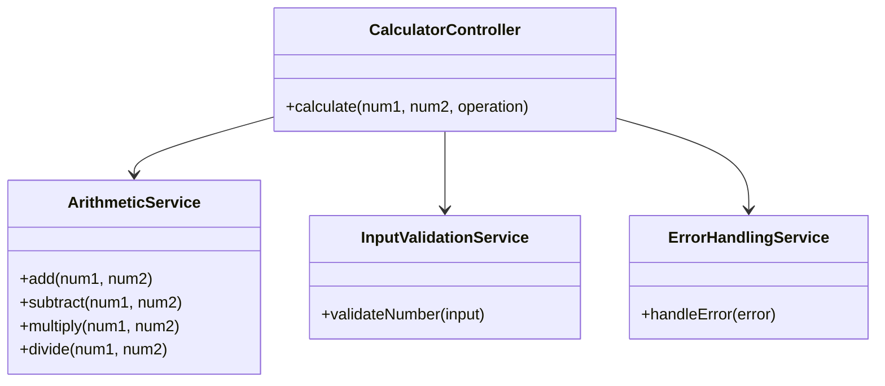
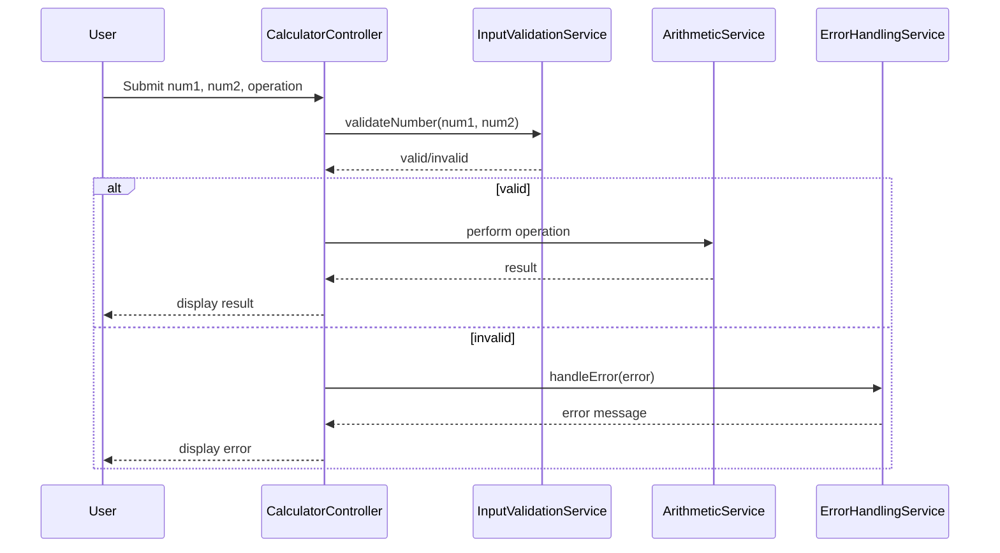
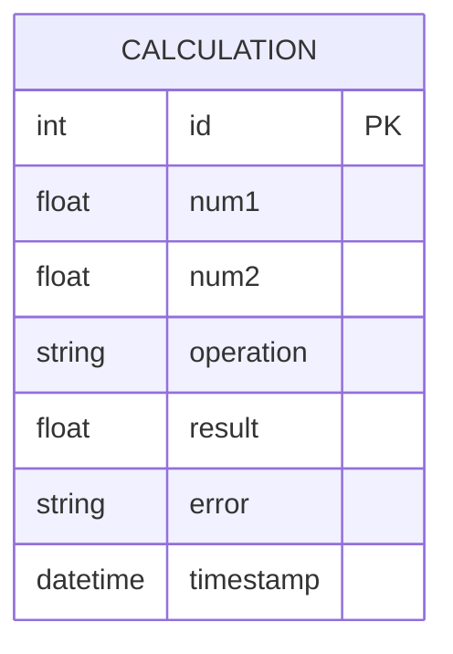

# For User Story Number [1]

1. Objective
The objective is to implement a calculator that allows users to perform basic arithmetic operations (addition, subtraction, multiplication, division) on two numbers. The calculator must display results immediately and handle division by zero gracefully. The interface should be intuitive, responsive, and support both mouse and keyboard input.

2. API Model
  2.1 Common Components/Services
    - Input Validation Service (existing)
    - ArithmeticService (new)
    - ErrorHandlingService (existing)

  2.2 API Details
| Operation   | REST Method | Type    | URL              | Request (JSON)                        | Response (JSON)                       |
|-------------|-------------|---------|------------------|---------------------------------------|---------------------------------------|
| Calculate   | POST        | Success | /api/calculate   | {"num1": 5, "num2": 2, "operation": "add"} | {"result": 7, "error": null}         |
| Calculate   | POST        | Failure | /api/calculate   | {"num1": 5, "num2": 0, "operation": "divide"} | {"result": null, "error": "Cannot divide by zero"} |

  2.3 Exceptions
| Exception Type           | Description                                  |
|-------------------------|----------------------------------------------|
| InvalidInputException    | Thrown when input is not a valid number      |
| DivisionByZeroException  | Thrown when division by zero is attempted    |
| OperationNotSupported    | Thrown when an unsupported operation is used |

3 Functional Design
  3.1 Class Diagram

  3.2 UML Sequence Diagram

  3.3 Components
| Component Name           | Description                                   | Existing/New |
|-------------------------|-----------------------------------------------|--------------|
| CalculatorController     | Handles API requests for calculations         | New          |
| ArithmeticService        | Performs arithmetic operations                | New          |
| InputValidationService   | Validates input numbers                       | Existing     |
| ErrorHandlingService     | Handles error messages                        | Existing     |

  3.4 Service Layer Logic and Validations
| FieldName | Validation                             | Error Message                | ClassUsed                |
|-----------|----------------------------------------|------------------------------|--------------------------|
| num1      | Must be a valid number (int/decimal)   | "Input must be a number"     | InputValidationService   |
| num2      | Must be a valid number (int/decimal)   | "Input must be a number"     | InputValidationService   |
| operation | Must be one of add, subtract, multiply, divide | "Invalid operation"      | ArithmeticService        |
| num2      | Division by zero not allowed           | "Cannot divide by zero"      | ArithmeticService        |

4 Integrations
| SystemToBeIntegrated | IntegratedFor         | IntegrationType |
|---------------------|-----------------------|-----------------|
| None                | Local calculation     | N/A             |

5 DB Details
  5.1 ER Model

  5.2 DB Validations
- None required (calculations are not persisted)

6 Non-Functional Requirements
  6.1 Performance
    - Results calculated and displayed within 100ms.
    - Lightweight API, no external calls.
  6.2 Security
    6.2.1 Authentication
      - Not required for public calculator.
    6.2.2 Authorization
      - Not required for public calculator.
    - Input sanitization to prevent injection.
  6.3 Logging
    6.3.1 Application Logging
      - Log calculation requests at INFO level.
      - Log errors at ERROR level.
    6.3.2 Audit Log
      - Log user actions for analytics if required.

7 Dependencies
    - ReactJS frontend
    - Node.js backend (optional, for API)
    - Material UI for UI components

8 Assumptions
    - All calculations are performed client-side unless backend is required for analytics.
    - No user authentication required.
    - Calculations are not persisted in a database.
