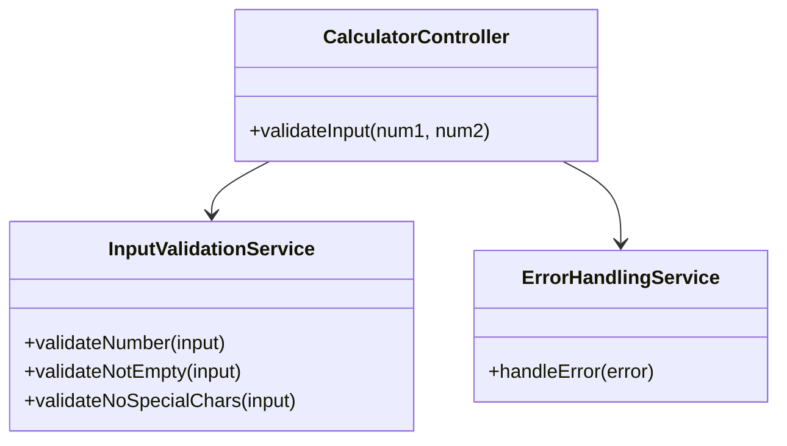
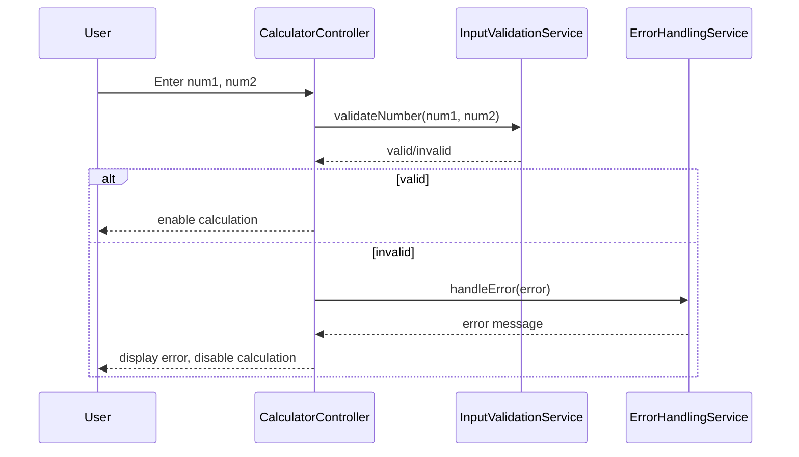
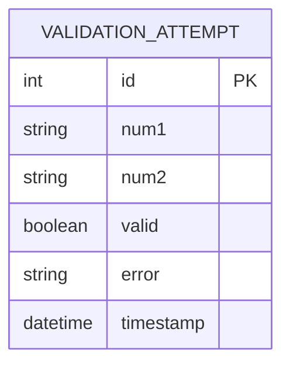

# For User Story Number [2]

1. Objective
The objective is to ensure that the calculator only accepts valid numeric inputs, preventing invalid data such as letters, special characters, or empty fields. This guarantees calculation reliability and prevents unexpected behavior. Clear error messages must be displayed for invalid input, and calculation should be blocked until inputs are valid.

2. API Model
  2.1 Common Components/Services
    - InputValidationService (new)
    - ErrorHandlingService (existing)

  2.2 API Details
| Operation   | REST Method | Type    | URL              | Request (JSON)                        | Response (JSON)                       |
|-------------|-------------|---------|------------------|---------------------------------------|---------------------------------------|
| Validate    | POST        | Success | /api/validate    | {"num1": "5", "num2": "2"}             | {"valid": true, "error": null}        |
| Validate    | POST        | Failure | /api/validate    | {"num1": "abc", "num2": "2"}           | {"valid": false, "error": "Input must be a number"} |

  2.3 Exceptions
| Exception Type           | Description                                  |
|-------------------------|----------------------------------------------|
| InvalidInputException    | Thrown when input is empty or not a number   |
| SpecialCharacterException| Thrown when input contains special characters|

3 Functional Design
  3.1 Class Diagram

  3.2 UML Sequence Diagram

  3.3 Components
| Component Name           | Description                                   | Existing/New |
|-------------------------|-----------------------------------------------|--------------|
| CalculatorController     | Handles input validation requests             | New          |
| InputValidationService   | Validates input numbers and checks for errors | New          |
| ErrorHandlingService     | Handles error messages                        | Existing     |

  3.4 Service Layer Logic and Validations
| FieldName | Validation                             | Error Message                | ClassUsed                |
|-----------|----------------------------------------|------------------------------|--------------------------|
| num1      | Must not be empty                      | "Input cannot be empty"      | InputValidationService   |
| num2      | Must not be empty                      | "Input cannot be empty"      | InputValidationService   |
| num1      | Must be a valid number                 | "Input must be a number"     | InputValidationService   |
| num2      | Must be a valid number                 | "Input must be a number"     | InputValidationService   |
| num1,num2 | No special characters allowed          | "No special characters allowed" | InputValidationService   |

4 Integrations
| SystemToBeIntegrated | IntegratedFor         | IntegrationType |
|---------------------|-----------------------|-----------------|
| None                | Local validation      | N/A             |

5 DB Details
  5.1 ER Model

  5.2 DB Validations
- None required (validation attempts are not persisted)

6 Non-Functional Requirements
  6.1 Performance
    - Validation occurs in real-time within 50ms of input.
  6.2 Security
    6.2.1 Authentication
      - Not required for public calculator.
    6.2.2 Authorization
      - Not required for public calculator.
    - Input sanitization to prevent script injection.
  6.3 Logging
    6.3.1 Application Logging
      - Log invalid input attempts at WARN level.
    6.3.2 Audit Log
      - Log validation errors for analytics.

7 Dependencies
    - ReactJS frontend
    - HTML5 input type="number"

8 Assumptions
    - All validation is performed client-side.
    - No backend persistence for validation attempts.
    - No user authentication required.
