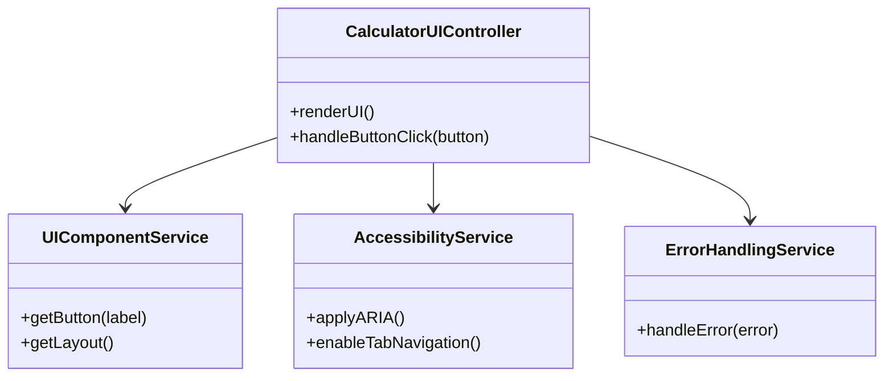
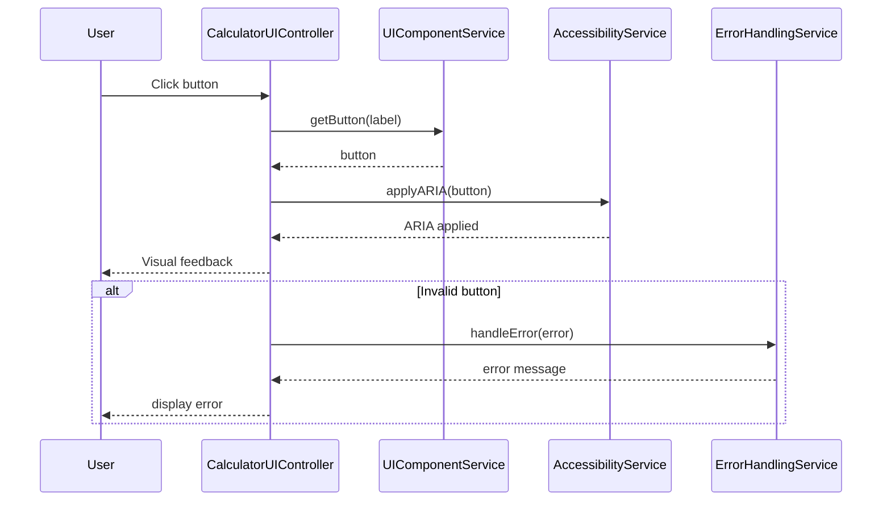
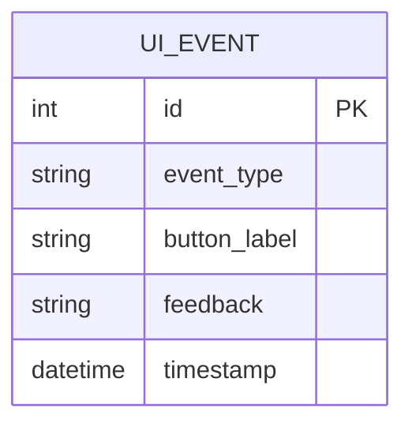

# For User Story Number [3]

1. Objective
The objective is to design a calculator interface that is simple, intuitive, and accessible, ensuring users can easily perform calculations without confusion. The UI must be responsive, provide clear visual feedback, and support both desktop and mobile devices. Accessibility and usability standards must be met for all users.

2. API Model
  2.1 Common Components/Services
    - UIComponentService (new)
    - AccessibilityService (new)
    - ErrorHandlingService (existing)

  2.2 API Details
| Operation   | REST Method | Type    | URL              | Request (JSON)                        | Response (JSON)                       |
|-------------|-------------|---------|------------------|---------------------------------------|---------------------------------------|
| Render UI   | GET         | Success | /api/ui          | N/A                                   | {"status": "success", "ui": "<html>...</html>"} |
| ButtonClick | POST        | Success | /api/button      | {"button": "1"}                      | {"status": "pressed", "feedback": "highlight"} |
| ButtonClick | POST        | Failure | /api/button      | {"button": "unknown"}                | {"status": "error", "error": "Invalid button"} |

  2.3 Exceptions
| Exception Type           | Description                                  |
|-------------------------|----------------------------------------------|
| InvalidButtonException   | Thrown when an invalid button is pressed     |
| UIComponentException     | Thrown when UI fails to render               |

3 Functional Design
  3.1 Class Diagram

  3.2 UML Sequence Diagram

  3.3 Components
| Component Name           | Description                                   | Existing/New |
|-------------------------|-----------------------------------------------|--------------|
| CalculatorUIController   | Handles UI rendering and button events        | New          |
| UIComponentService       | Provides UI components and layout             | New          |
| AccessibilityService     | Implements accessibility features             | New          |
| ErrorHandlingService     | Handles error messages                        | Existing     |

  3.4 Service Layer Logic and Validations
| FieldName | Validation                             | Error Message                | ClassUsed                |
|-----------|----------------------------------------|------------------------------|--------------------------|
| button    | Must be a valid calculator button      | "Invalid button"             | UIComponentService       |
| layout    | Must adapt to screen size              | "UI layout error"            | UIComponentService       |
| button    | Must be accessible via keyboard        | "Button not accessible"      | AccessibilityService     |
| ui        | Must pass usability and accessibility  | "UI usability/accessibility error" | AccessibilityService     |

4 Integrations
| SystemToBeIntegrated | IntegratedFor         | IntegrationType |
|---------------------|-----------------------|-----------------|
| None                | Local UI rendering    | N/A             |

5 DB Details
  5.1 ER Model

  5.2 DB Validations
- None required (UI events are not persisted)

6 Non-Functional Requirements
  6.1 Performance
    - UI renders within 200ms.
    - Responsive layout adapts instantly.
  6.2 Security
    6.2.1 Authentication
      - Not required for public calculator.
    6.2.2 Authorization
      - Not required for public calculator.
    - Input sanitization for UI events.
  6.3 Logging
    6.3.1 Application Logging
      - Log UI errors at ERROR level.
      - Log user interactions at INFO level.
    6.3.2 Audit Log
      - Log accessibility and usability test results.

7 Dependencies
    - ReactJS frontend
    - Material UI for UI components
    - CSS Flexbox/Grid for responsive design

8 Assumptions
    - All UI logic is client-side.
    - No backend persistence for UI events.
    - No user authentication required.
