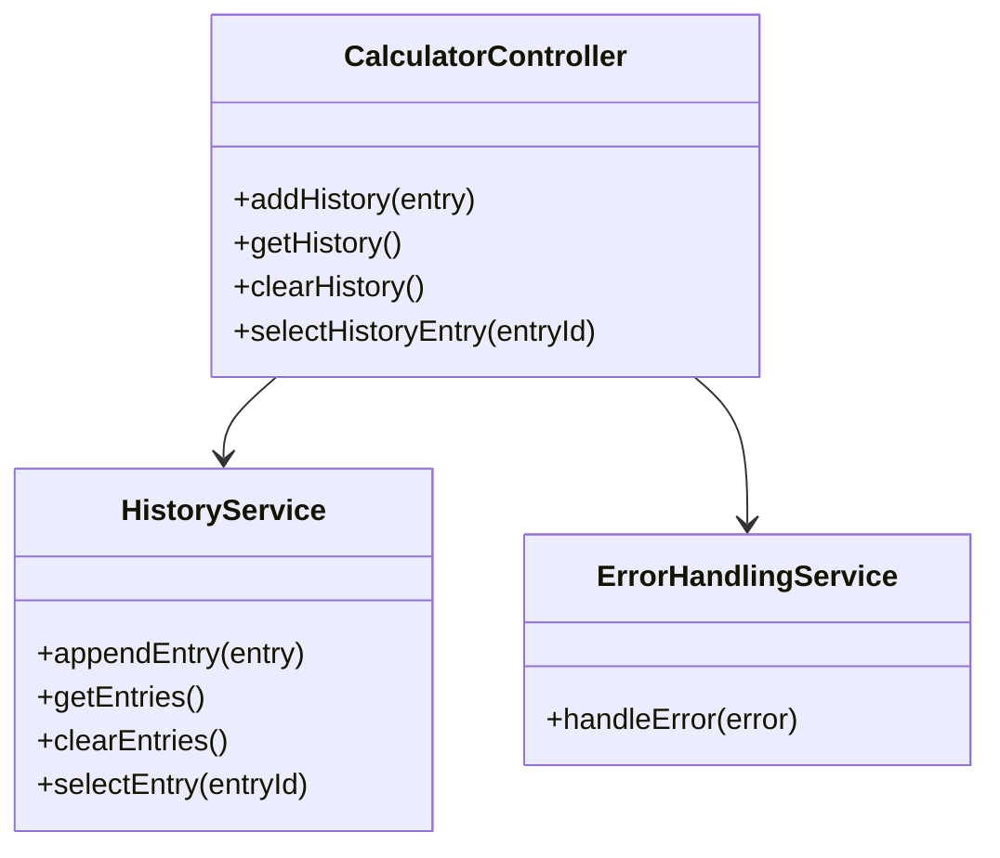
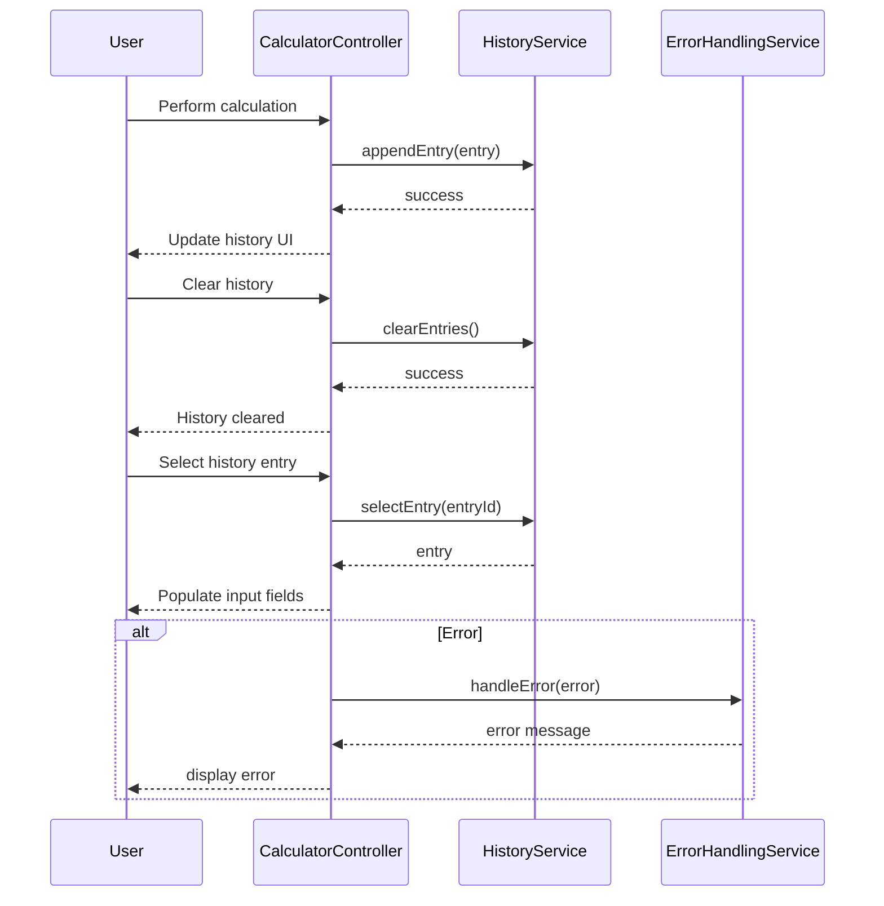
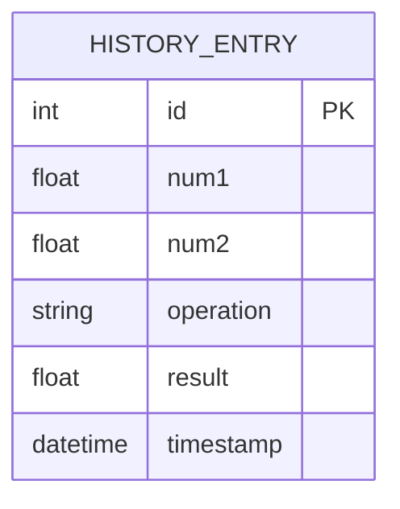

# For User Story Number [4]

1. Objective
The objective is to provide users with a session-based history of their previous calculations, enabling them to view, clear, and reuse past results. This feature improves usability and efficiency for users performing multiple related calculations. The history must be session-based and not persist beyond the current app session.

2. API Model
  2.1 Common Components/Services
    - HistoryService (new)
    - CalculatorController (existing)
    - ErrorHandlingService (existing)

  2.2 API Details
| Operation   | REST Method | Type    | URL              | Request (JSON)                        | Response (JSON)                       |
|-------------|-------------|---------|------------------|---------------------------------------|---------------------------------------|
| GetHistory  | GET         | Success | /api/history     | N/A                                   | {"history": [{"num1": 5, "num2": 2, "operation": "add", "result": 7}]} |
| AddHistory  | POST        | Success | /api/history     | {"num1": 5, "num2": 2, "operation": "add", "result": 7} | {"status": "added"}                  |
| ClearHistory| DELETE      | Success | /api/history     | N/A                                   | {"status": "cleared"}                |
| SelectEntry | POST        | Success | /api/history/select | {"entryId": 1}                    | {"num1": 5, "num2": 2, "operation": "add"} |

  2.3 Exceptions
| Exception Type           | Description                                  |
|-------------------------|----------------------------------------------|
| HistoryNotFoundException | Thrown when history entry is not found       |
| HistoryClearException    | Thrown when history cannot be cleared        |

3 Functional Design
  3.1 Class Diagram

  3.2 UML Sequence Diagram

  3.3 Components
| Component Name           | Description                                   | Existing/New |
|-------------------------|-----------------------------------------------|--------------|
| CalculatorController     | Handles calculation and history actions       | Existing     |
| HistoryService           | Manages session-based history array           | New          |
| ErrorHandlingService     | Handles error messages                        | Existing     |

  3.4 Service Layer Logic and Validations
| FieldName | Validation                             | Error Message                | ClassUsed                |
|-----------|----------------------------------------|------------------------------|--------------------------|
| entry     | Must contain num1, num2, operation, result | "Invalid history entry"   | HistoryService           |
| entryId   | Must exist in history array            | "History entry not found"    | HistoryService           |
| history   | Must clear all entries on request      | "Unable to clear history"    | HistoryService           |

4 Integrations
| SystemToBeIntegrated | IntegratedFor         | IntegrationType |
|---------------------|-----------------------|-----------------|
| None                | Local session history | N/A             |

5 DB Details
  5.1 ER Model

  5.2 DB Validations
- None required (history is session-based, not persisted)

6 Non-Functional Requirements
  6.1 Performance
    - History updates within 100ms of calculation.
    - Supports up to 100 history entries per session.
  6.2 Security
    6.2.1 Authentication
      - Not required for public calculator.
    6.2.2 Authorization
      - Not required for public calculator.
    - Do not persist sensitive data.
  6.3 Logging
    6.3.1 Application Logging
      - Log history actions at INFO level.
    6.3.2 Audit Log
      - Log history usage for analytics.

7 Dependencies
    - ReactJS frontend
    - React Context or Redux for state management

8 Assumptions
    - History is stored in memory for the session only.
    - No backend persistence for history.
    - No user authentication required.
