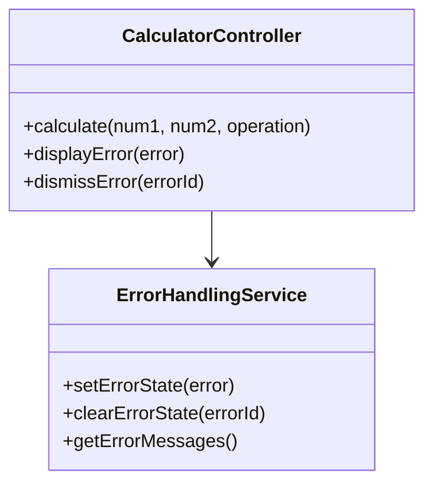
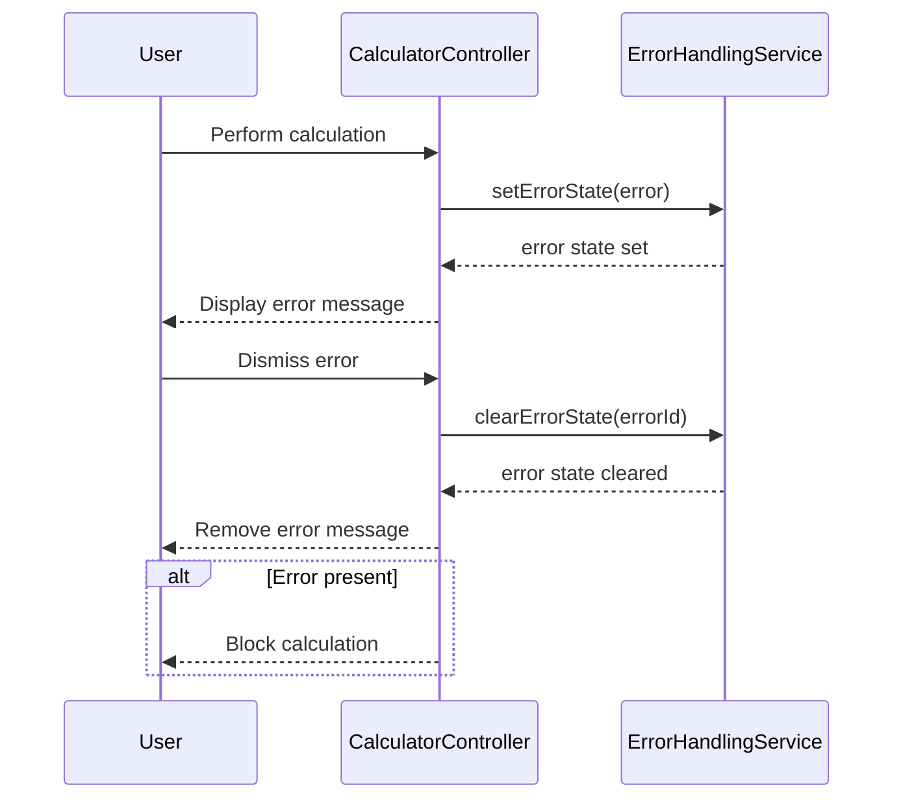
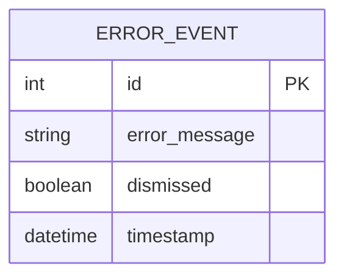

# For User Story Number [5]

1. Objective
The objective is to provide clear, actionable error messages for invalid inputs, calculation errors, and system issues in the calculator. Error messages must be displayed prominently, be easily dismissible, and guide users to resolve the problem. No calculation should be performed when an error is present.

2. API Model
  2.1 Common Components/Services
    - ErrorHandlingService (new)
    - CalculatorController (existing)

  2.2 API Details
| Operation     | REST Method | Type    | URL                   | Request (JSON)                        | Response (JSON)                       |
|---------------|-------------|---------|-----------------------|---------------------------------------|---------------------------------------|
| DisplayError  | POST        | Success | /api/error            | {"error": "Cannot divide by zero"}    | {"status": "shown", "error": "Cannot divide by zero"} |
| DismissError  | POST        | Success | /api/error/dismiss    | {"errorId": 1}                        | {"status": "dismissed"}              |
| Calculation   | POST        | Failure | /api/calculate        | {"num1": 5, "num2": 0, "operation": "divide"} | {"result": null, "error": "Cannot divide by zero"} |

  2.3 Exceptions
| Exception Type           | Description                                  |
|-------------------------|----------------------------------------------|
| CalculationException     | Thrown when calculation cannot proceed due to error |
| ErrorDisplayException    | Thrown when error message cannot be shown    |

3 Functional Design
  3.1 Class Diagram

  3.2 UML Sequence Diagram

  3.3 Components
| Component Name           | Description                                   | Existing/New |
|-------------------------|-----------------------------------------------|--------------|
| CalculatorController     | Handles calculation and error actions         | Existing     |
| ErrorHandlingService     | Manages error state and messages              | New          |

  3.4 Service Layer Logic and Validations
| FieldName | Validation                             | Error Message                | ClassUsed                |
|-----------|----------------------------------------|------------------------------|--------------------------|
| error     | Must be specific and actionable        | "Cannot divide by zero"      | ErrorHandlingService     |
| error     | Must be dismissible                    | "Error cannot be dismissed"  | ErrorHandlingService     |
| error     | Must disappear when issue resolved     | "Error persists after fix"   | ErrorHandlingService     |
| result    | Must not be shown if error present     | "Calculation blocked due to error" | CalculatorController     |

4 Integrations
| SystemToBeIntegrated | IntegratedFor         | IntegrationType |
|---------------------|-----------------------|-----------------|
| None                | Local error handling  | N/A             |

5 DB Details
  5.1 ER Model

  5.2 DB Validations
- None required (error events are not persisted)

6 Non-Functional Requirements
  6.1 Performance
    - Error messages display within 50ms of error detection.
  6.2 Security
    6.2.1 Authentication
      - Not required for public calculator.
    6.2.2 Authorization
      - Not required for public calculator.
    - Prevent exposure of internal system errors.
  6.3 Logging
    6.3.1 Application Logging
      - Log error occurrences at ERROR level.
    6.3.2 Audit Log
      - Log error events for troubleshooting.

7 Dependencies
    - ReactJS frontend

8 Assumptions
    - Error handling is managed client-side.
    - No backend persistence for error events.
    - No user authentication required.
