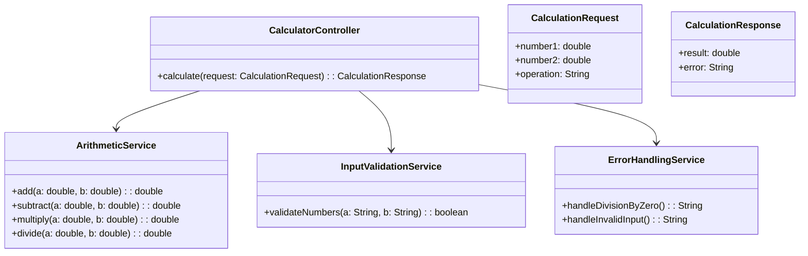
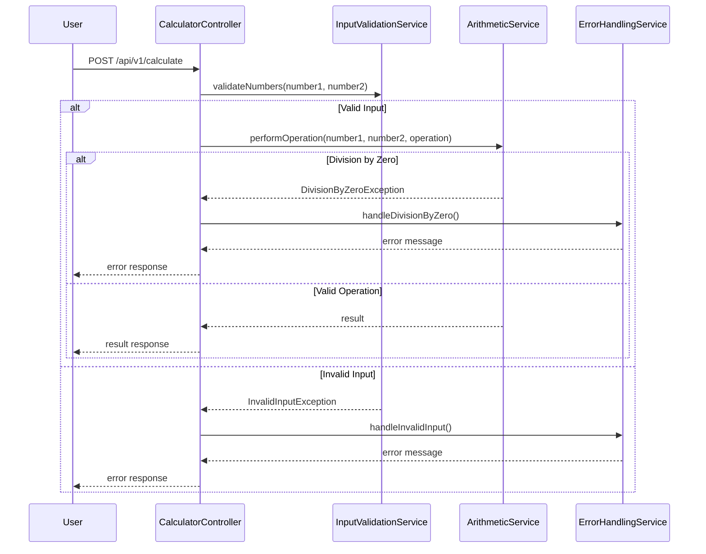
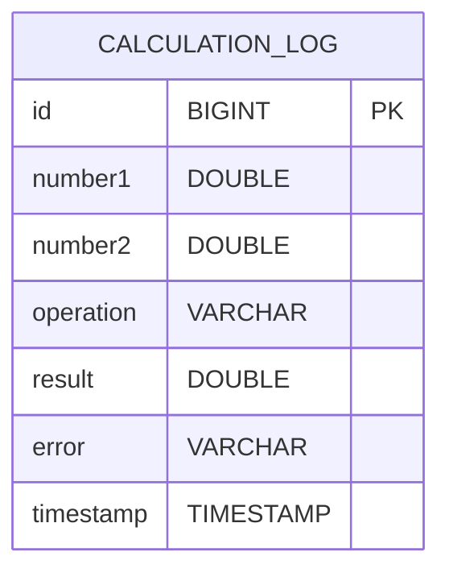

# For User Story Number [1]

1. Objective
The objective is to enable users to perform basic arithmetic operations (addition, subtraction, multiplication, division) within a calculator application. The system must accept two numeric inputs, allow the user to select an operation, and display the result. Division by zero must be handled gracefully with an error message.

2. API Model
2.1 Common Components/Services
- InputValidationService (for numeric input validation)
- ArithmeticService (for arithmetic operations)
- ErrorHandlingService (for error message generation)

2.2 API Details
| Operation | REST Method | Type    | URL                 | Request (JSON)                        | Response (JSON)                     |
|-----------|-------------|---------|---------------------|---------------------------------------|-------------------------------------|
| Create    | POST        | Success | /api/v1/calculate   | {"number1": 5, "number2": 2, "operation": "add"} | {"result": 7}                      |
| Create    | POST        | Failure | /api/v1/calculate   | {"number1": 5, "number2": 0, "operation": "divide"} | {"error": "Division by zero is not allowed."} |

2.3 Exceptions
| Exception Type           | Scenario                                   | Error Message                        |
|-------------------------|--------------------------------------------|--------------------------------------|
| InvalidInputException   | Non-numeric input provided                 | "Input must be a valid number."     |
| DivisionByZeroException | Division operation with zero as divisor     | "Division by zero is not allowed."  |
| OperationNotSupported   | Unsupported operation requested             | "Operation not supported."          |

3 Functional Design
3.1 Class Diagram

3.2 UML Sequence Diagram

3.3 Components
| Component Name         | Description                                            | Existing/New |
|-----------------------|--------------------------------------------------------|--------------|
| CalculatorController  | REST controller for calculation requests               | New          |
| ArithmeticService     | Service for arithmetic operations                      | New          |
| InputValidationService| Service for validating numeric inputs                  | New          |
| ErrorHandlingService  | Service for error message generation                   | New          |

3.4 Service Layer Logic and Validations
| FieldName  | Validation                        | Error Message                        | ClassUsed              |
|------------|-----------------------------------|--------------------------------------|------------------------|
| number1    | Must be a valid number            | "Input must be a valid number."     | InputValidationService |
| number2    | Must be a valid number            | "Input must be a valid number."     | InputValidationService |
| operation  | Must be add/subtract/multiply/divide | "Operation not supported."          | CalculatorController   |
| number2    | If operation is divide, must not be zero | "Division by zero is not allowed."  | ArithmeticService      |

4 Integrations
| SystemToBeIntegrated | IntegratedFor         | IntegrationType |
|----------------------|----------------------|-----------------|
| None                 | N/A                  | N/A             |

5 DB Details
5.1 ER Model

5.2 DB Validations
- None required for basic arithmetic, but CALCULATION_LOG table should have NOT NULL constraints on number1, number2, operation, and timestamp.

6 Non-Functional Requirements
6.1 Performance
- Each calculation must complete in less than 100ms.
- No caching required for basic operations.

6.2 Security
6.2.1 Authentication
- No authentication required for basic calculator.
6.2.2 Authorization
- No authorization required for basic calculator.

6.3 Logging
6.3.1 Application Logging
- Log each calculation request and response at INFO level.
- Log invalid input and division by zero at WARN level.
- Log unexpected errors at ERROR level.
6.3.2 Audit Log
- Log each operation (inputs, operation, result/error, timestamp) in CALCULATION_LOG table.

7 Dependencies
- None for basic arithmetic operations.

8 Assumptions
- Only two numbers are supported per operation.
- No scientific operations are required.
- No user authentication or session management is required.
- The frontend will handle UI/UX for input and error display.