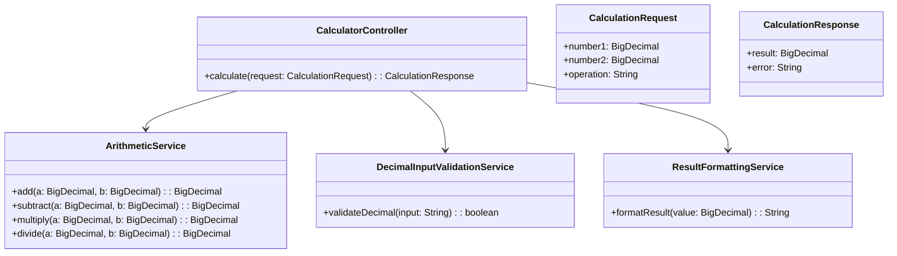
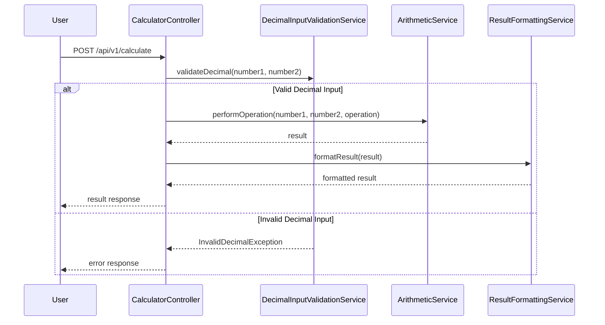

# For User Story Number [2]

1. Objective
The objective is to enable users to perform arithmetic operations with decimal (floating-point) numbers in the calculator application. The system must accept decimal inputs, validate them, and display results with appropriate precision. All arithmetic operations must be accurate and results formatted as per business rules.

2. API Model
2.1 Common Components/Services
- DecimalInputValidationService (for validating decimal input)
- ArithmeticService (for floating-point operations)
- ResultFormattingService (for result precision/formatting)

2.2 API Details
| Operation | REST Method | Type    | URL                 | Request (JSON)                                  | Response (JSON)                     |
|-----------|-------------|---------|---------------------|-----------------------------------------------|-------------------------------------|
| Create    | POST        | Success | /api/v1/calculate   | {"number1": 1.23, "number2": 0.5, "operation": "multiply"} | {"result": 0.615}                   |
| Create    | POST        | Failure | /api/v1/calculate   | {"number1": 1.2.3, "number2": 0.5, "operation": "add"}      | {"error": "Invalid decimal input."} |

2.3 Exceptions
| Exception Type           | Scenario                                   | Error Message                        |
|-------------------------|--------------------------------------------|--------------------------------------|
| InvalidDecimalException | Malformed decimal input                    | "Invalid decimal input."            |
| MultipleDecimalPoints   | More than one decimal point in input       | "Only one decimal point allowed."   |
| OperationNotSupported   | Unsupported operation requested             | "Operation not supported."          |

3 Functional Design
3.1 Class Diagram


3.2 UML Sequence Diagram


3.3 Components
| Component Name               | Description                                            | Existing/New |
|-----------------------------|--------------------------------------------------------|--------------|
| CalculatorController        | REST controller for calculation requests               | Existing     |
| ArithmeticService           | Service for arithmetic operations                      | Existing     |
| DecimalInputValidationService| Service for validating decimal inputs                  | New          |
| ResultFormattingService     | Service for formatting results to required precision   | New          |

3.4 Service Layer Logic and Validations
| FieldName  | Validation                                  | Error Message                        | ClassUsed                  |
|------------|---------------------------------------------|--------------------------------------|----------------------------|
| number1    | Must be a valid decimal (regex)             | "Invalid decimal input."            | DecimalInputValidationService |
| number2    | Must be a valid decimal (regex)             | "Invalid decimal input."            | DecimalInputValidationService |
| number1, number2 | Only one decimal point allowed         | "Only one decimal point allowed."   | DecimalInputValidationService |
| result     | Format to 4 decimal places                  | N/A                                 | ResultFormattingService     |

4 Integrations
| SystemToBeIntegrated | IntegratedFor         | IntegrationType |
|----------------------|----------------------|-----------------|
| None                 | N/A                  | N/A             |

5 DB Details
5.1 ER Model
```mermaid
erDiagram
    CALCULATION_LOG {
        id BIGINT PK
        number1 DECIMAL(20,8)
        number2 DECIMAL(20,8)
        operation VARCHAR
        result DECIMAL(20,8)
        error VARCHAR
        timestamp TIMESTAMP
    }
```

5.2 DB Validations
- number1 and number2 must match decimal format (enforced at application layer).
- result column should store up to 8 decimal places.

6 Non-Functional Requirements
6.1 Performance
- Calculations with decimals must complete in less than 100ms.
- No performance degradation compared to integer operations.

6.2 Security
6.2.1 Authentication
- No authentication required for basic calculator.
6.2.2 Authorization
- No authorization required for basic calculator.

6.3 Logging
6.3.1 Application Logging
- Log each calculation request and response at INFO level.
- Log invalid decimal input at WARN level.
- Log unexpected errors at ERROR level.
6.3.2 Audit Log
- Log each operation (inputs, operation, result/error, timestamp) in CALCULATION_LOG table.

7 Dependencies
- None for decimal arithmetic operations.

8 Assumptions
- Only two decimal numbers are supported per operation.
- Results are rounded to 4 decimal places for display.
- No scientific notation support required.
- The frontend will handle UI/UX for decimal input and error display.