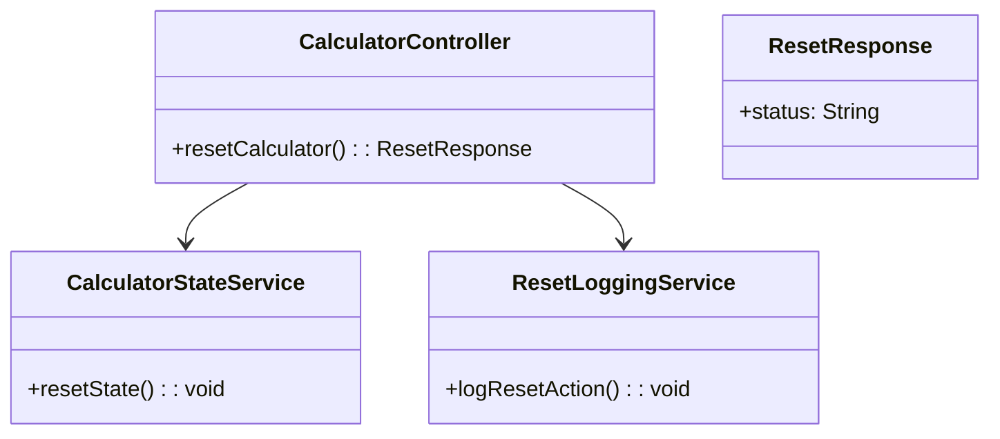
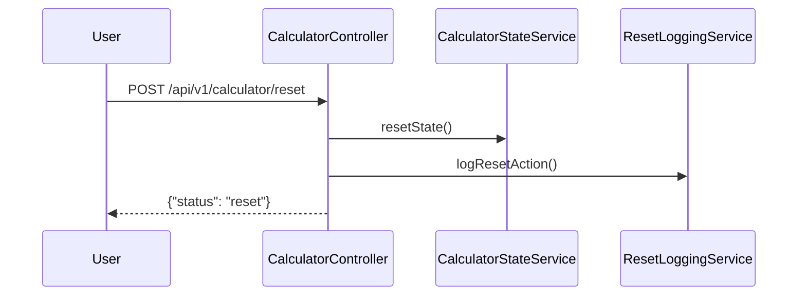
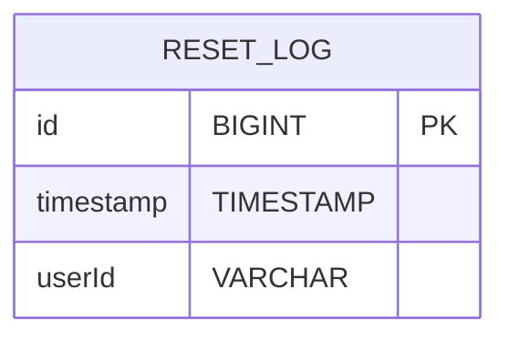

# For User Story Number [3]

1. Objective
The objective is to provide a clear/reset button in the calculator application that allows users to erase all current inputs and results instantly. This enables users to quickly start a new calculation without refreshing the page. The reset action must ensure no residual data remains and the calculator is ready for new input.

2. API Model
2.1 Common Components/Services
- CalculatorStateService (for managing calculator state)
- ResetLoggingService (for logging reset actions)

2.2 API Details
| Operation | REST Method | Type    | URL                 | Request (JSON)  | Response (JSON) |
|-----------|-------------|---------|---------------------|-----------------|-----------------|
| Update    | POST        | Success | /api/v1/calculator/reset | {}            | {"status": "reset"} |

2.3 Exceptions
| Exception Type         | Scenario                                   | Error Message                        |
|-----------------------|--------------------------------------------|--------------------------------------|
| None                  | Reset is a stateless operation             | N/A                                  |

3 Functional Design
3.1 Class Diagram

3.2 UML Sequence Diagram

3.3 Components
| Component Name           | Description                                            | Existing/New |
|-------------------------|--------------------------------------------------------|--------------|
| CalculatorController    | REST controller for calculator actions                 | Existing     |
| CalculatorStateService  | Service for managing and resetting calculator state    | New          |
| ResetLoggingService     | Service for logging reset actions                      | New          |

3.4 Service Layer Logic and Validations
| FieldName  | Validation                        | Error Message                        | ClassUsed              |
|------------|-----------------------------------|--------------------------------------|------------------------|
| All fields | Reset to default/empty state      | N/A                                 | CalculatorStateService |

4 Integrations
| SystemToBeIntegrated | IntegratedFor         | IntegrationType |
|----------------------|----------------------|-----------------|
| None                 | N/A                  | N/A             |

5 DB Details
5.1 ER Model

5.2 DB Validations
- timestamp must not be null.
- userId can be null if not authenticated.

6 Non-Functional Requirements
6.1 Performance
- Reset action must complete in less than 50ms.

6.2 Security
6.2.1 Authentication
- No authentication required for basic calculator.
6.2.2 Authorization
- No authorization required for basic calculator.

6.3 Logging
6.3.1 Application Logging
- Log each reset action at INFO level.
6.3.2 Audit Log
- Log each reset event (timestamp, userId if available) in RESET_LOG table.

7 Dependencies
- None for reset functionality.

8 Assumptions
- Reset is a frontend and/or stateless backend operation.
- No sensitive data is handled.
- No user authentication is required.
- The frontend will handle UI/UX for the reset button and state clearing.