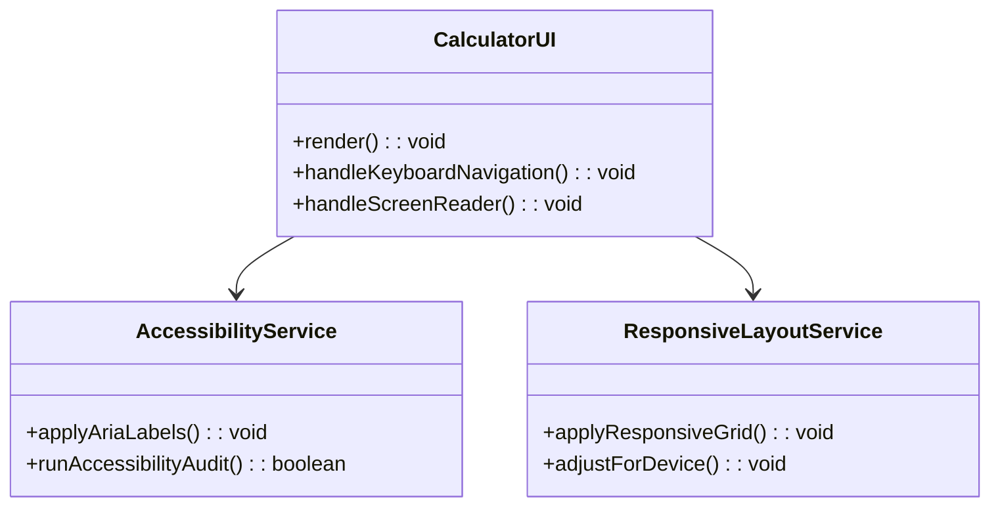
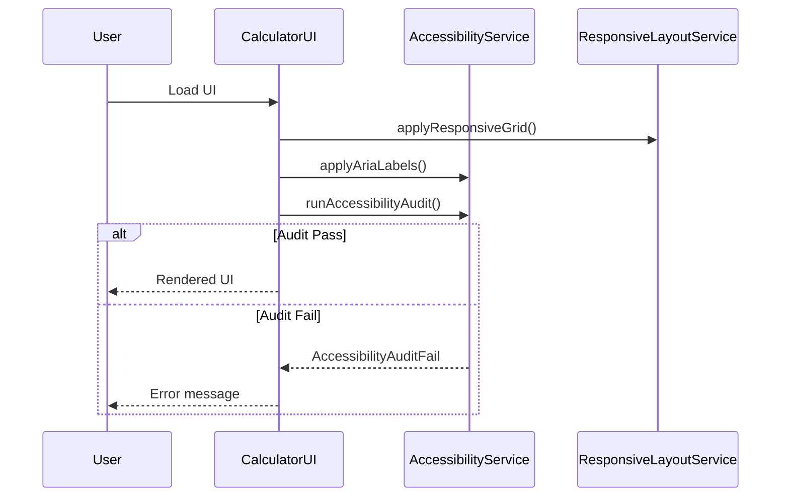
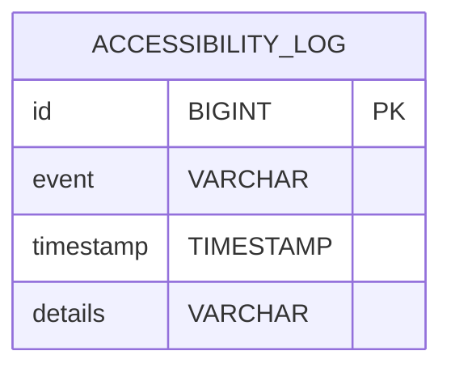

# For User Story Number [4]

1. Objective
The objective is to provide a user-friendly and accessible calculator interface that is intuitive for all users, including those with disabilities, and works seamlessly across desktop and mobile devices. The interface must be responsive, support keyboard navigation and screen readers, and meet accessibility standards. All interactive elements must be clearly labeled, and the application must pass accessibility audits.

2. API Model
2.1 Common Components/Services
- AccessibilityService (for ARIA and accessibility checks)
- ResponsiveLayoutService (for adapting UI to screen sizes)

2.2 API Details
| Operation | REST Method | Type    | URL                 | Request (JSON)  | Response (JSON) |
|-----------|-------------|---------|---------------------|-----------------|-----------------|
| Read      | GET         | Success | /api/v1/calculator/ui | N/A            | {"ui": "rendered"} |

2.3 Exceptions
| Exception Type         | Scenario                                   | Error Message                        |
|-----------------------|--------------------------------------------|--------------------------------------|
| AccessibilityAuditFail| UI fails accessibility audit               | "Accessibility requirements not met."|

3 Functional Design
3.1 Class Diagram

3.2 UML Sequence Diagram

3.3 Components
| Component Name             | Description                                            | Existing/New |
|---------------------------|--------------------------------------------------------|--------------|
| CalculatorUI              | React component for calculator interface               | New          |
| AccessibilityService      | Service for ARIA labels and accessibility audits       | New          |
| ResponsiveLayoutService   | Service for responsive grid and device adaptation      | New          |

3.4 Service Layer Logic and Validations
| FieldName  | Validation                        | Error Message                        | ClassUsed              |
|------------|-----------------------------------|--------------------------------------|------------------------|
| UI         | Must pass accessibility audit      | "Accessibility requirements not met."| AccessibilityService   |
| UI         | All elements reachable by keyboard | "Element not reachable by keyboard." | AccessibilityService   |
| UI         | Screen reader announces labels     | "Screen reader label missing."       | AccessibilityService   |

4 Integrations
| SystemToBeIntegrated | IntegratedFor         | IntegrationType |
|----------------------|----------------------|-----------------|
| None                 | N/A                  | N/A             |

5 DB Details
5.1 ER Model

5.2 DB Validations
- event and timestamp must not be null.

6 Non-Functional Requirements
6.1 Performance
- UI must load in under 1 second.

6.2 Security
6.2.1 Authentication
- No authentication required for UI rendering.
6.2.2 Authorization
- No authorization required for UI rendering.

6.3 Logging
6.3.1 Application Logging
- Log UI load and accessibility audit results at INFO level.
6.3.2 Audit Log
- Log accessibility errors and audit events in ACCESSIBILITY_LOG table.

7 Dependencies
- None for UI rendering and accessibility.

8 Assumptions
- The frontend is built with React and CSS3.
- Accessibility audits are performed using tools like Lighthouse or axe.
- No sensitive data is handled.
- The frontend will handle all UI/UX and accessibility features.