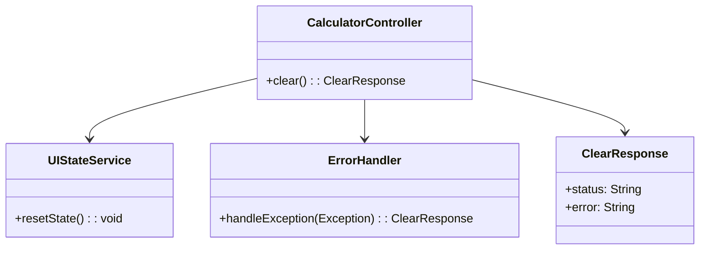
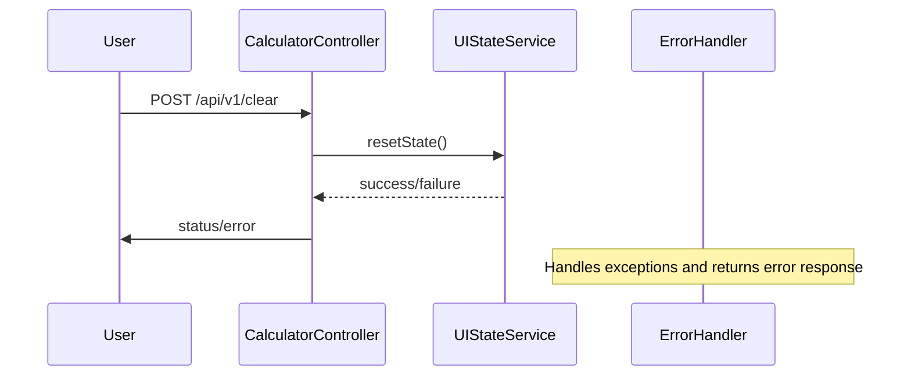

# For User Story Number [2]
1. Objective
Enable users to clear all calculator inputs and results instantly with a single button, resetting the calculator to its initial state. Ensure no previous values or results remain after clearing, and prevent any application crash or freeze. Provide a seamless and responsive user experience for starting new calculations.

2. API Model
  2.1 Common Components/Services
    - UI State Management Service (existing)
    - Error Handling Service (existing)
  2.2 API Details
| Operation | REST Method | Type | URL | Request | Response |
|-----------|-------------|------|-----|---------|----------|
| Clear Calculator | POST | Success | /api/v1/clear | { } | { "status": "cleared" } |
| Clear Calculator | POST | Failure | /api/v1/clear | { } | { "error": "Unable to clear calculator." } |
  2.3 Exceptions
    - ClearOperationException: Thrown if clearing fails due to unexpected error.

3 Functional Design
  3.1 Class Diagram

  3.2 UML Sequence Diagram

  3.3 Components
| Component Name | Description | Existing/New |
|----------------|-------------|--------------|
| CalculatorController | REST controller handling clear requests | New |
| UIStateService | Manages and resets calculator state | Existing |
| ErrorHandler | Handles and formats errors | Existing |
| ClearResponse | DTO for response payload | New |
  3.4 Service Layer Logic and Validations
| FieldName | Validation | Error Message | ClassUsed |
|-----------|------------|--------------|-----------|
| All fields | Must reset to initial state | "Unable to clear calculator." | UIStateService |
| All fields | No residual data after clear | "Residual data found after clearing." | UIStateService |

4 Integrations
| SystemToBeIntegrated | IntegratedFor | IntegrationType |
|----------------------|---------------|-----------------|
| None | N/A | N/A |

5 DB Details
  5.1 ER Model
```mermaid
erDiagram
    // No persistent entities required for clear operation
```
  5.2 DB Validations
    - Not applicable

6 Non-Functional Requirements
  6.1 Performance
    - Clear operation response time < 0.5 seconds.
  6.2 Security
    6.2.1 Authentication
      - Not applicable for frontend-only clear operation.
    6.2.2 Authorization
      - Not applicable for frontend-only clear operation.
  6.3 Logging
    6.3.1 Application Logging
      - Log clear operations at INFO level.
      - Log errors at ERROR level.
    6.3.2 Audit Log
      - Not applicable

7 Dependencies
    - React frontend for UI

8 Assumptions
    - No backend or persistent storage involved for clear operation.
    - UI state is managed in memory and can be reset instantly.
    - No sensitive data is retained after clearing.
