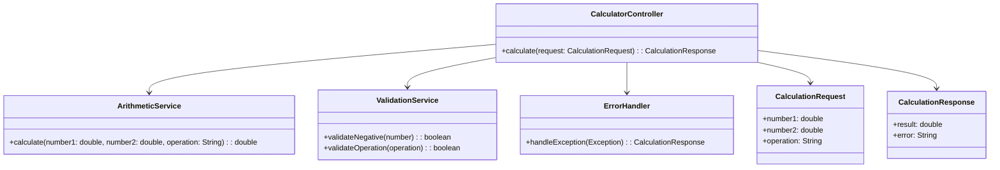
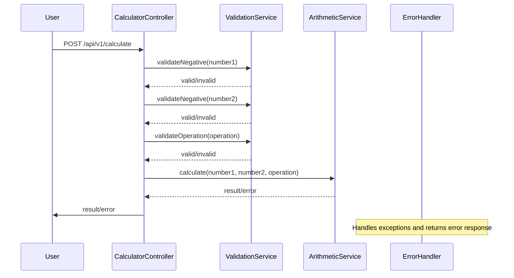
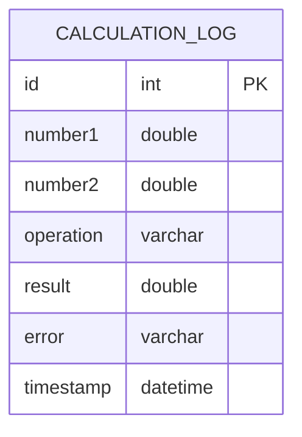

# For User Story Number [4]
1. Objective
Enable users to input and perform calculations with negative numbers, supporting both positive and negative values for all arithmetic operations in the calculator. Ensure results are displayed correctly with the appropriate sign and provide robust input validation for negative numbers. Prevent invalid negative input and guarantee mathematical accuracy.

2. API Model
  2.1 Common Components/Services
    - Input Validation Service (existing)
    - Arithmetic Operation Service (existing)
    - Error Handling Service (existing)
  2.2 API Details
| Operation | REST Method | Type | URL | Request | Response |
|-----------|-------------|------|-----|---------|----------|
| Calculate | POST | Success | /api/v1/calculate | { "number1": -5, "number2": -2, "operation": "add" } | { "result": -7 } |
| Calculate | POST | Failure | /api/v1/calculate | { "number1": "--5", "number2": -2, "operation": "add" } | { "error": "Invalid negative number input." } |
  2.3 Exceptions
    - InvalidNegativeNumberException: Thrown if either input is not a valid negative number.
    - InvalidOperationException: Thrown if operation is not supported.

3 Functional Design
  3.1 Class Diagram

  3.2 UML Sequence Diagram

  3.3 Components
| Component Name | Description | Existing/New |
|----------------|-------------|--------------|
| CalculatorController | REST controller handling calculation requests | Existing |
| ArithmeticService | Performs arithmetic operations | Existing |
| ValidationService | Validates negative number input and operation | Existing |
| ErrorHandler | Handles and formats errors | Existing |
| CalculationRequest | DTO for request payload | Existing |
| CalculationResponse | DTO for response payload | Existing |
  3.4 Service Layer Logic and Validations
| FieldName | Validation | Error Message | ClassUsed |
|-----------|------------|--------------|-----------|
| number1 | Must be a valid negative number | "First input is not a valid negative number." | ValidationService |
| number2 | Must be a valid negative number | "Second input is not a valid negative number." | ValidationService |
| operation | Must be one of add, subtract, multiply, divide | "Invalid operation selected." | ValidationService |
| number1/number2 | '-' sign only at beginning | "Invalid negative number format." | ValidationService |
| result | Must be mathematically accurate | "Calculation result is not mathematically accurate." | ArithmeticService |

4 Integrations
| SystemToBeIntegrated | IntegratedFor | IntegrationType |
|----------------------|---------------|-----------------|
| None | N/A | N/A |

5 DB Details
  5.1 ER Model

  5.2 DB Validations
    - All fields must be non-null except 'error'.
    - 'operation' must be one of the supported values.
    - 'result' must be mathematically accurate.

6 Non-Functional Requirements
  6.1 Performance
    - Calculation response time < 1 second.
  6.2 Security
    6.2.1 Authentication
      - Basic authentication for API access if exposed.
    6.2.2 Authorization
      - Only authenticated users can access calculation API.
  6.3 Logging
    6.3.1 Application Logging
      - Log all calculation requests at INFO level.
      - Log errors at ERROR level.
      - Log validation failures at WARN level.
    6.3.2 Audit Log
      - Log operation usage for analytics with timestamp.

7 Dependencies
    - React frontend for UI
    - JavaScript number handling
    - Database for calculation logs (optional, for analytics)

8 Assumptions
    - Only basic arithmetic operations are supported.
    - Input validation is enforced on both frontend and backend.
    - Application is stateless except for optional logging.
    - Calculations must be mathematically accurate for negative numbers.
