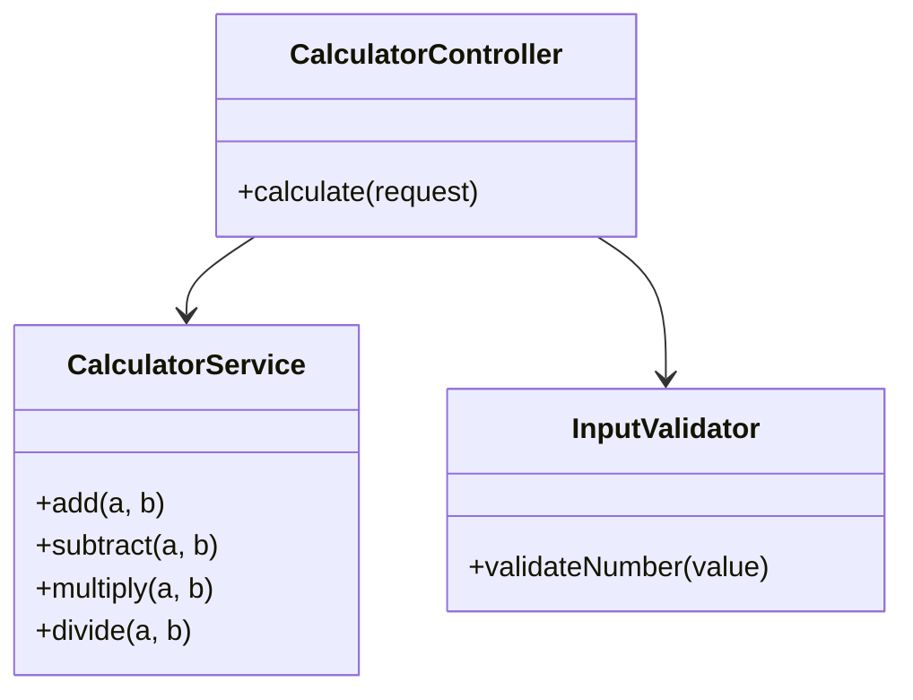
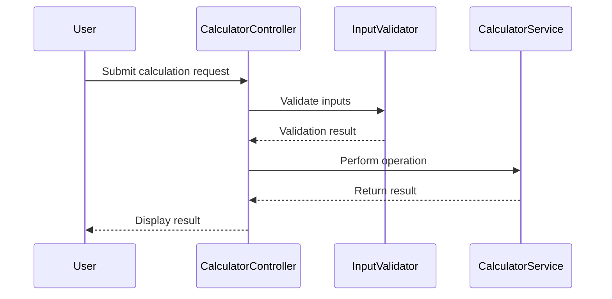
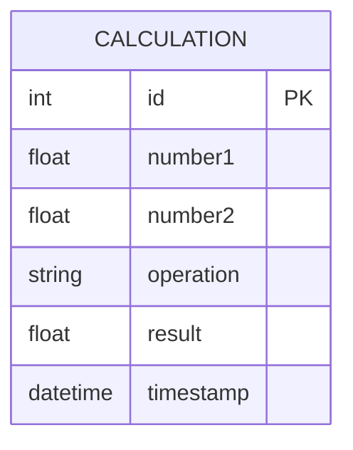

# For User Story Number [1]

1. Objective
The objective is to enable users to perform basic arithmetic operations (addition, subtraction, multiplication, division) on two numeric inputs. The calculator must display results instantly and handle division by zero gracefully. The interface should be intuitive and responsive for quick calculations.

2. API Model
2.1 Common Components/Services
- Input validation service for numeric checks
- Calculation service for arithmetic operations

2.2 API Details
| Operation | REST Method | Type | URL | Request | Response |
|-----------|------------|------|-----|---------|----------|
| Calculate | POST | Success/Failure | /api/calculate | { "number1": 5, "number2": 3, "operation": "add" } | { "result": 8 } |

2.3 Exceptions
| Exception | Condition | Error Message |
|-----------|-----------|--------------|
| InvalidInputException | Non-numeric input | "Input must be a number." |
| DivisionByZeroException | Division by zero | "Cannot divide by zero." |

3 Functional Design
3.1 Class Diagram

3.2 UML Sequence Diagram

3.3 Components
| Component Name | Description | Existing/New |
|----------------|-------------|--------------|
| CalculatorController | Handles API requests and responses | New |
| CalculatorService | Performs arithmetic operations | New |
| InputValidator | Validates numeric input | New |

3.4 Service Layer Logic and Validations
| FieldName | Validation | Error Message | ClassUsed |
|-----------|------------|--------------|-----------|
| number1 | Must be numeric | "Input must be a number." | InputValidator |
| number2 | Must be numeric | "Input must be a number." | InputValidator |
| number2 | Not zero for division | "Cannot divide by zero." | CalculatorService |

4 Integrations
| SystemToBeIntegrated | IntegratedFor | IntegrationType |
|---------------------|---------------|-----------------|
| None | N/A | N/A |

5 DB Details
5.1 ER Model

5.2 DB Validations
- None required for basic arithmetic; optional logging of calculations.

6 Non-Functional Requirements
6.1 Performance
- Calculation and result display must be <100ms; consider in-memory caching for repeated calculations.

6.2 Security
6.2.1 Authentication
- Not required for basic calculator.
6.2.2 Authorization
- Not required for basic calculator.

6.3 Logging
6.3.1 Application Logging
- Log calculation requests at INFO level.
- Log errors (invalid input, division by zero) at ERROR level.
6.3.2 Audit Log
- Log calculation performed with timestamp if analytics required.

7 Dependencies
- ReactJS frontend, Node.js backend (optional for persistence/logging)

8 Assumptions
- Only numeric input is allowed.
- No user authentication required.
- Calculations are stateless unless logging is implemented.
