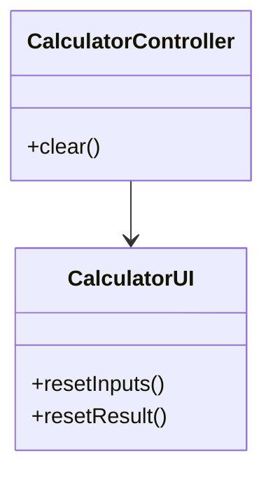
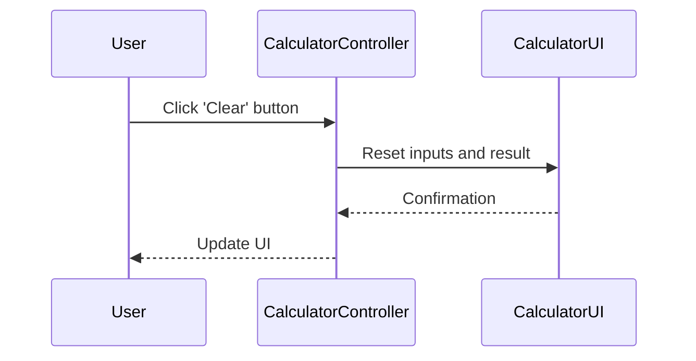

# For User Story Number [2]

1. Objective
Enable users to quickly reset the calculator by providing a 'Clear' button that empties both input fields and the result display. This feature ensures users can efficiently start new calculations without page refresh. No residual data should remain after clearing.

2. API Model
2.1 Common Components/Services
- UI component for the 'Clear' button
- Input and result reset logic

2.2 API Details
| Operation | REST Method | Type | URL | Request | Response |
|-----------|------------|------|-----|---------|----------|
| Clear | POST | Success/Failure | /api/clear | { } | { "status": "cleared" } |

2.3 Exceptions
| Exception | Condition | Error Message |
|-----------|-----------|--------------|
| ClearFailedException | UI fails to reset | "Unable to clear calculator." |

3 Functional Design
3.1 Class Diagram


3.2 UML Sequence Diagram


3.3 Components
| Component Name | Description | Existing/New |
|----------------|-------------|--------------|
| CalculatorController | Handles clear action | New |
| CalculatorUI | Manages input/result fields | Existing |

3.4 Service Layer Logic and Validations
| FieldName | Validation | Error Message | ClassUsed |
|-----------|------------|--------------|-----------|
| input fields | Must be empty after clear | "Input not cleared." | CalculatorUI |
| result display | Must be blank/default | "Result not cleared." | CalculatorUI |

4 Integrations
| SystemToBeIntegrated | IntegratedFor | IntegrationType |
|---------------------|---------------|-----------------|
| None | N/A | N/A |

5 DB Details
5.1 ER Model
```mermaid
erDiagram
    // No persistent entities required for clear feature
```

5.2 DB Validations
- Not applicable

6 Non-Functional Requirements
6.1 Performance
- Clearing should be instantaneous (<50ms)

6.2 Security
6.2.1 Authentication
- Not required
6.2.2 Authorization
- Not required

6.3 Logging
6.3.1 Application Logging
- Log clear actions at INFO level
- Log errors if clear fails at ERROR level
6.3.2 Audit Log
- Track usage of 'Clear' button if analytics required

7 Dependencies
- ReactJS frontend

8 Assumptions
- No backend required for clear functionality
- UI state is managed in frontend only
