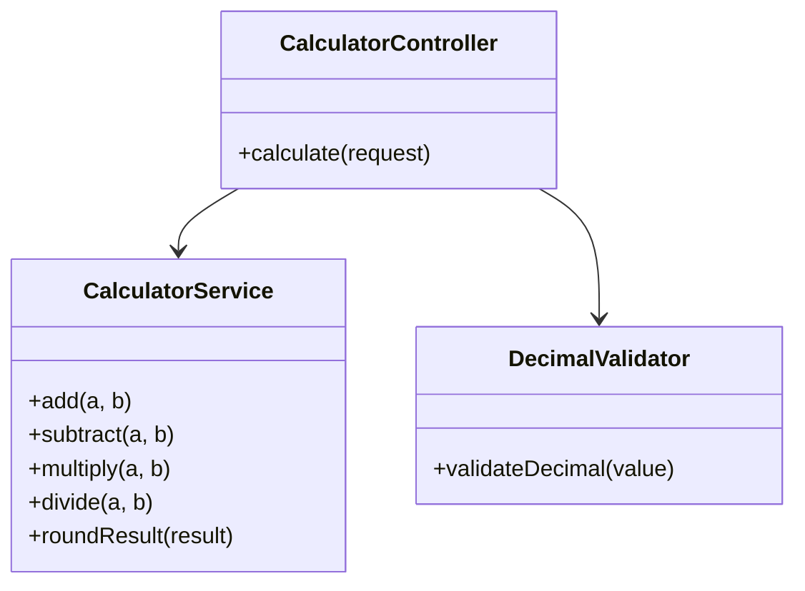
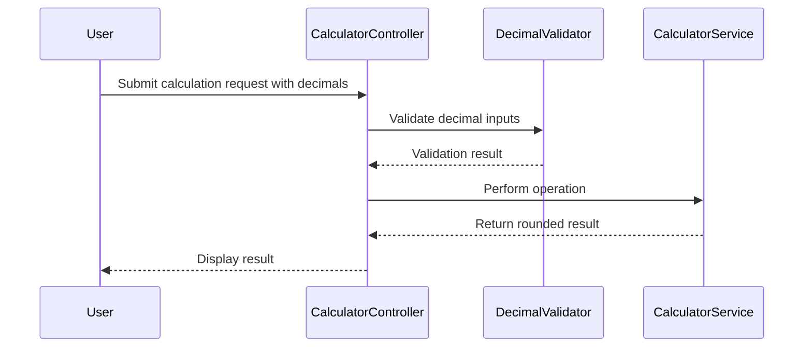
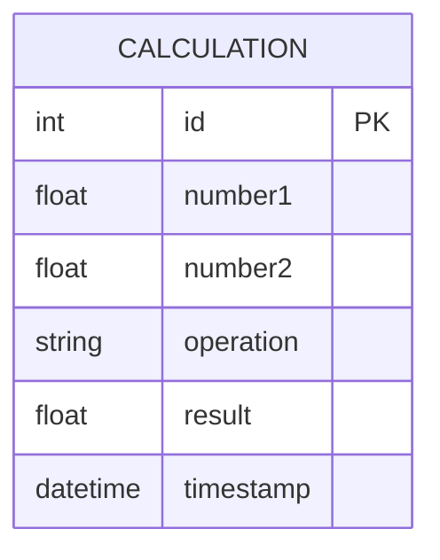

# For User Story Number [3]

1. Objective
Enable users to enter decimal numbers for both operands and perform arithmetic operations with precise results. The calculator must support decimal input, perform calculations using floating-point arithmetic, and display results rounded to four decimal places. Input validation must ensure only valid decimals are accepted.

2. API Model
2.1 Common Components/Services
- Decimal input validation service
- Calculation service supporting floating-point arithmetic

2.2 API Details
| Operation | REST Method | Type | URL | Request | Response |
|-----------|------------|------|-----|---------|----------|
| Calculate | POST | Success/Failure | /api/calculate | { "number1": 12.34, "number2": -0.56, "operation": "multiply" } | { "result": -6.9104 } |

2.3 Exceptions
| Exception | Condition | Error Message |
|-----------|-----------|--------------|
| InvalidDecimalException | Invalid decimal input | "Input must be a valid decimal number." |
| MultipleDecimalPointsException | Multiple decimal points in input | "Only one decimal point allowed." |

3 Functional Design
3.1 Class Diagram

3.2 UML Sequence Diagram

3.3 Components
| Component Name | Description | Existing/New |
|----------------|-------------|--------------|
| CalculatorController | Handles API requests and responses | Existing |
| CalculatorService | Performs floating-point arithmetic and rounding | Existing |
| DecimalValidator | Validates decimal input | New |

3.4 Service Layer Logic and Validations
| FieldName | Validation | Error Message | ClassUsed |
|-----------|------------|--------------|-----------|
| number1 | Valid decimal | "Input must be a valid decimal number." | DecimalValidator |
| number2 | Valid decimal | "Input must be a valid decimal number." | DecimalValidator |
| number1/number2 | Only one decimal point | "Only one decimal point allowed." | DecimalValidator |
| result | Rounded to 4 decimal places | N/A | CalculatorService |

4 Integrations
| SystemToBeIntegrated | IntegratedFor | IntegrationType |
|---------------------|---------------|-----------------|
| None | N/A | N/A |

5 DB Details
5.1 ER Model

5.2 DB Validations
- None required for decimal calculations; optional logging of calculations.

6 Non-Functional Requirements
6.1 Performance
- Calculation and result display must be <100ms

6.2 Security
6.2.1 Authentication
- Not required
6.2.2 Authorization
- Not required

6.3 Logging
6.3.1 Application Logging
- Log decimal calculation requests at INFO level
- Log errors related to decimal input at ERROR level
6.3.2 Audit Log
- Track number of decimal calculations if analytics required

7 Dependencies
- ReactJS frontend

8 Assumptions
- Only valid decimal input is allowed
- No backend required for decimal calculation functionality
- Calculations are stateless unless logging is implemented
