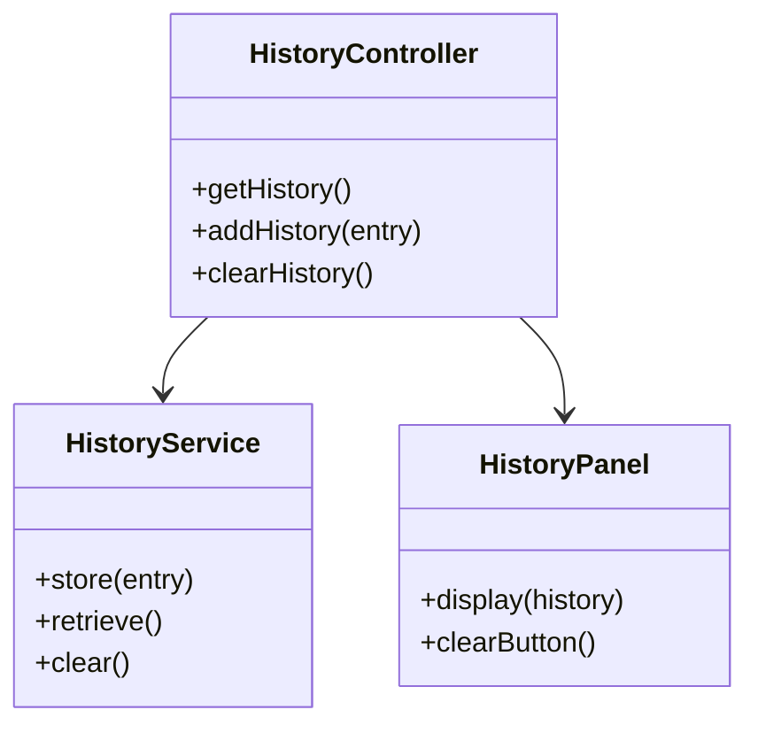
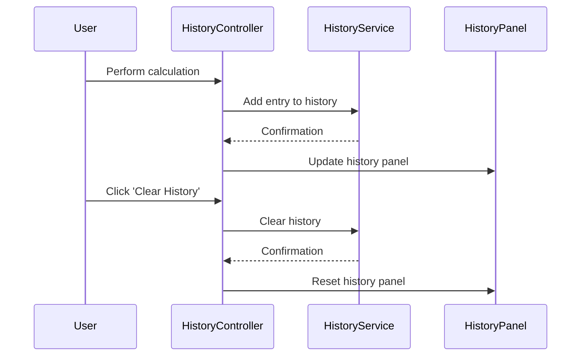

# For User Story Number [4]

1. Objective
Allow users to view a history of their last 10 calculations within the current session, including operands, operation, and result. Users can refer back to previous results and clear the history as needed. History is session-based and not persisted beyond the browser session.

2. API Model
2.1 Common Components/Services
- History management service (local state/localStorage/sessionStorage)
- UI component for history panel and 'Clear History' button

2.2 API Details
| Operation | REST Method | Type | URL | Request | Response |
|-----------|------------|------|-----|---------|----------|
| GetHistory | GET | Success | /api/history | { } | { "history": [ { "number1": 2, "number2": 3, "operation": "add", "result": 5 } ] } |
| AddHistory | POST | Success/Failure | /api/history | { "number1": 2, "number2": 3, "operation": "add", "result": 5 } | { "status": "added" } |
| ClearHistory | POST | Success/Failure | /api/history/clear | { } | { "status": "cleared" } |

2.3 Exceptions
| Exception | Condition | Error Message |
|-----------|-----------|--------------|
| HistoryOverflowException | More than 10 entries | "History limit exceeded." |
| HistoryClearException | Unable to clear history | "Unable to clear history." |

3 Functional Design
3.1 Class Diagram


3.2 UML Sequence Diagram


3.3 Components
| Component Name | Description | Existing/New |
|----------------|-------------|--------------|
| HistoryController | Handles history actions | New |
| HistoryService | Manages history storage/retrieval | New |
| HistoryPanel | UI for displaying history | New |

3.4 Service Layer Logic and Validations
| FieldName | Validation | Error Message | ClassUsed |
|-----------|------------|--------------|-----------|
| history array | Max 10 entries | "History limit exceeded." | HistoryService |
| history array | Only current session | N/A | HistoryService |
| history array | Clear removes all entries | "Unable to clear history." | HistoryService |

4 Integrations
| SystemToBeIntegrated | IntegratedFor | IntegrationType |
|---------------------|---------------|-----------------|
| None | N/A | N/A |

5 DB Details
5.1 ER Model
```mermaid
erDiagram
    // No persistent entities required; history stored in local state/localStorage/sessionStorage
```

5.2 DB Validations
- Not applicable

6 Non-Functional Requirements
6.1 Performance
- History updates must be instantaneous

6.2 Security
6.2.1 Authentication
- Not required
6.2.2 Authorization
- Not required

6.3 Logging
6.3.1 Application Logging
- Log history actions at INFO level
- Log errors related to history at ERROR level
6.3.2 Audit Log
- Track usage of history feature if analytics required

7 Dependencies
- ReactJS frontend

8 Assumptions
- History is session-based and not persisted beyond browser session
- No backend required for history functionality
