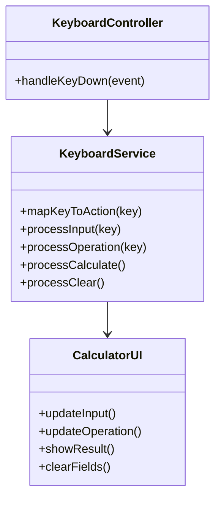
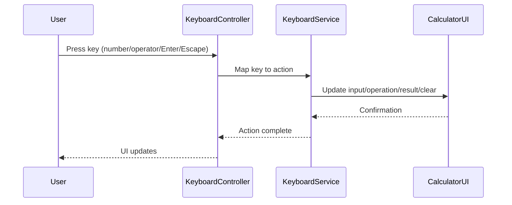

# For User Story Number [5]

1. Objective
Enable users to efficiently perform calculations using keyboard input for numbers, decimal points, operators, and control keys (Enter for calculate, Escape for clear). This improves accessibility and speed for power users and ensures input fields update correctly with keyboard events.

2. API Model
2.1 Common Components/Services
- Keyboard event listener service
- Input and operation mapping logic

2.2 API Details
| Operation | REST Method | Type | URL | Request | Response |
|-----------|------------|------|-----|---------|----------|
| KeyboardInput | POST | Success/Failure | /api/keyboard | { "key": "Enter" } | { "result": 5 } |
| KeyboardClear | POST | Success/Failure | /api/keyboard/clear | { "key": "Escape" } | { "status": "cleared" } |

2.3 Exceptions
| Exception | Condition | Error Message |
|-----------|-----------|--------------|
| InvalidKeyException | Invalid key pressed | "Key not supported." |
| KeyboardInputException | Input field not updated | "Unable to update input field." |

3 Functional Design
3.1 Class Diagram


3.2 UML Sequence Diagram


3.3 Components
| Component Name | Description | Existing/New |
|----------------|-------------|--------------|
| KeyboardController | Handles keydown events | New |
| KeyboardService | Maps keys to calculator actions | New |
| CalculatorUI | Updates input, operation, result, clear | Existing |

3.4 Service Layer Logic and Validations
| FieldName | Validation | Error Message | ClassUsed |
|-----------|------------|--------------|-----------|
| key | Valid key (0-9, ., +, -, *, /, Enter, Escape) | "Key not supported." | KeyboardService |
| input fields | Update correctly | "Unable to update input field." | CalculatorUI |
| keyboard shortcuts | Do not interfere with browser | N/A | KeyboardController |

4 Integrations
| SystemToBeIntegrated | IntegratedFor | IntegrationType |
|---------------------|---------------|-----------------|
| None | N/A | N/A |

5 DB Details
5.1 ER Model
```mermaid
erDiagram
    // No persistent entities required for keyboard input feature
```

5.2 DB Validations
- Not applicable

6 Non-Functional Requirements
6.1 Performance
- Keyboard input must be responsive (<50ms delay)

6.2 Security
6.2.1 Authentication
- Not required
6.2.2 Authorization
- Not required

6.3 Logging
6.3.1 Application Logging
- Log keyboard actions at INFO level
- Log errors related to keyboard input at ERROR level
6.3.2 Audit Log
- Track usage of keyboard shortcuts if analytics required

7 Dependencies
- ReactJS frontend

8 Assumptions
- Only valid keys are accepted
- No backend required for keyboard input functionality
- UI state is managed in frontend only
