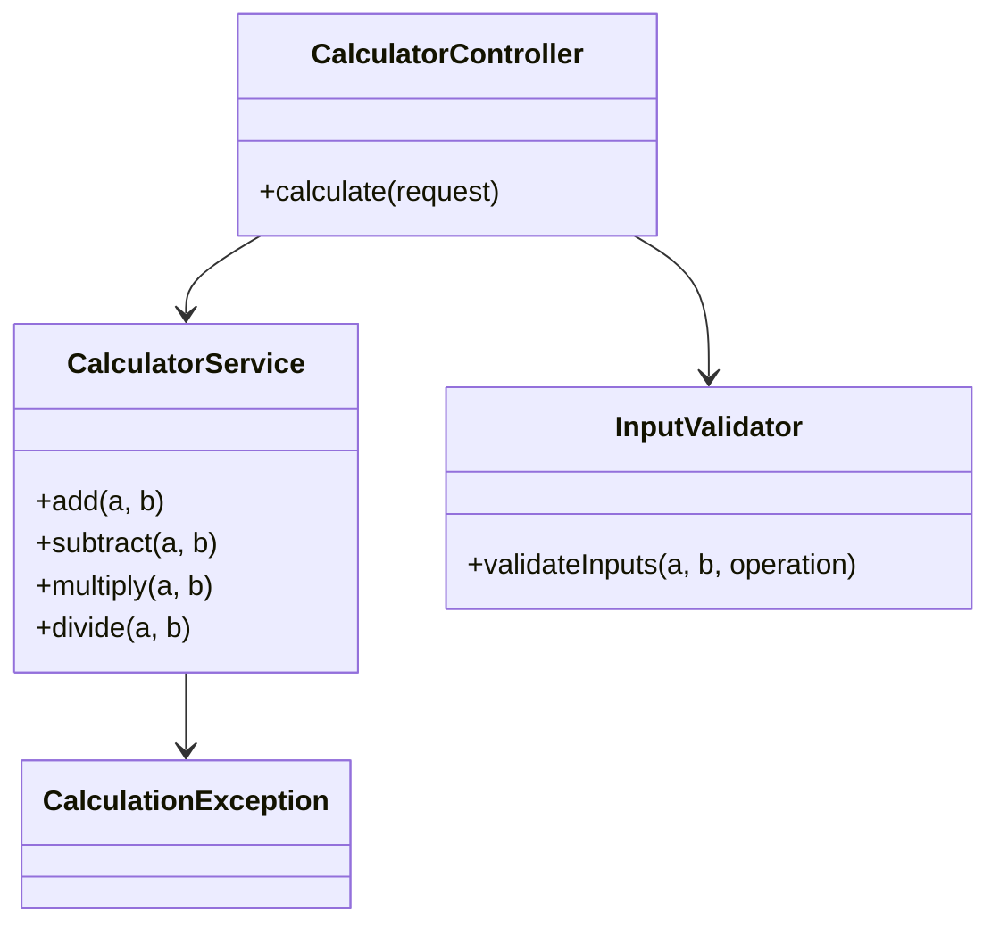
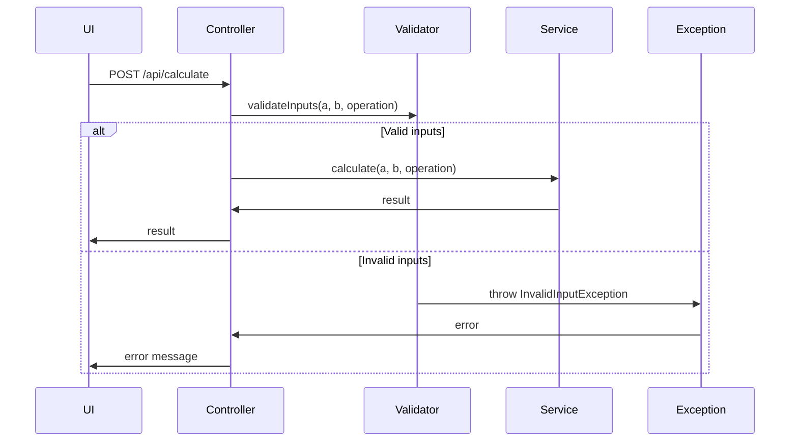
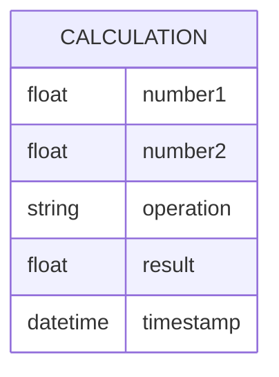

# For User Story Number [1]

1. Objective
The objective is to enable users to perform basic arithmetic operations (addition, subtraction, multiplication, division) by inputting two numbers and selecting an operation. The system should handle both integer and decimal values, display results clearly, and gracefully handle division by zero. The solution must ensure input validation and security on both frontend and backend.

2. API Model
  2.1 Common Components/Services
    - Input validation service
    - Calculation service
    - Error handling middleware

  2.2 API Details
| Operation | REST Method | Type | URL | Request | Response |
|-----------|------------|------|-----|---------|----------|
| Calculate | POST | Success | /api/calculate | { "number1": 12.5, "number2": 3, "operation": "divide" } | { "result": 4.1667 } |
| Calculate | POST | Failure | /api/calculate | { "number1": 12.5, "number2": 0, "operation": "divide" } | { "error": "Division by zero is not allowed." } |

  2.3 Exceptions
| Exception | Description |
|-----------|-------------|
| InvalidInputException | Thrown when inputs are not numeric or empty |
| DivisionByZeroException | Thrown when division by zero is attempted |
| OperationNotSupportedException | Thrown when an unsupported operation is requested |

3 Functional Design
  3.1 Class Diagram

  3.2 UML Sequence Diagram

  3.3 Components
| Component Name | Description | Existing/New |
|----------------|-------------|--------------|
| CalculatorController | Handles API requests for calculation | New |
| CalculatorService | Implements arithmetic logic | New |
| InputValidator | Validates input data | New |
| CalculationException | Custom exceptions for error handling | New |

  3.4 Service Layer Logic & Validations
| FieldName | Validation | Error Message | ClassUsed |
|-----------|------------|--------------|-----------|
| number1 | Must be numeric | "Input must be a number" | InputValidator |
| number2 | Must be numeric | "Input must be a number" | InputValidator |
| operation | Must be one of add, subtract, multiply, divide | "Invalid operation" | InputValidator |
| number2 (for divide) | Must not be zero | "Division by zero is not allowed" | CalculatorService |
| number1, number2 | Must not be empty | "Inputs cannot be empty" | InputValidator |

4 Integrations
| SystemToBeIntegrated | IntegratedFor | IntegrationType |
|----------------------|---------------|-----------------|
| ReactJS Frontend | Calculation API | API |

5 DB Details
  5.1 ER Model

  5.2 DB Validations
- Not applicable (no persistence required for calculation)

6 Non-Functional Requirements
  6.1 Performance
    - Calculation and result display should be near-instantaneous (<1 second)
    - No caching required

  6.2 Security
    6.2.1 Authentication
      - No authentication required for calculation API
    6.2.2 Authorization
      - No authorization required
    - Input sanitization on both frontend and backend

  6.3 Logging
    6.3.1 Application Logging
      - Log calculation errors at ERROR level
      - Log invalid input attempts at WARN level
      - Log successful calculations at INFO level
    6.3.2 Audit Log
      - Log error events with timestamp and input details

7 Dependencies
    - ReactJS frontend for UI
    - Node.js backend for API

8 Assumptions
    - Only basic arithmetic operations are required
    - No persistence of calculation results
    - API is stateless
    - Inputs are provided via a web UI
