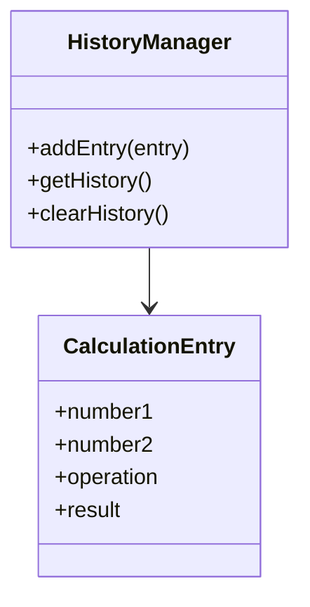
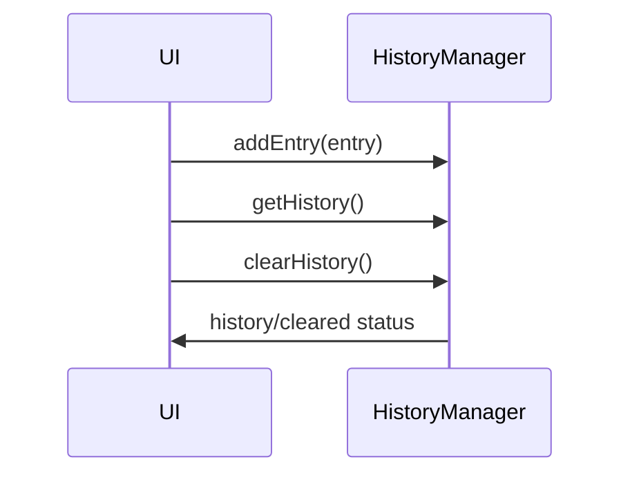
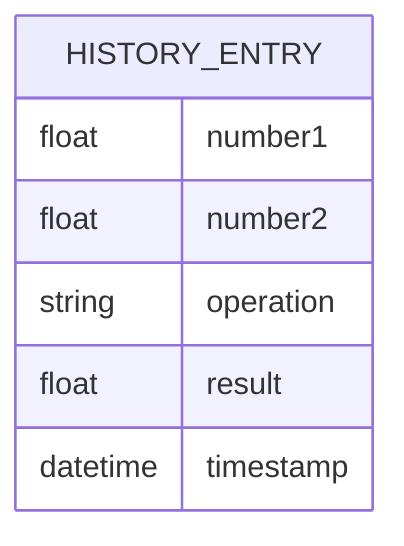

# For User Story Number [2]

1. Objective
Enable users to view a session-based history of their previous calculations, including operands, operation, and result. Provide the ability to clear the history, ensuring no persistence beyond the current session. The solution must update history instantaneously and maintain security by not storing sensitive data.

2. API Model
  2.1 Common Components/Services
    - History management service (frontend)
    - Calculation result display component

  2.2 API Details
| Operation | REST Method | Type | URL | Request | Response |
|-----------|------------|------|-----|---------|----------|
| Get History | GET | Success | /api/history | - | [ { "number1": 12, "number2": 3, "operation": "add", "result": 15 } ] |
| Clear History | POST | Success | /api/history/clear | - | { "status": "cleared" } |

  2.3 Exceptions
| Exception | Description |
|-----------|-------------|
| InvalidCalculationException | Thrown if an invalid calculation is attempted to be added to history |
| HistoryClearException | Thrown if history cannot be cleared |

3 Functional Design
  3.1 Class Diagram

  3.2 UML Sequence Diagram

  3.3 Components
| Component Name | Description | Existing/New |
|----------------|-------------|--------------|
| HistoryManager | Handles calculation history in session | New |
| CalculationEntry | Represents a calculation record | New |
| HistoryDisplay | UI component for displaying history | New |
| ClearHistoryButton | UI component for clearing history | New |

  3.4 Service Layer Logic & Validations
| FieldName | Validation | Error Message | ClassUsed |
|-----------|------------|--------------|-----------|
| entry | Must be valid calculation | "Invalid calculation entry" | HistoryManager |
| history | Must clear all entries | "Failed to clear history" | HistoryManager |

4 Integrations
| SystemToBeIntegrated | IntegratedFor | IntegrationType |
|----------------------|---------------|-----------------|
| ReactJS Frontend | History management | Local State/Redux |

5 DB Details
  5.1 ER Model

  5.2 DB Validations
- Not applicable (no backend persistence)

6 Non-Functional Requirements
  6.1 Performance
    - History updates should be instantaneous
    - No caching required

  6.2 Security
    6.2.1 Authentication
      - No authentication required
    6.2.2 Authorization
      - No authorization required
    - No sensitive data stored

  6.3 Logging
    6.3.1 Application Logging
      - Log history clear events at INFO level
    6.3.2 Audit Log
      - Log history clear actions with timestamp

7 Dependencies
    - ReactJS frontend for UI and state management

8 Assumptions
    - History is session-based and not persisted
    - Only valid calculations are added to history
    - No backend or database required
