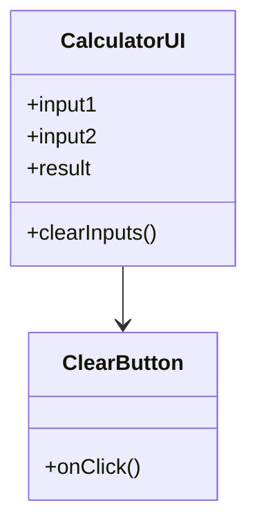
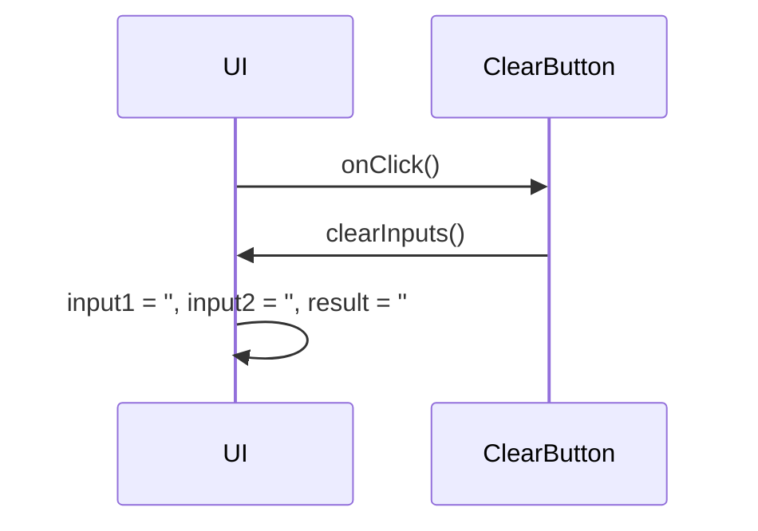

# For User Story Number [3]

1. Objective
Provide users with a clear/reset button that instantly empties all calculator input fields and the displayed result, preparing the calculator for a new calculation. Ensure the reset is always available, leaves no residual data, and logs usage for monitoring.

2. API Model
  2.1 Common Components/Services
    - Input fields component
    - Result display component
    - Clear/reset button component

  2.2 API Details
| Operation | REST Method | Type | URL | Request | Response |
|-----------|------------|------|-----|---------|----------|
| Clear Inputs | POST | Success | /api/clear | - | { "status": "cleared" } |

  2.3 Exceptions
| Exception | Description |
|-----------|-------------|
| ClearOperationException | Thrown if clear/reset operation fails |

3 Functional Design
  3.1 Class Diagram


  3.2 UML Sequence Diagram


  3.3 Components
| Component Name | Description | Existing/New |
|----------------|-------------|--------------|
| CalculatorUI | Main UI with input/result fields | New |
| ClearButton | Button to clear all fields | New |

  3.4 Service Layer Logic & Validations
| FieldName | Validation | Error Message | ClassUsed |
|-----------|------------|--------------|-----------|
| ClearButton | Always enabled and visible | "Clear/reset button must be visible" | CalculatorUI |
| input1, input2, result | Must be empty after clear | "Fields not cleared" | CalculatorUI |

4 Integrations
| SystemToBeIntegrated | IntegratedFor | IntegrationType |
|----------------------|---------------|-----------------|
| ReactJS Frontend | UI clear/reset | Component |

5 DB Details
  5.1 ER Model
```mermaid
erDiagram
    // No DB entities required for this user story
```
  5.2 DB Validations
- Not applicable

6 Non-Functional Requirements
  6.1 Performance
    - Clearing should be instantaneous

  6.2 Security
    6.2.1 Authentication
      - No authentication required
    6.2.2 Authorization
      - No authorization required
    - No data persistence

  6.3 Logging
    6.3.1 Application Logging
      - Log clear/reset button usage at INFO level
    6.3.2 Audit Log
      - Log clear/reset events with timestamp

7 Dependencies
    - ReactJS frontend for UI

8 Assumptions
    - No backend or persistence required
    - Clear/reset button is always available
    - No sensitive data involved
