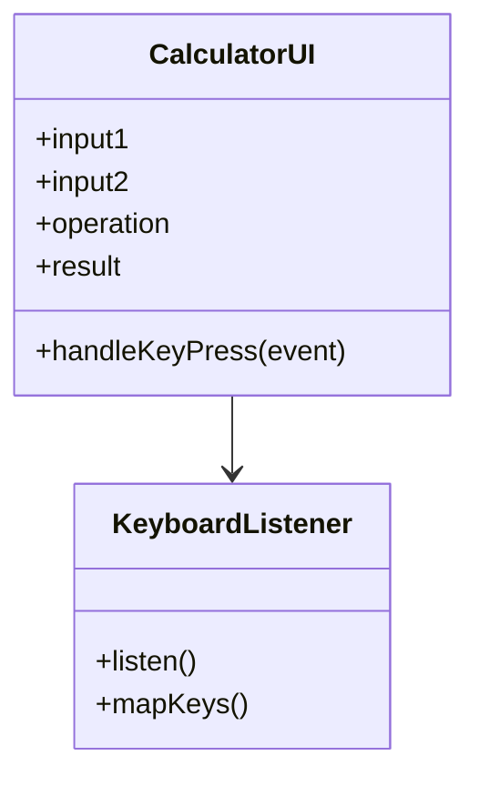
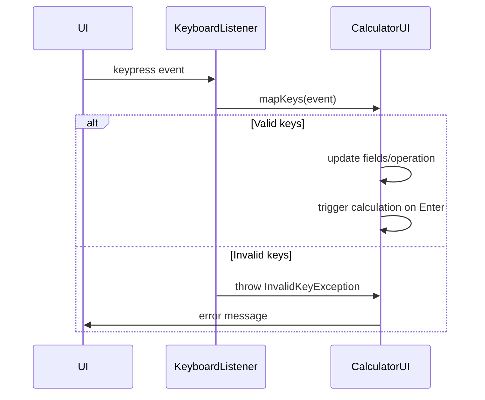

# For User Story Number [4]

1. Objective
Enable users to perform calculator operations using keyboard input, allowing entry of numbers, selection of arithmetic operations via keys (+, -, *, /), and calculation trigger with Enter. Ensure keyboard navigation between fields/buttons and prevent interference with browser/system shortcuts.

2. API Model
  2.1 Common Components/Services
    - Keyboard event listener service
    - Input fields component
    - Operation selector component
    - Calculation trigger handler

  2.2 API Details
| Operation | REST Method | Type | URL | Request | Response |
|-----------|------------|------|-----|---------|----------|
| Keyboard Calculation | POST | Success | /api/calculate | { "number1": 5, "number2": 2, "operation": "+" } | { "result": 7 } |
| Keyboard Calculation | POST | Failure | /api/calculate | { "number1": "abc", "number2": 2, "operation": "+" } | { "error": "Invalid input" } |

  2.3 Exceptions
| Exception | Description |
|-----------|-------------|
| InvalidKeyException | Thrown when an unsupported key is pressed |
| InvalidInputException | Thrown when inputs are not valid numbers |
| ShortcutConflictException | Thrown if keyboard shortcut conflicts with browser/system |

3 Functional Design
  3.1 Class Diagram


  3.2 UML Sequence Diagram


  3.3 Components
| Component Name | Description | Existing/New |
|----------------|-------------|--------------|
| CalculatorUI | Main UI with input/result fields | New |
| KeyboardListener | Handles keyboard events | New |
| OperationSelector | UI for operation selection via keys | New |
| CalculationTrigger | Handles Enter key for calculation | New |

  3.4 Service Layer Logic & Validations
| FieldName | Validation | Error Message | ClassUsed |
|-----------|------------|--------------|-----------|
| operation | Only valid keys (+, -, *, /) | "Invalid operation key" | KeyboardListener |
| input1, input2 | Must be valid numbers | "Invalid input" | CalculatorUI |
| calculation trigger | Only if both inputs valid | "Cannot calculate: invalid inputs" | CalculatorUI |
| keyboard shortcuts | Must not conflict | "Shortcut conflict" | KeyboardListener |

4 Integrations
| SystemToBeIntegrated | IntegratedFor | IntegrationType |
|----------------------|---------------|-----------------|
| ReactJS Frontend | Keyboard event handling | Component |

5 DB Details
  5.1 ER Model
```mermaid
erDiagram
    // No DB entities required for this user story
```
  5.2 DB Validations
- Not applicable

6 Non-Functional Requirements
  6.1 Performance
    - Keyboard input should be responsive (<50ms delay)

  6.2 Security
    6.2.1 Authentication
      - No authentication required
    6.2.2 Authorization
      - No authorization required
    - Sanitize all keyboard input
    - Prevent code injection via keyboard

  6.3 Logging
    6.3.1 Application Logging
      - Log keyboard-triggered calculation attempts at INFO level
      - Log invalid key attempts at WARN level
    6.3.2 Audit Log
      - Log calculation attempts with timestamp and input details

7 Dependencies
    - ReactJS frontend for UI and event handling

8 Assumptions
    - No backend or persistence required
    - Only valid operations are mapped to keys
    - Keyboard shortcuts do not interfere with browser/system
