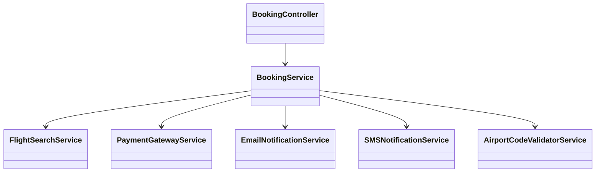
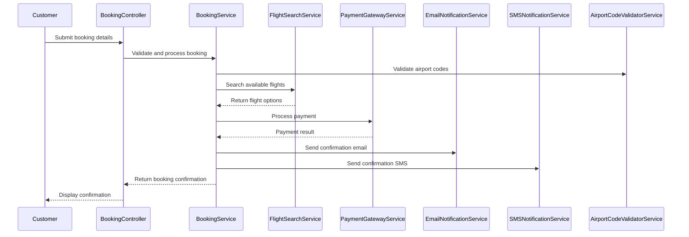
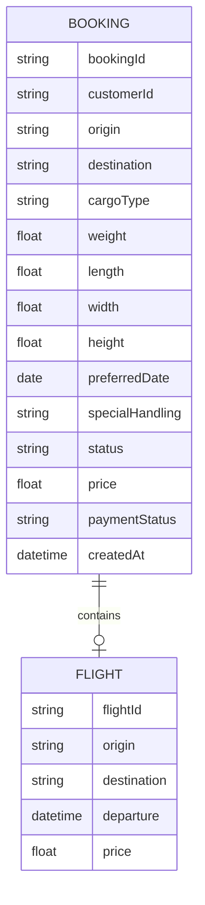

# For User Story Number 1

1. Objective
This requirement enables customers to book air transport for their cargo, capturing all necessary details and ensuring timely delivery. The system validates inputs, presents available flight options, and integrates payment processing for booking confirmation. Customers receive booking confirmation and details via email/SMS.

2. API Model
  2.1 Common Components/Services
  - AirportCodeValidatorService (existing)
  - PaymentGatewayService (existing)
  - EmailNotificationService (existing)
  - SMSNotificationService (existing)
  - FlightSearchService (new)
  - BookingService (new)

  2.2 API Details
  | Operation | REST Method | Type | URL | Request | Response |
  |-----------|------------|------|-----|---------|----------|
  | Create Booking | POST | Success/Failure | /api/bookings | {"origin": "JFK", "destination": "LHR", "cargoType": "General", "weight": 500, "dimensions": {"length": 2, "width": 1, "height": 1}, "preferredDates": ["2025-10-15"], "specialHandling": "Fragile"} | {"bookingId": "BKG12345", "status": "CONFIRMED", "flightOptions": [{"flightId": "FL123", "departure": "2025-10-15T08:00", "price": 1200}], "confirmationSent": true} |
  | Search Flights | POST | Success/Failure | /api/flights/search | {"origin": "JFK", "destination": "LHR", "cargoType": "General", "weight": 500, "dimensions": {"length": 2, "width": 1, "height": 1}, "preferredDates": ["2025-10-15"]} | [{"flightId": "FL123", "departure": "2025-10-15T08:00", "price": 1200}]
  | Confirm Payment | POST | Success/Failure | /api/payments/confirm | {"bookingId": "BKG12345", "paymentDetails": {"method": "CARD", "amount": 1200}} | {"paymentStatus": "SUCCESS", "transactionId": "TX98765"}

  2.3 Exceptions
  - InvalidAirportCodeException
  - CargoLimitExceededException
  - InvalidDateException
  - PaymentFailedException
  - FlightNotAvailableException

3 Functional Design
  3.1 Class Diagram

  3.2 UML Sequence Diagram

  3.3 Components
  | Component Name | Description | Existing/New |
  |----------------|-------------|--------------|
  | BookingController | Handles booking API requests | New |
  | BookingService | Orchestrates booking logic | New |
  | FlightSearchService | Queries available flights | New |
  | PaymentGatewayService | Integrates with payment gateway | Existing |
  | EmailNotificationService | Sends confirmation emails | Existing |
  | SMSNotificationService | Sends confirmation SMS | Existing |
  | AirportCodeValidatorService | Validates airport codes | Existing |

  3.4 Service Layer Logic & Validations
  | FieldName | Validation | Error Message | ClassUsed |
  |-----------|-----------|--------------|-----------|
  | origin | Valid airport code | Invalid origin airport code | AirportCodeValidatorService |
  | destination | Valid airport code | Invalid destination airport code | AirportCodeValidatorService |
  | weight | <= max allowed | Cargo weight exceeds limit | BookingService |
  | dimensions | <= max allowed | Cargo dimensions exceed limit | BookingService |
  | preferredDates | Future date | Preferred date must be in the future | BookingService |
  | payment | Success before confirm | Payment failed | PaymentGatewayService |

4 Integrations
  | SystemToBeIntegrated | IntegratedFor | IntegrationType |
  |---------------------|---------------|-----------------|
  | Airline Flight DB | Flight search | API |
  | Payment Gateway | Payment processing | API |
  | Email Service | Booking confirmation | API |
  | SMS Service | Booking confirmation | API |

5 DB Details
  5.1 ER Model

  5.2 DB Validations
  - Booking status must be updated only after successful payment.
  - Flight availability must be checked before booking is finalized.

6 Non-Functional Requirements
  6.1 Performance
    - Booking search response time <2 seconds.
    - Caching of frequent flight searches at API layer.
  6.2 Security
    6.2.1 Authentication
      - OAuth2 required for all booking APIs.
    6.2.2 Authorization
      - Only authenticated customers can book cargo.
  6.3 Logging
    6.3.1 Application Logging
      - DEBUG: API request/response payloads
      - INFO: Booking creation, payment confirmation
      - ERROR: Validation failures, payment errors
      - WARN: Flight unavailability
    6.3.2 Audit Log
      - Log booking activities: creation, payment, confirmation

7 Dependencies
  - Airline flight database/API
  - Payment gateway API
  - Email/SMS notification services

8 Assumptions
  - All airport codes are IATA standard.
  - Payment gateway supports instant confirmation.
  - Customer contact details are available and valid.
