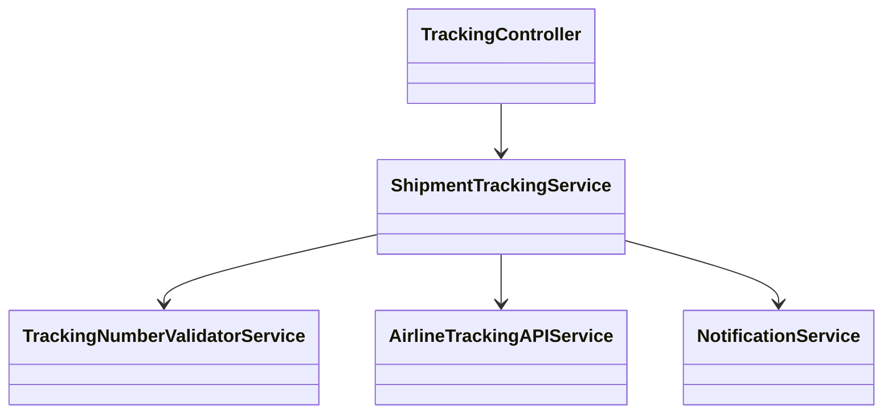
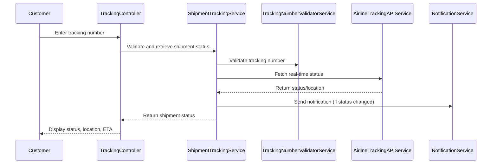
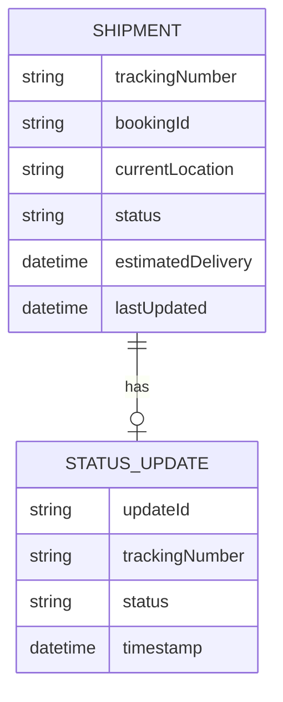

# For User Story Number 2

1. Objective
This requirement enables customers to track the real-time status of their air cargo shipments using a tracking number. The system provides current location, status updates, and estimated delivery time, with notifications sent for key status changes. Customers stay informed about their shipment throughout its journey.

2. API Model
  2.1 Common Components/Services
  - TrackingNumberValidatorService (new)
  - ShipmentTrackingService (new)
  - NotificationService (existing)
  - AirlineTrackingAPIService (new)

  2.2 API Details
  | Operation | REST Method | Type | URL | Request | Response |
  |-----------|------------|------|-----|---------|----------|
  | Track Shipment | GET | Success/Failure | /api/shipments/track/{trackingNumber} | N/A | {"trackingNumber": "TRK12345", "status": "In Transit", "location": "JFK", "estimatedDelivery": "2025-10-18T15:00", "lastUpdated": "2025-10-15T10:00"} |
  | Get Status Updates | GET | Success/Failure | /api/shipments/status/{trackingNumber} | N/A | [{"status": "Arrived at Airport", "timestamp": "2025-10-15T08:00"}, {"status": "Customs Clearance", "timestamp": "2025-10-16T09:00"}]
  | Send Notification | POST | Success/Failure | /api/notifications/send | {"trackingNumber": "TRK12345", "event": "Arrived at Airport", "contact": "customer@email.com"} | {"notificationStatus": "SENT"}

  2.3 Exceptions
  - InvalidTrackingNumberException
  - ShipmentNotFoundException
  - NotificationFailedException

3 Functional Design
  3.1 Class Diagram

  3.2 UML Sequence Diagram

  3.3 Components
  | Component Name | Description | Existing/New |
  |----------------|-------------|--------------|
  | TrackingController | Handles tracking API requests | New |
  | ShipmentTrackingService | Orchestrates tracking logic | New |
  | TrackingNumberValidatorService | Validates tracking numbers | New |
  | AirlineTrackingAPIService | Integrates with airline tracking APIs | New |
  | NotificationService | Sends notifications for status changes | Existing |

  3.4 Service Layer Logic & Validations
  | FieldName | Validation | Error Message | ClassUsed |
  |-----------|-----------|--------------|-----------|
  | trackingNumber | Valid and associated | Invalid tracking number | TrackingNumberValidatorService |
  | status | Accurate and timely | Status update not available | ShipmentTrackingService |
  | contact | Valid customer contact | Notification failed | NotificationService |

4 Integrations
  | SystemToBeIntegrated | IntegratedFor | IntegrationType |
  |---------------------|---------------|-----------------|
  | Airline Tracking System | Real-time shipment status | API |
  | Notification Service | Status change notifications | API |

5 DB Details
  5.1 ER Model

  5.2 DB Validations
  - Status updates must be timestamped and associated with a valid tracking number.
  - Estimated delivery must be updated on location/status change.

6 Non-Functional Requirements
  6.1 Performance
    - Real-time update latency <30 seconds.
    - Asynchronous API calls to airline tracking systems.
  6.2 Security
    6.2.1 Authentication
      - OAuth2 required for tracking APIs.
    6.2.2 Authorization
      - Only customers with valid tracking numbers can access shipment status.
  6.3 Logging
    6.3.1 Application Logging
      - DEBUG: API request/response payloads
      - INFO: Status updates, notifications sent
      - ERROR: Invalid tracking numbers, API failures
      - WARN: Delayed updates
    6.3.2 Audit Log
      - Log all tracking requests and notifications

7 Dependencies
  - Airline tracking system API
  - Notification service

8 Assumptions
  - Tracking numbers are unique and securely generated.
  - Airline APIs provide real-time data.
  - Customer contact details are accurate and available.
