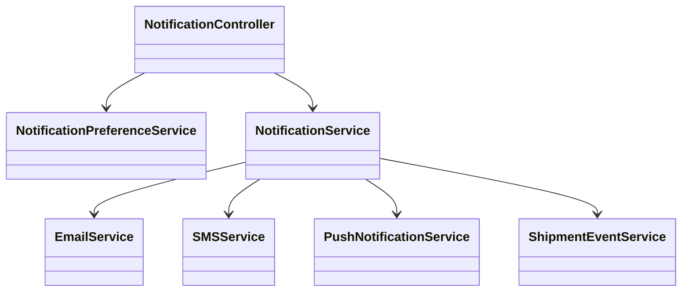
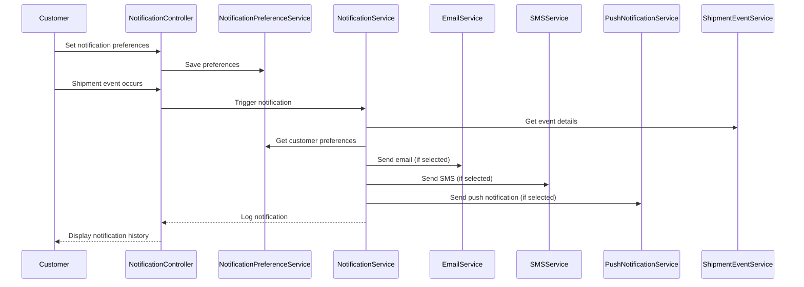
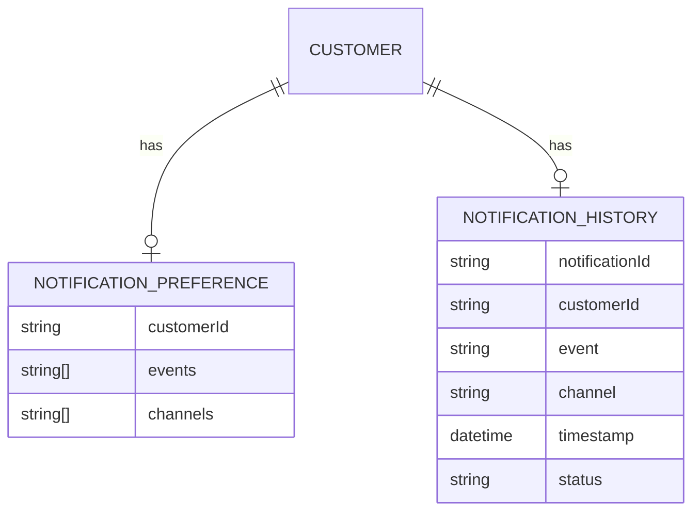

# For User Story Number 3

1. Objective
This requirement enables customers to receive automated notifications for important shipment events such as booking confirmation, departure, arrival, customs clearance, and delivery. Customers can manage notification preferences and choose their preferred channels (email, SMS, push). Notification history is available in the customer portal.

2. API Model
  2.1 Common Components/Services
  - NotificationPreferenceService (new)
  - NotificationService (existing)
  - EmailService (existing)
  - SMSService (existing)
  - PushNotificationService (existing)
  - ShipmentEventService (new)

  2.2 API Details
  | Operation | REST Method | Type | URL | Request | Response |
  |-----------|------------|------|-----|---------|----------|
  | Set Notification Preferences | POST | Success/Failure | /api/notifications/preferences | {"customerId": "CUST123", "events": ["Booking", "Departure"], "channels": ["email", "sms"]} | {"status": "SUCCESS"} |
  | Get Notification Preferences | GET | Success/Failure | /api/notifications/preferences/{customerId} | N/A | {"customerId": "CUST123", "events": ["Booking", "Departure"], "channels": ["email", "sms"]} |
  | Send Notification | POST | Success/Failure | /api/notifications/send | {"customerId": "CUST123", "event": "Departure", "channel": "sms"} | {"notificationStatus": "SENT"} |
  | Get Notification History | GET | Success/Failure | /api/notifications/history/{customerId} | N/A | [{"event": "Booking", "channel": "email", "timestamp": "2025-10-10T10:00"}]

  2.3 Exceptions
  - InvalidPreferenceException
  - NotificationSendFailedException
  - InvalidContactDetailsException

3 Functional Design
  3.1 Class Diagram

  3.2 UML Sequence Diagram

  3.3 Components
  | Component Name | Description | Existing/New |
  |----------------|-------------|--------------|
  | NotificationController | Handles notification API requests | New |
  | NotificationPreferenceService | Manages customer notification preferences | New |
  | NotificationService | Orchestrates notification logic | Existing |
  | EmailService | Sends email notifications | Existing |
  | SMSService | Sends SMS notifications | Existing |
  | PushNotificationService | Sends app push notifications | Existing |
  | ShipmentEventService | Detects shipment events | New |

  3.4 Service Layer Logic & Validations
  | FieldName | Validation | Error Message | ClassUsed |
  |-----------|-----------|--------------|-----------|
  | events | Valid shipment events | Invalid event type | NotificationPreferenceService |
  | channels | Valid notification channels | Invalid channel | NotificationPreferenceService |
  | contact | Valid contact details | Invalid contact details | NotificationService |
  | content | Accurate and relevant | Notification content error | NotificationService |

4 Integrations
  | SystemToBeIntegrated | IntegratedFor | IntegrationType |
  |---------------------|---------------|-----------------|
  | Email Service (SendGrid) | Email notifications | API |
  | SMS Service (Twilio) | SMS notifications | API |
  | Push Notification Service (Azure Notification Hubs) | Push notifications | API |

5 DB Details
  5.1 ER Model

  5.2 DB Validations
  - Notification preferences must be unique per customer.
  - Notification history must be logged for each sent notification.

6 Non-Functional Requirements
  6.1 Performance
    - Notification delivery time <60 seconds from event occurrence.
    - Asynchronous notification processing.
  6.2 Security
    6.2.1 Authentication
      - OAuth2 required for notification APIs.
    6.2.2 Authorization
      - Only authenticated customers can manage preferences and view history.
  6.3 Logging
    6.3.1 Application Logging
      - DEBUG: API request/response payloads
      - INFO: Notification sent, preference changes
      - ERROR: Notification failures, invalid preferences
      - WARN: Delayed notifications
    6.3.2 Audit Log
      - Log all notification events and preference changes

7 Dependencies
  - Email (SendGrid), SMS (Twilio), Push notification (Azure Notification Hubs) services

8 Assumptions
  - Customer contact details are accurate and available.
  - Notification channels are operational and integrated.
  - Shipment events are reliably detected and triggered.
