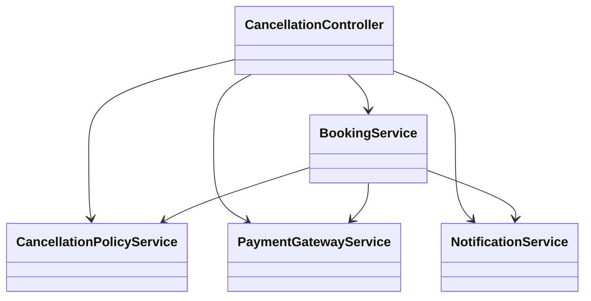
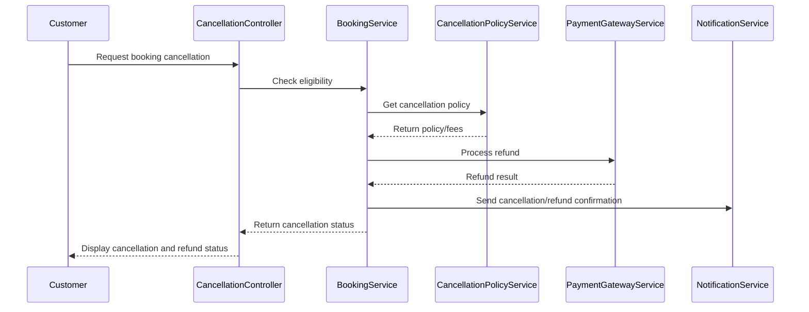
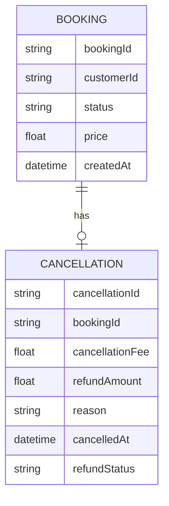

# For User Story Number 4

1. Objective
This requirement enables customers to cancel their air transport bookings and request refunds through the application. The system displays cancellation policies, calculates applicable fees, processes refunds via the original payment method, and sends confirmation of cancellation and refund status to the customer.

2. API Model
  2.1 Common Components/Services
  - BookingService (existing)
  - CancellationPolicyService (new)
  - PaymentGatewayService (existing)
  - NotificationService (existing)

  2.2 API Details
  | Operation | REST Method | Type | URL | Request | Response |
  |-----------|------------|------|-----|---------|----------|
  | Cancel Booking | POST | Success/Failure | /api/bookings/cancel | {"bookingId": "BKG12345", "reason": "Change of plans"} | {"status": "CANCELLED", "refundAmount": 900, "cancellationFee": 100} |
  | Get Cancellation Policy | GET | Success/Failure | /api/bookings/cancellation-policy/{bookingId} | N/A | {"bookingId": "BKG12345", "cancellationFee": 100, "refundable": true} |
  | Process Refund | POST | Success/Failure | /api/payments/refund | {"bookingId": "BKG12345", "amount": 900} | {"refundStatus": "SUCCESS", "transactionId": "TX98766"}

  2.3 Exceptions
  - BookingNotEligibleForCancellationException
  - RefundProcessingException
  - InvalidBookingIdException

3 Functional Design
  3.1 Class Diagram

  3.2 UML Sequence Diagram

  3.3 Components
  | Component Name | Description | Existing/New |
  |----------------|-------------|--------------|
  | CancellationController | Handles cancellation API requests | New |
  | BookingService | Manages booking logic and status | Existing |
  | CancellationPolicyService | Calculates cancellation fees and eligibility | New |
  | PaymentGatewayService | Processes refunds | Existing |
  | NotificationService | Sends cancellation/refund notifications | Existing |

  3.4 Service Layer Logic & Validations
  | FieldName | Validation | Error Message | ClassUsed |
  |-----------|-----------|--------------|-----------|
  | bookingId | Eligible for cancellation | Booking not eligible for cancellation | BookingService |
  | cancellationFee | Calculated per policy | Cancellation fee calculation error | CancellationPolicyService |
  | refundAmount | Accurate per policy | Refund amount error | CancellationPolicyService |
  | payment | Refund processed successfully | Refund processing failed | PaymentGatewayService |

4 Integrations
  | SystemToBeIntegrated | IntegratedFor | IntegrationType |
  |---------------------|---------------|-----------------|
  | Payment Gateway | Refund processing | API |
  | Notification Service | Cancellation/refund notifications | API |

5 DB Details
  5.1 ER Model

  5.2 DB Validations
  - Only eligible bookings can be cancelled.
  - Refund status must be updated after successful payment gateway response.

6 Non-Functional Requirements
  6.1 Performance
    - Refund processing time <24 hours.
    - Asynchronous refund processing.
  6.2 Security
    6.2.1 Authentication
      - OAuth2 required for cancellation APIs.
    6.2.2 Authorization
      - Only authenticated customers can cancel bookings.
  6.3 Logging
    6.3.1 Application Logging
      - DEBUG: API request/response payloads
      - INFO: Cancellation initiated, refund processed
      - ERROR: Refund failures, invalid cancellation requests
      - WARN: Delayed refund processing
    6.3.2 Audit Log
      - Log all cancellation and refund transactions

7 Dependencies
  - Payment gateway API
  - Notification service

8 Assumptions
  - Cancellation policies are clearly defined and up-to-date.
  - Payment gateway supports refund processing.
  - Customer contact details are accurate for notifications.
