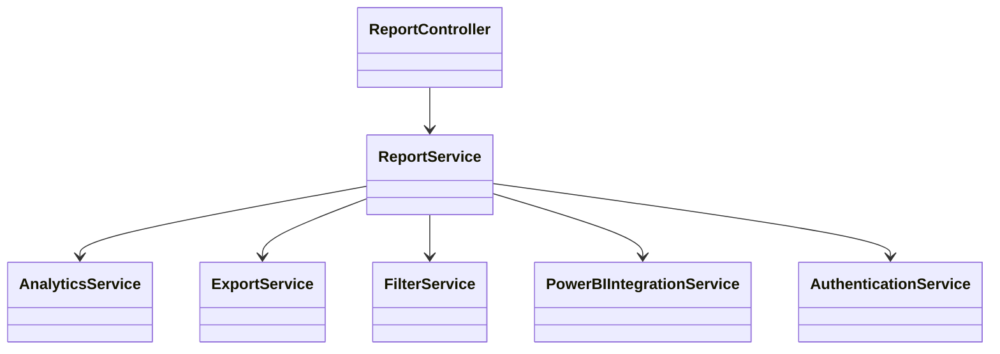
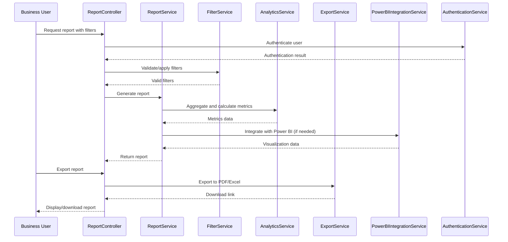
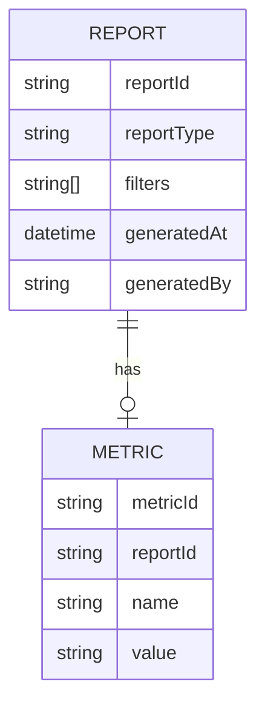

# For User Story Number 5

1. Objective
This requirement enables business users and administrators to generate analytics and reports on air transport shipments, including metrics such as total shipments, delivery times, cancellations, revenue, and customer satisfaction. Reports are exportable in PDF/Excel formats and support filtering by date, route, and customer. Data is updated in real-time or near real-time for informed decision-making.

2. API Model
  2.1 Common Components/Services
  - ReportService (new)
  - AnalyticsService (new)
  - ExportService (new)
  - FilterService (new)
  - PowerBIIntegrationService (new)
  - AuthenticationService (existing)

  2.2 API Details
  | Operation | REST Method | Type | URL | Request | Response |
  |-----------|------------|------|-----|---------|----------|
  | Generate Report | POST | Success/Failure | /api/reports/generate | {"reportType": "shipment", "filters": {"dateRange": ["2025-10-01", "2025-10-31"], "route": "JFK-LHR", "customer": "CUST123"}} | {"reportId": "RPT12345", "metrics": {"totalShipments": 100, "avgDeliveryTime": "48h", "cancellations": 5, "revenue": 120000}} |
  | Export Report | POST | Success/Failure | /api/reports/export | {"reportId": "RPT12345", "format": "PDF"} | {"exportStatus": "SUCCESS", "downloadUrl": "https://.../RPT12345.pdf"} |
  | Get Available Filters | GET | Success/Failure | /api/reports/filters | N/A | {"filters": ["dateRange", "route", "customer"]} |

  2.3 Exceptions
  - InvalidFilterException
  - ReportGenerationException
  - ExportFailedException
  - UnauthorizedAccessException

3 Functional Design
  3.1 Class Diagram

  3.2 UML Sequence Diagram

  3.3 Components
  | Component Name | Description | Existing/New |
  |----------------|-------------|--------------|
  | ReportController | Handles report API requests | New |
  | ReportService | Orchestrates report generation | New |
  | AnalyticsService | Aggregates and calculates metrics | New |
  | ExportService | Handles report export functionality | New |
  | FilterService | Validates and applies filters | New |
  | PowerBIIntegrationService | Integrates with Power BI for visualization | New |
  | AuthenticationService | Authenticates users and enforces access control | Existing |

  3.4 Service Layer Logic & Validations
  | FieldName | Validation | Error Message | ClassUsed |
  |-----------|-----------|--------------|-----------|
  | filters | Applied correctly to report data | Invalid filter | FilterService |
  | reportType | Valid report type | Invalid report type | ReportService |
  | exportFormat | PDF/Excel only | Invalid export format | ExportService |
  | user | Authorized for access | Unauthorized access | AuthenticationService |

4 Integrations
  | SystemToBeIntegrated | IntegratedFor | IntegrationType |
  |---------------------|---------------|-----------------|
  | Power BI | Data visualization | API |
  | PDF/Excel Export Service | Report export | API |
  | Authentication Service | Role-based access control | API |

5 DB Details
  5.1 ER Model

  5.2 DB Validations
  - Filters must be persisted with each report.
  - Metrics must be accurate and match displayed/exported data.
  - Access control must be enforced for sensitive reports.

6 Non-Functional Requirements
  6.1 Performance
    - Report generation time <10 seconds for standard filters.
    - Asynchronous report generation for large datasets.
  6.2 Security
    6.2.1 Authentication
      - OAuth2 required for report APIs.
    6.2.2 Authorization
      - Role-based access for analytics and reports.
  6.3 Logging
    6.3.1 Application Logging
      - DEBUG: API request/response payloads
      - INFO: Report generation, export events
      - ERROR: Filter/application/report failures
      - WARN: Delayed report generation
    6.3.2 Audit Log
      - Log all report generations and exports

7 Dependencies
  - Power BI API
  - PDF/Excel export service
  - Authentication service

8 Assumptions
  - Shipment data is accurate and up-to-date in the database.
  - Power BI integration is operational.
  - User roles and permissions are correctly configured.
