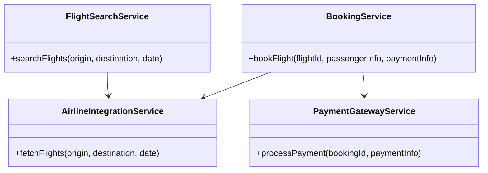
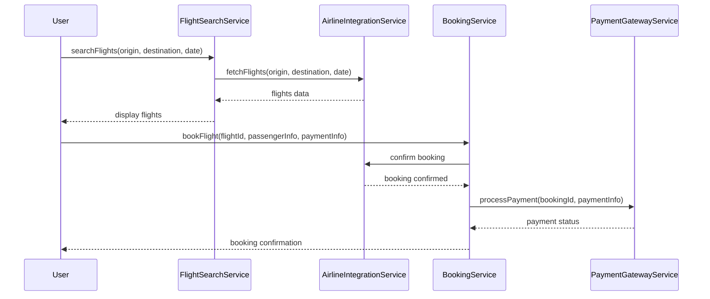
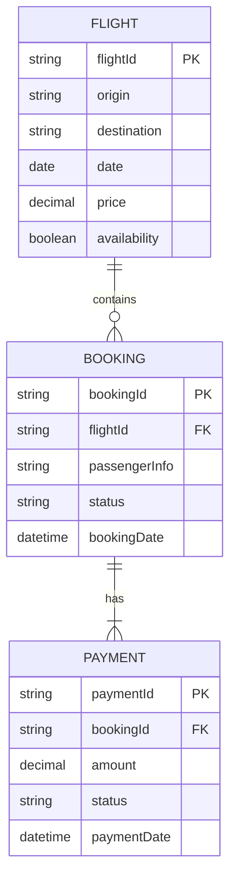

# For User Story Number 1

1. Objective
This requirement enables travelers to search for flights, compare prices, select preferred options, and book air transport tickets online. The system supports multiple airlines and provides real-time availability and pricing. Secure payment processing and seamless booking experience are key objectives.

2. API Model
2.1 Common Components/Services
- FlightSearchService (existing)
- PaymentGatewayService (existing)
- AirlineIntegrationService (new)
- BookingService (new)

2.2 API Details
| Operation      | REST Method | Type           | URL                           | Request (sample)                                                                 | Response (sample)                                                               |
|---------------|-------------|----------------|-------------------------------|----------------------------------------------------------------------------------|----------------------------------------------------------------------------------|
| Search Flights| GET         | Success/Failure| /api/flights/search           | {"origin": "JFK", "destination": "LAX", "date": "2025-07-01"}             | {"flights": [{"flightId": "AA101", "price": 300, "availability": true}]}   |
| Book Flight   | POST        | Success/Failure| /api/flights/book             | {"flightId": "AA101", "passengerInfo": {...}, "paymentInfo": {...}}          | {"bookingId": "BK123", "status": "CONFIRMED"}                                |
| Payment       | POST        | Success/Failure| /api/payments/process         | {"bookingId": "BK123", "paymentInfo": {...}}                                  | {"paymentStatus": "SUCCESS", "transactionId": "TX456"}                      |

2.3 Exceptions
- FlightNotFoundException
- InvalidAirportException
- InvalidDateException
- PaymentFailedException
- AirlineAPIException

3 Functional Design
3.1 Class Diagram

3.2 UML Sequence Diagram

3.3 Components
| Component Name           | Description                                         | Existing/New |
|-------------------------|-----------------------------------------------------|--------------|
| FlightSearchService     | Handles flight search logic                         | Existing     |
| AirlineIntegrationService| Integrates with external airline APIs               | New          |
| BookingService          | Manages booking transactions                        | New          |
| PaymentGatewayService   | Handles payment processing                          | Existing     |

3.4 Service Layer Logic and Validations
| FieldName      | Validation                                 | Error Message                 | ClassUsed                 |
|----------------|--------------------------------------------|-------------------------------|---------------------------|
| origin         | Must be valid airport code                  | Invalid origin airport        | FlightSearchService       |
| destination    | Must be valid airport code                  | Invalid destination airport   | FlightSearchService       |
| date           | Must be in the future                       | Invalid travel date           | FlightSearchService       |
| paymentInfo    | Must pass payment gateway validation        | Payment processing failed     | PaymentGatewayService     |

4 Integrations
| SystemToBeIntegrated | IntegratedFor           | IntegrationType |
|----------------------|------------------------|-----------------|
| Airline APIs         | Flight search & booking| API             |
| Payment Gateway      | Payment processing     | API             |

5 DB Details
5.1 ER Model

5.2 DB Validations
- Flight availability must be checked before booking.
- Booking status must be updated only after successful payment.

6 Non-Functional Requirements
6.1 Performance
- Flight search response time < 2 seconds.
- API endpoints optimized with caching for frequent queries.

6.2 Security
6.2.1 Authentication
- OAuth2/JWT authentication for all APIs.
- HTTPS enforced for all endpoints.
6.2.2 Authorization
- Role-based access for booking and payment APIs.

6.3 Logging
6.3.1 Application Logging
- DEBUG: API request/response payloads
- INFO: Successful bookings and payments
- ERROR: Payment failures, airline API errors
- WARN: Invalid search parameters
6.3.2 Audit Log
- Audit log for booking and payment transactions with event messages

7 Dependencies
- Airline API availability
- Payment gateway integration
- Valid airport code database

8 Assumptions
- All airlines provide RESTful APIs for flight data and booking
- Payment gateway is PCI-DSS compliant
- User authentication is handled by existing IAM solution
