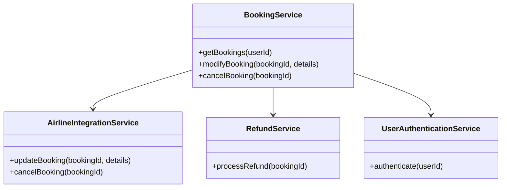
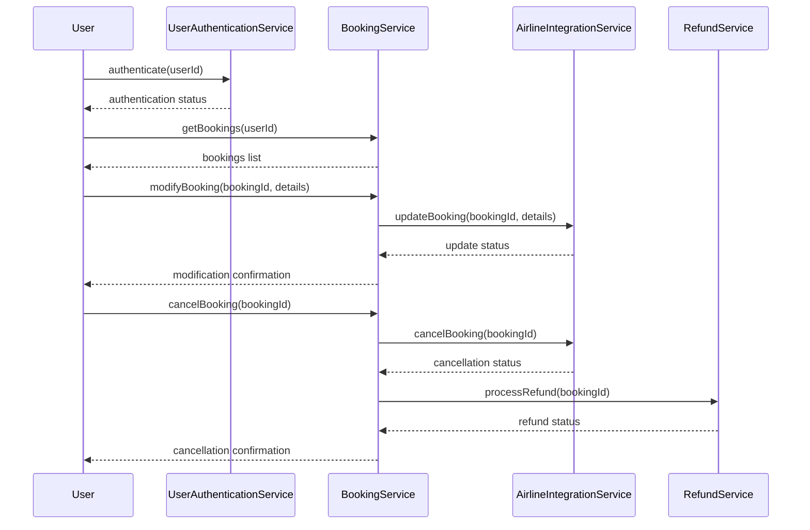
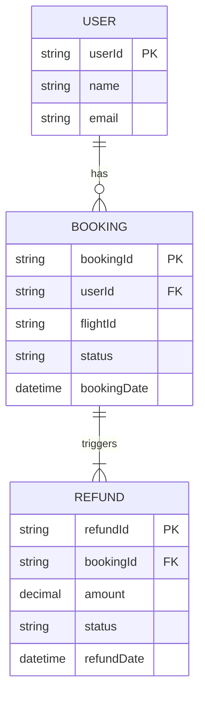

# For User Story Number 2

1. Objective
This requirement enables travelers to view, modify, and cancel their air transport bookings through a unified interface. The system enforces airline rules for modifications and cancellations, ensures secure access, and provides clear confirmations for all actions. Audit logging and timely updates are essential for reliability and compliance.

2. API Model
2.1 Common Components/Services
- BookingService (existing)
- AirlineIntegrationService (existing)
- RefundService (new)
- UserAuthenticationService (existing)

2.2 API Details
| Operation      | REST Method | Type           | URL                           | Request (sample)                                                                 | Response (sample)                                                               |
|---------------|-------------|----------------|-------------------------------|----------------------------------------------------------------------------------|----------------------------------------------------------------------------------|
| View Bookings | GET         | Success/Failure| /api/bookings                 | {"userId": "U123"}                                                             | {"bookings": [{"bookingId": "BK123", "flightId": "AA101", "status": "CONFIRMED"}]} |
| Modify Booking| PUT         | Success/Failure| /api/bookings/{bookingId}      | {"date": "2025-07-02", "seat": "12A"}                                       | {"bookingId": "BK123", "status": "MODIFIED"}                                |
| Cancel Booking| DELETE      | Success/Failure| /api/bookings/{bookingId}      |                                                                                  | {"bookingId": "BK123", "status": "CANCELLED", "refundStatus": "PENDING"} |

2.3 Exceptions
- BookingNotFoundException
- ModificationWindowExpiredException
- CancellationPolicyException
- UnauthorizedAccessException
- AirlineAPIException

3 Functional Design
3.1 Class Diagram

3.2 UML Sequence Diagram

3.3 Components
| Component Name           | Description                                         | Existing/New |
|-------------------------|-----------------------------------------------------|--------------|
| BookingService          | Manages booking retrieval, modification, cancellation| Existing     |
| AirlineIntegrationService| Integrates with airline APIs for booking management | Existing     |
| RefundService           | Handles refund processing for cancellations         | New          |
| UserAuthenticationService| Authenticates users for booking management          | Existing     |

3.4 Service Layer Logic and Validations
| FieldName      | Validation                                 | Error Message                 | ClassUsed                 |
|----------------|--------------------------------------------|-------------------------------|---------------------------|
| bookingId      | Must exist and belong to user              | Booking not found             | BookingService            |
| modification   | Within allowed window                      | Modification not allowed      | BookingService            |
| cancellation   | Policy enforcement                         | Cancellation not allowed      | BookingService            |
| userId         | Must be authenticated                      | Unauthorized access           | UserAuthenticationService |

4 Integrations
| SystemToBeIntegrated | IntegratedFor           | IntegrationType |
|----------------------|------------------------|-----------------|
| Airline APIs         | Booking modification/cancellation| API             |
| Refund System        | Refund processing       | API             |
| IAM/Auth System      | User authentication     | API             |

5 DB Details
5.1 ER Model

5.2 DB Validations
- Booking modification/cancellation allowed only within permitted window.
- Refund status must be updated after cancellation.

6 Non-Functional Requirements
6.1 Performance
- Booking update response time < 3 seconds.
- Optimized DB queries for booking retrieval.

6.2 Security
6.2.1 Authentication
- OAuth2/JWT authentication for all APIs.
- HTTPS enforced for all endpoints.
6.2.2 Authorization
- Only booking owners can modify/cancel their bookings.

6.3 Logging
6.3.1 Application Logging
- DEBUG: API request/response payloads
- INFO: Successful modifications and cancellations
- ERROR: Airline API errors, unauthorized access
- WARN: Attempted modifications outside allowed window
6.3.2 Audit Log
- Audit log for booking changes and cancellations

7 Dependencies
- Airline API availability
- Refund system integration
- IAM/Auth system

8 Assumptions
- Airlines support booking modification/cancellation via API
- Refunds are processed automatically for eligible cancellations
- User authentication is handled by existing IAM solution
