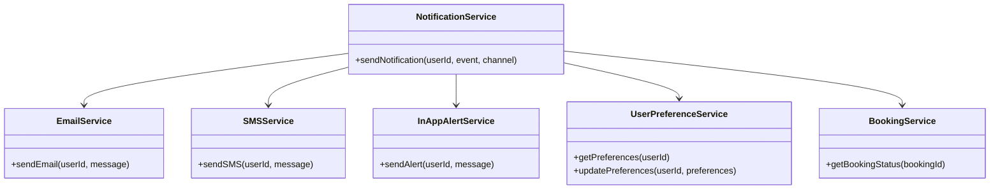
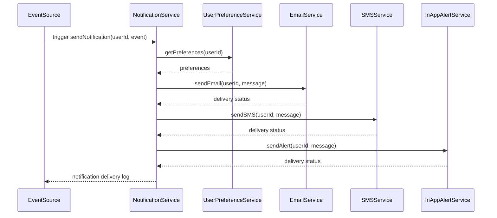
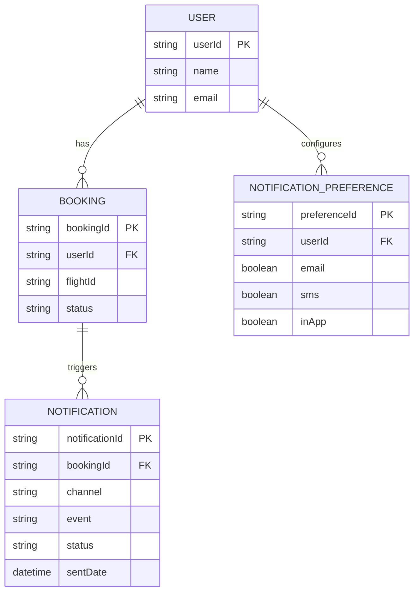

# For User Story Number 3

1. Objective
This requirement enables travelers to receive timely notifications regarding their air transport bookings, including confirmations, schedule changes, reminders, and gate updates. Notifications are delivered via email, SMS, and in-app alerts based on user preferences. The system ensures secure, reliable, and auditable notification delivery.

2. API Model
2.1 Common Components/Services
- NotificationService (new)
- BookingService (existing)
- UserPreferenceService (existing)
- EmailService (existing)
- SMSService (existing)
- InAppAlertService (new)

2.2 API Details
| Operation         | REST Method | Type           | URL                                 | Request (sample)                                                    | Response (sample)                                                   |
|-------------------|-------------|----------------|-------------------------------------|---------------------------------------------------------------------|---------------------------------------------------------------------|
| Send Notification | POST        | Success/Failure| /api/notifications/send             | {"userId": "U123", "event": "BOOKING_CONFIRMED", "channel": "EMAIL"} | {"notificationId": "N789", "status": "SENT"}                  |
| Get Preferences   | GET         | Success/Failure| /api/users/{userId}/preferences     |                                                                     | {"preferences": {"email": true, "sms": false, "inApp": true}}  |
| Update Preferences| PUT         | Success/Failure| /api/users/{userId}/preferences     | {"preferences": {"email": true, "sms": true, "inApp": true}}   | {"status": "UPDATED"}                                            |

2.3 Exceptions
- NotificationChannelException
- InvalidUserPreferenceException
- NotificationDeliveryException
- BookingNotFoundException

3 Functional Design
3.1 Class Diagram

3.2 UML Sequence Diagram

3.3 Components
| Component Name           | Description                                         | Existing/New |
|-------------------------|-----------------------------------------------------|--------------|
| NotificationService     | Orchestrates notification delivery                   | New          |
| BookingService          | Provides booking status for notification triggers    | Existing     |
| UserPreferenceService   | Manages user notification preferences                | Existing     |
| EmailService            | Sends email notifications                           | Existing     |
| SMSService              | Sends SMS notifications                             | Existing     |
| InAppAlertService       | Sends in-app alerts                                 | New          |

3.4 Service Layer Logic and Validations
| FieldName      | Validation                                 | Error Message                 | ClassUsed                 |
|----------------|--------------------------------------------|-------------------------------|---------------------------|
| userId         | Must exist and have active bookings         | Booking not found             | BookingService            |
| preferences    | Must be valid and configurable             | Invalid notification preference| UserPreferenceService     |
| event          | Must be relevant to active booking          | Irrelevant notification event | NotificationService       |
| channel        | Must be supported (email, sms, inApp)      | Notification channel error    | NotificationService       |

4 Integrations
| SystemToBeIntegrated | IntegratedFor           | IntegrationType |
|----------------------|------------------------|-----------------|
| Email API            | Email notifications    | API             |
| SMS API              | SMS notifications      | API             |
| In-app alert system  | In-app notifications   | API             |
| Booking system       | Booking status/events  | API             |

5 DB Details
5.1 ER Model

5.2 DB Validations
- Notification preferences must be set before sending notifications.
- Notification delivery status must be logged.

6 Non-Functional Requirements
6.1 Performance
- Notification delivery within 1 minute of event.
- Scalable messaging infrastructure.

6.2 Security
6.2.1 Authentication
- OAuth2/JWT authentication for all APIs.
- HTTPS enforced for all endpoints.
6.2.2 Authorization
- Only booking owners receive notifications.

6.3 Logging
6.3.1 Application Logging
- DEBUG: Notification payloads and delivery attempts
- INFO: Successful notification deliveries
- ERROR: Notification delivery failures
- WARN: Preference misconfigurations
6.3.2 Audit Log
- Audit log for notification events and delivery status

7 Dependencies
- Email and SMS API availability
- Booking system event triggers
- User preference configuration

8 Assumptions
- Users have valid contact information for notifications
- All notification channels are reliably integrated
- Booking system provides event hooks for notifications
