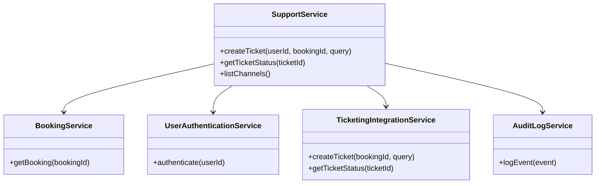
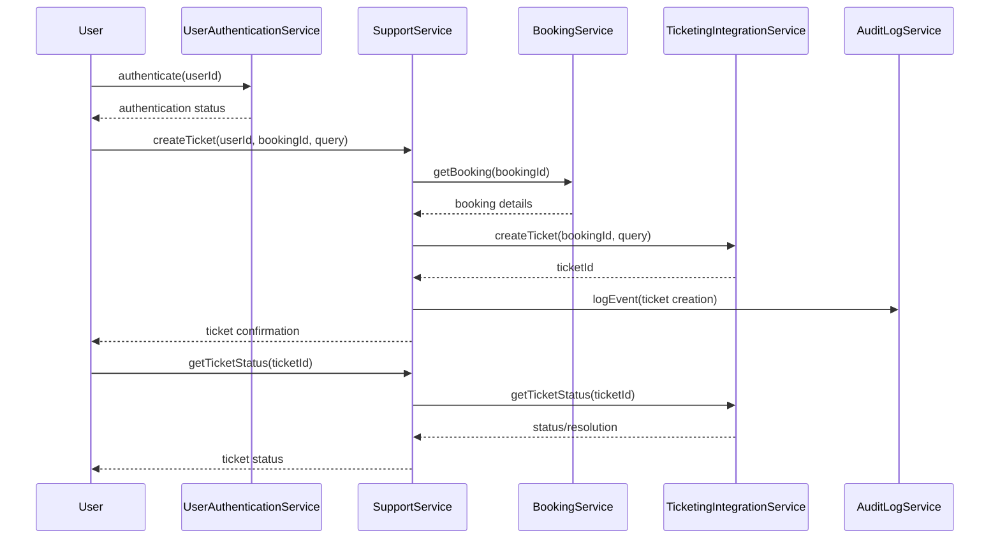
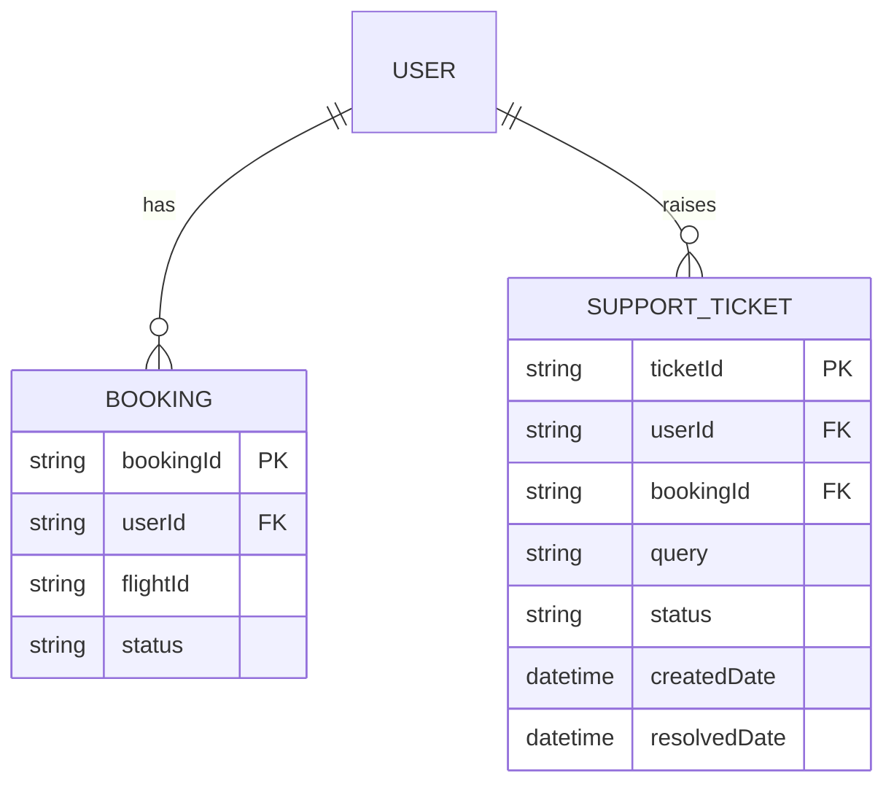

# For User Story Number 4

1. Objective
This requirement enables travelers to access customer support for air transport bookings via multiple channels (live chat, email, phone). The system allows users to raise queries related to bookings, cancellations, refunds, and flight status, tracks support requests, and ensures timely responses and auditability.

2. API Model
2.1 Common Components/Services
- SupportService (new)
- BookingService (existing)
- UserAuthenticationService (existing)
- TicketingIntegrationService (new)
- AuditLogService (existing)

2.2 API Details
| Operation         | REST Method | Type           | URL                                 | Request (sample)                                                    | Response (sample)                                                   |
|-------------------|-------------|----------------|-------------------------------------|---------------------------------------------------------------------|---------------------------------------------------------------------|
| Create Support Ticket | POST    | Success/Failure| /api/support/tickets                | {"userId": "U123", "bookingId": "BK123", "query": "Refund status"} | {"ticketId": "T456", "status": "OPEN"}                        |
| Get Ticket Status | GET         | Success/Failure| /api/support/tickets/{ticketId}     |                                                                     | {"ticketId": "T456", "status": "RESOLVED", "resolution": "Refund processed"} |
| List Support Channels | GET     | Success/Failure| /api/support/channels               |                                                                     | {"channels": ["chat", "email", "phone"]}                      |

2.3 Exceptions
- InvalidBookingException
- UnauthorizedAccessException
- TicketingAPIException
- SupportChannelUnavailableException

3 Functional Design
3.1 Class Diagram

3.2 UML Sequence Diagram

3.3 Components
| Component Name           | Description                                         | Existing/New |
|-------------------------|-----------------------------------------------------|--------------|
| SupportService          | Manages support ticket creation and status tracking  | New          |
| BookingService          | Provides booking validation for support requests     | Existing     |
| UserAuthenticationService| Authenticates users for support access              | Existing     |
| TicketingIntegrationService| Integrates with external ticketing system         | New          |
| AuditLogService         | Logs all support-related events                      | Existing     |

3.4 Service Layer Logic and Validations
| FieldName      | Validation                                 | Error Message                 | ClassUsed                 |
|----------------|--------------------------------------------|-------------------------------|---------------------------|
| bookingId      | Must exist and belong to user              | Invalid booking               | BookingService            |
| userId         | Must be authenticated                      | Unauthorized access           | UserAuthenticationService |
| query          | Must be non-empty                          | Query cannot be empty         | SupportService            |
| channel        | Must be available                          | Support channel unavailable   | SupportService            |

4 Integrations
| SystemToBeIntegrated | IntegratedFor           | IntegrationType |
|----------------------|------------------------|-----------------|
| Ticketing System     | Support ticket management| API             |
| IAM/Auth System      | User authentication     | API             |
| Audit Log System     | Event logging           | API             |

5 DB Details
5.1 ER Model

5.2 DB Validations
- Support tickets must be linked to valid bookings.
- Only authenticated users can create support tickets.

6 Non-Functional Requirements
6.1 Performance
- Support response within 15 minutes for chat, 1 hour for email.
- Scalable ticketing infrastructure.

6.2 Security
6.2.1 Authentication
- OAuth2/JWT authentication for all APIs.
- HTTPS enforced for all endpoints.
6.2.2 Authorization
- Only booking owners can raise booking-related support tickets.

6.3 Logging
6.3.1 Application Logging
- DEBUG: Support ticket creation and updates
- INFO: Ticket resolution events
- ERROR: Ticketing API errors, unauthorized access
- WARN: Invalid booking references
6.3.2 Audit Log
- Audit log for all support ticket events and communications

7 Dependencies
- Ticketing system API availability
- IAM/Auth system
- Audit log system

8 Assumptions
- Ticketing system supports API integration
- All support channels are available and reliable
- User authentication is handled by existing IAM solution
