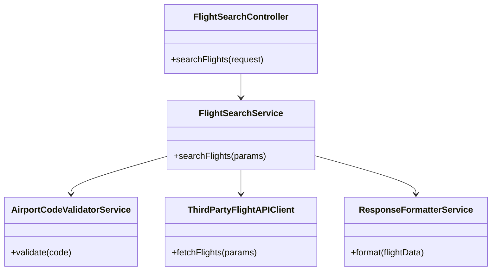
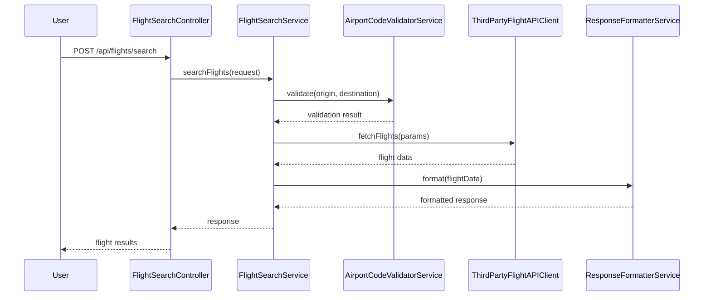
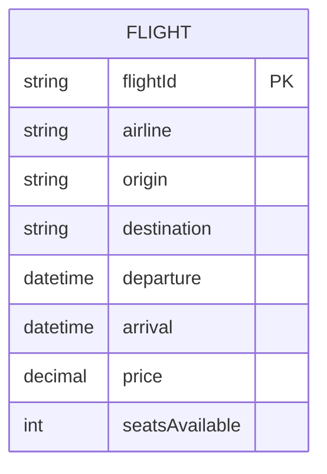

# For User Story Number [1]

1. Objective
The objective is to enable travelers to search for available flights based on origin, destination, date, and number of passengers. The system must validate input parameters and display a list of matching flights with airline, timings, price, and seat availability. The solution should be efficient, secure, and scalable for high user concurrency.

2. API Model
2.1 Common Components/Services
- AirportCodeValidatorService (validates airport codes)
- FlightSearchService (handles flight search logic)
- ThirdPartyFlightAPIClient (integrates with external flight data provider)
- ResponseFormatterService (formats API responses)

2.2 API Details
| Operation | REST Method | Type | URL | Request | Response |
|-----------|------------|------|-----|---------|----------|
| Search Flights | POST | Success | /api/flights/search | `{ "origin": "JFK", "destination": "LAX", "date": "2025-12-01", "passengers": 2 }` | `{ "flights": [ { "airline": "Delta", "departure": "2025-12-01T08:00:00", "arrival": "2025-12-01T11:00:00", "price": 320.00, "seatsAvailable": 5 } ] }` |
| Search Flights | POST | Failure | /api/flights/search | `{ "origin": "XXX", "destination": "LAX", "date": "2020-01-01", "passengers": -1 }` | `{ "error": "Invalid search parameters" }` |

2.3 Exceptions
| API | Exception | Description |
|-----|-----------|-------------|
| /api/flights/search | InvalidAirportCodeException | Origin or destination is not a valid airport code |
| /api/flights/search | InvalidDateException | Date is in the past |
| /api/flights/search | InvalidPassengerCountException | Number of passengers is not a positive integer |
| /api/flights/search | ThirdPartyAPIException | Error from external flight data provider |

3 Functional Design
3.1 Class Diagram

3.2 UML Sequence Diagram

3.3 Components
| Component Name | Description | Existing/New |
|----------------|-------------|--------------|
| FlightSearchController | REST endpoint for flight search | New |
| FlightSearchService | Business logic for searching flights | New |
| AirportCodeValidatorService | Validates airport codes | New |
| ThirdPartyFlightAPIClient | Integrates with external flight data API | New |
| ResponseFormatterService | Formats flight search results | New |

3.4 Service Layer Logic and Validations
| FieldName | Validation | Error Message | ClassUsed |
|-----------|-----------|---------------|-----------|
| origin | Must be valid airport code | Invalid origin airport code | AirportCodeValidatorService |
| destination | Must be valid airport code | Invalid destination airport code | AirportCodeValidatorService |
| date | Must be in the future | Date must be in the future | FlightSearchService |
| passengers | Must be positive integer | Number of passengers must be positive | FlightSearchService |

4 Integrations
| SystemToBeIntegrated | IntegratedFor | IntegrationType |
|----------------------|---------------|-----------------|
| Amadeus Flight API | Fetching flight data | API |

5 DB Details
5.1 ER Model

5.2 DB Validations
- None (flight data is fetched from external API, not persisted)

6 Non-Functional Requirements
6.1 Performance
- API response time < 2 seconds
- Efficient querying and filtering of flight data
- Caching of frequent search queries at API layer (optional)

6.2 Security
6.2.1 Authentication
- API endpoints secured via HTTPS
- JWT/OAuth2 authentication for user sessions

6.2.2 Authorization
- Only authenticated users can perform flight search

6.3 Logging
6.3.1 Application Logging
- DEBUG: Incoming requests, outgoing responses
- INFO: Successful searches
- ERROR: Validation failures, third-party API errors
- WARN: Slow responses (>1.5 seconds)

6.3.2 Audit Log
- Audit log for all search requests with timestamp, userId, parameters

7 Dependencies
- Amadeus or similar flight data provider API
- Airport code validation library/service

8 Assumptions
- All airport codes are IATA standard
- Flight data is always up-to-date from provider
- No persistence of search results in local DB
