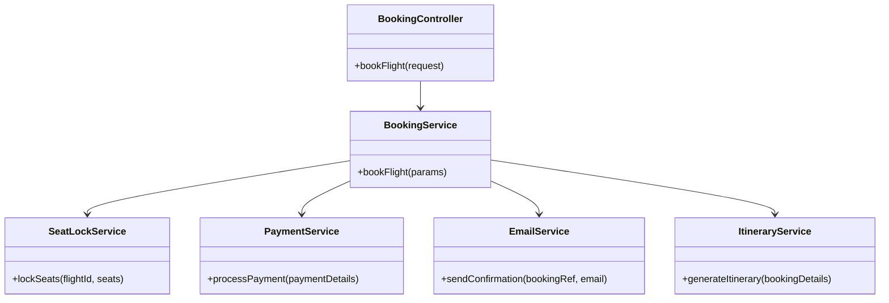
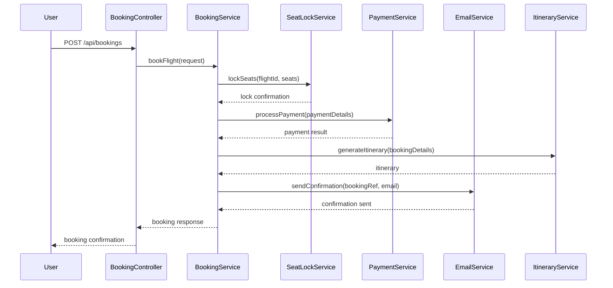
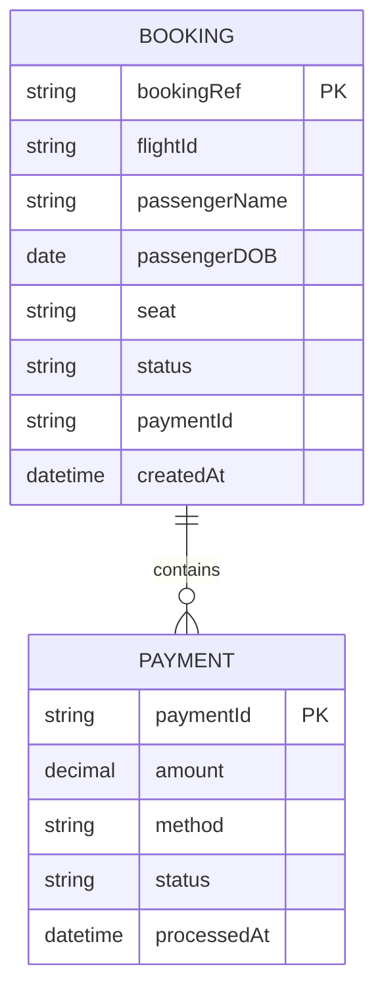

# For User Story Number [2]

1. Objective
Enable travelers to book selected flights by entering passenger details, choosing seats, and making payments. The system must lock seats during booking, validate payment, and provide confirmation and itinerary. The solution should ensure secure, reliable, and fast transaction processing.

2. API Model
2.1 Common Components/Services
- BookingService (handles booking logic)
- SeatLockService (locks seats during booking)
- PaymentService (integrates with payment gateway)
- EmailService (sends confirmation)
- ItineraryService (generates itinerary)

2.2 API Details
| Operation | REST Method | Type | URL | Request | Response |
|-----------|------------|------|-----|---------|----------|
| Book Flight | POST | Success | /api/bookings | `{ "flightId": "DL123", "passengers": [{"name": "John Doe", "dob": "1990-01-01"}], "seats": ["12A"], "payment": {"method": "card", "details": {...}} }` | `{ "bookingRef": "ABC123", "status": "CONFIRMED", "itinerary": "<pdf-url>" }` |
| Book Flight | POST | Failure | /api/bookings | `{ "flightId": "DL123", "passengers": [], "seats": ["12A"], "payment": {"method": "card", "details": {...}} }` | `{ "error": "Passenger details required" }` |

2.3 Exceptions
| API | Exception | Description |
|-----|-----------|-------------|
| /api/bookings | MissingPassengerDetailsException | Required passenger info missing |
| /api/bookings | PaymentAuthorizationException | Payment failed or not authorized |
| /api/bookings | SeatUnavailableException | Selected seat not available |
| /api/bookings | ThirdPartyPaymentException | Error from payment gateway |

3 Functional Design
3.1 Class Diagram

3.2 UML Sequence Diagram

3.3 Components
| Component Name | Description | Existing/New |
|----------------|-------------|--------------|
| BookingController | REST endpoint for booking flights | New |
| BookingService | Business logic for booking | New |
| SeatLockService | Locks seats during booking | New |
| PaymentService | Handles payment processing | New |
| EmailService | Sends confirmation email | New |
| ItineraryService | Generates itinerary PDF | New |

3.4 Service Layer Logic and Validations
| FieldName | Validation | Error Message | ClassUsed |
|-----------|-----------|---------------|-----------|
| passengers | Must be non-empty array | Passenger details required | BookingService |
| payment | Must be authorized and successful | Payment failed | PaymentService |
| seats | Must be available | Selected seat not available | SeatLockService |

4 Integrations
| SystemToBeIntegrated | IntegratedFor | IntegrationType |
|----------------------|---------------|-----------------|
| Stripe/PayPal | Payment processing | API |
| Email Provider (SendGrid) | Confirmation email | API |
| PDF Generator | Itinerary generation | API |

5 DB Details
5.1 ER Model

5.2 DB Validations
- BookingRef must be unique
- Payment status must be 'AUTHORIZED' for booking to be confirmed

6 Non-Functional Requirements
6.1 Performance
- Transaction completion < 5 seconds
- High concurrency supported for booking engine

6.2 Security
6.2.1 Authentication
- API endpoints secured via HTTPS
- JWT/OAuth2 authentication for user sessions

6.2.2 Authorization
- Only authenticated users can book flights
- PCI DSS compliance for payment processing

6.3 Logging
6.3.1 Application Logging
- DEBUG: Incoming booking requests, payment payloads
- INFO: Successful bookings
- ERROR: Payment failures, seat lock failures
- WARN: Slow transaction (>4 seconds)

6.3.2 Audit Log
- Audit log for all booking and payment events with timestamp, userId, bookingRef

7 Dependencies
- Stripe/PayPal payment gateway
- Email provider (SendGrid)
- PDF generator service

8 Assumptions
- Payment gateway is always available
- Seats can be locked for at least 5 minutes during booking
- Email delivery is reliable
