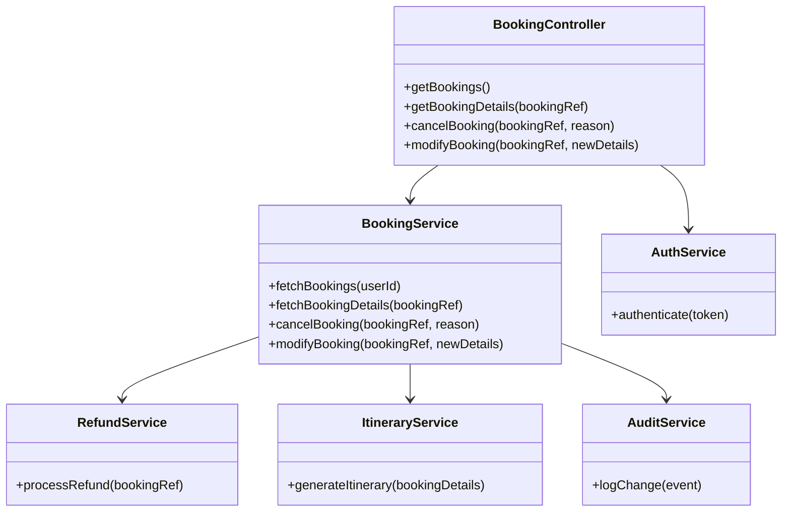
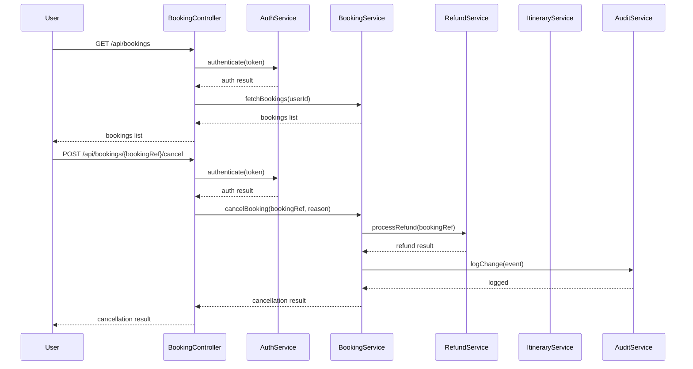
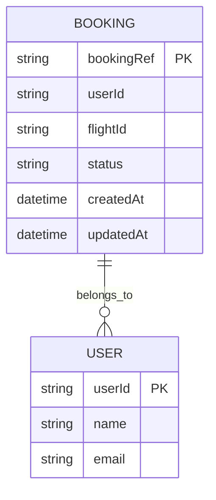

# For User Story Number [3]

1. Objective
Enable travelers to view and manage their flight bookings through a secure dashboard. Users should be able to review details, download itineraries, and modify or cancel bookings within allowed policies. The system must ensure secure access, policy compliance, and auditability of booking changes.

2. API Model
2.1 Common Components/Services
- BookingService (handles booking retrieval and management)
- AuthService (handles user authentication)
- RefundService (processes refunds)
- ItineraryService (generates itineraries)
- AuditService (logs booking changes)

2.2 API Details
| Operation | REST Method | Type | URL | Request | Response |
|-----------|------------|------|-----|---------|----------|
| Get Bookings | GET | Success | /api/bookings | N/A | `{ "bookings": [ { "bookingRef": "ABC123", "flightId": "DL123", "status": "CONFIRMED" } ] }` |
| Get Booking Details | GET | Success | /api/bookings/{bookingRef} | N/A | `{ "bookingRef": "ABC123", "details": {...}, "itinerary": "<pdf-url>" }` |
| Cancel Booking | POST | Success | /api/bookings/{bookingRef}/cancel | `{ "reason": "Change of plans" }` | `{ "status": "CANCELLED", "refund": 120.00 }` |
| Modify Booking | POST | Success | /api/bookings/{bookingRef}/modify | `{ "newDetails": {...} }` | `{ "status": "MODIFIED", "details": {...} }` |
| Cancel/Modify | POST | Failure | /api/bookings/{bookingRef}/cancel or /modify | `{ "reason": "Late" }` | `{ "error": "Modification/Cancellation not allowed as per policy" }` |

2.3 Exceptions
| API | Exception | Description |
|-----|-----------|-------------|
| /api/bookings | AuthenticationException | User not authenticated |
| /api/bookings/{bookingRef}/cancel | PolicyViolationException | Cancellation not allowed as per policy |
| /api/bookings/{bookingRef}/modify | PolicyViolationException | Modification not allowed as per policy |
| /api/bookings/{bookingRef}/cancel | RefundProcessingException | Refund failed |

3 Functional Design
3.1 Class Diagram

3.2 UML Sequence Diagram

3.3 Components
| Component Name | Description | Existing/New |
|----------------|-------------|--------------|
| BookingController | REST endpoints for booking management | New |
| BookingService | Business logic for booking management | New |
| AuthService | Handles authentication | New |
| RefundService | Processes refunds | New |
| ItineraryService | Generates itinerary PDF | New |
| AuditService | Logs all booking changes | New |

3.4 Service Layer Logic and Validations
| FieldName | Validation | Error Message | ClassUsed |
|-----------|-----------|---------------|-----------|
| userId | Must be authenticated | Authentication required | AuthService |
| bookingRef | Must exist and belong to user | Booking not found | BookingService |
| cancellation/modification | Allowed only as per policy | Not allowed by policy | BookingService |
| refund | Processed as per fare rules | Refund failed | RefundService |

4 Integrations
| SystemToBeIntegrated | IntegratedFor | IntegrationType |
|----------------------|---------------|-----------------|
| Airline Booking System | Booking status, modifications | API |
| PDF Generator | Itinerary download | API |
| Audit Log System | Booking changes | API |

5 DB Details
5.1 ER Model

5.2 DB Validations
- BookingRef must be unique
- Only bookings belonging to userId can be accessed

6 Non-Functional Requirements
6.1 Performance
- Dashboard scalable to 10,000 concurrent users
- API response time < 2 seconds

6.2 Security
6.2.1 Authentication
- OAuth2 authentication for all endpoints
- Secure REST API via HTTPS

6.2.2 Authorization
- Users can access only their own bookings
- GDPR compliance for user data

6.3 Logging
6.3.1 Application Logging
- DEBUG: API requests/responses
- INFO: Successful booking changes
- ERROR: Policy violations, refund failures
- WARN: Slow dashboard responses

6.3.2 Audit Log
- Audit trail for all booking changes with timestamp, userId, bookingRef

7 Dependencies
- Airline booking system API
- PDF generator service
- Audit log system

8 Assumptions
- Airline policy data is always up-to-date
- Refunds are processed instantly
- PDF generator is reliable
