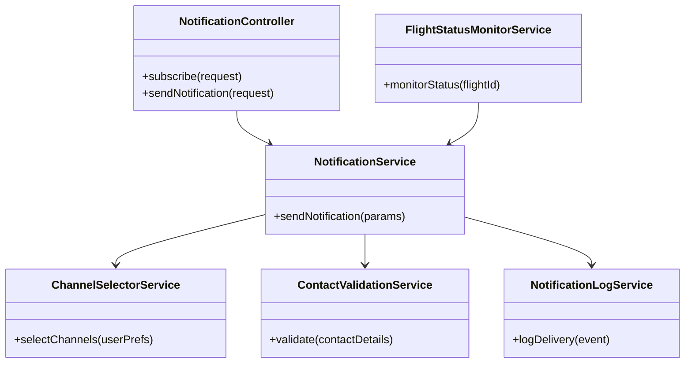
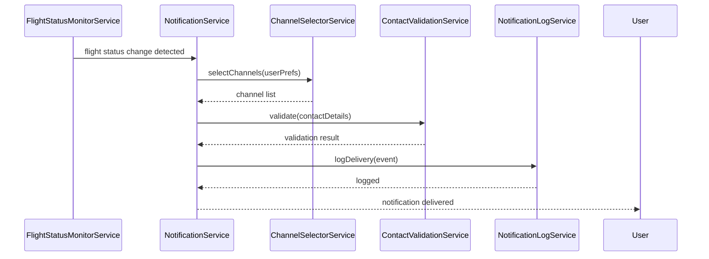
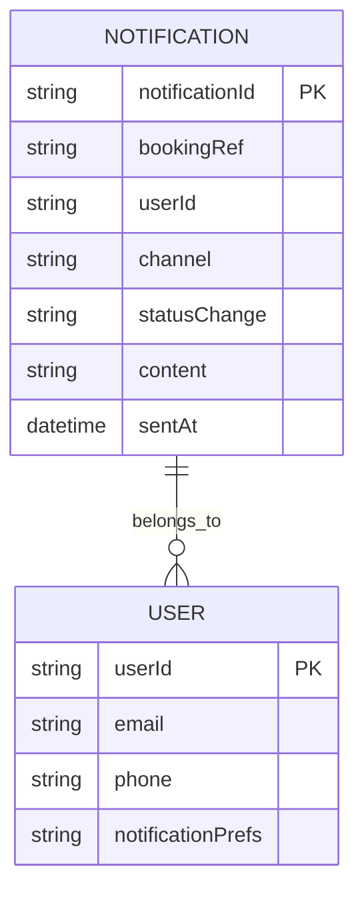

# For User Story Number [4]

1. Objective
Enable travelers to receive real-time notifications about flight status changes, including delays, cancellations, and gate changes. Notifications should be sent via user-preferred channels (email, SMS, in-app) and be clear and actionable. The system must ensure timely, reliable, and secure delivery of notifications.

2. API Model
2.1 Common Components/Services
- NotificationService (handles notification logic)
- ChannelSelectorService (chooses preferred channels)
- FlightStatusMonitorService (monitors flight status)
- ContactValidationService (validates user contact details)
- NotificationLogService (logs delivery events)

2.2 API Details
| Operation | REST Method | Type | URL | Request | Response |
|-----------|------------|------|-----|---------|----------|
| Subscribe to Notifications | POST | Success | /api/notifications/subscribe | `{ "bookingRef": "ABC123", "channels": ["email", "sms"] }` | `{ "status": "SUBSCRIBED" }` |
| Notify Flight Status Change | POST | Success | /api/notifications/send | `{ "bookingRef": "ABC123", "statusChange": "DELAY", "details": {...} }` | `{ "status": "SENT", "channels": ["email", "sms"] }` |
| Notify Flight Status Change | POST | Failure | /api/notifications/send | `{ "bookingRef": "ABC123", "statusChange": "DELAY" }` | `{ "error": "Contact details invalid" }` |

2.3 Exceptions
| API | Exception | Description |
|-----|-----------|-------------|
| /api/notifications/subscribe | InvalidContactException | Contact details not valid or verified |
| /api/notifications/send | DuplicateNotificationException | Notification already sent for this event |
| /api/notifications/send | NotificationDeliveryException | Delivery failed on one or more channels |

3 Functional Design
3.1 Class Diagram

3.2 UML Sequence Diagram

3.3 Components
| Component Name | Description | Existing/New |
|-------------------------|--------------------------------------|--------------|
| NotificationController | REST endpoints for notifications | New |
| NotificationService | Business logic for notifications | New |
| ChannelSelectorService | Selects user-preferred channels | New |
| FlightStatusMonitorService | Monitors flight status changes | New |
| ContactValidationService | Validates contact details | New |
| NotificationLogService | Logs notification delivery | New |

3.4 Service Layer Logic and Validations
| FieldName | Validation | Error Message | ClassUsed |
|-----------|-----------|---------------|-----------|
| contactDetails | Must be valid and verified | Contact details invalid | ContactValidationService |
| bookingRef | Must belong to user | Booking not found | NotificationService |
| notification | No duplicates for same event | Duplicate notification | NotificationService |

4 Integrations
| SystemToBeIntegrated | IntegratedFor | IntegrationType |
|----------------------|---------------|-----------------|
| Airline Status API | Flight status monitoring | API |
| Twilio | SMS notifications | API |
| SendGrid | Email notifications | API |
| Audit Log System | Notification delivery logs | API |

5 DB Details
5.1 ER Model

5.2 DB Validations
- notificationId must be unique
- No duplicate notifications for same bookingRef and statusChange

6 Non-Functional Requirements
6.1 Performance
- Real-time notification delivery (<1 minute)
- Scalable to 100,000 notifications/day

6.2 Security
6.2.1 Authentication
- Secure REST API via HTTPS
- Encrypted user data

6.2.2 Authorization
- Notifications sent only for flights booked by user

6.3 Logging
6.3.1 Application Logging
- DEBUG: Notification payloads
- INFO: Successful deliveries
- ERROR: Delivery failures
- WARN: Delayed notifications

6.3.2 Audit Log
- Audit log for all notification events with timestamp, userId, bookingRef

7 Dependencies
- Airline status API
- Twilio SMS service
- SendGrid email service
- Audit log system

8 Assumptions
- User contact details are always up-to-date
- Notification services are highly available
- Flight status changes are received in real time
