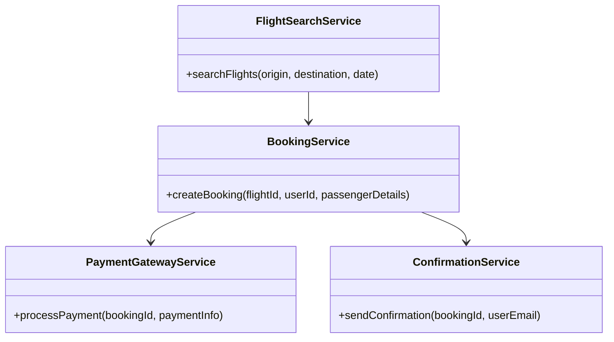
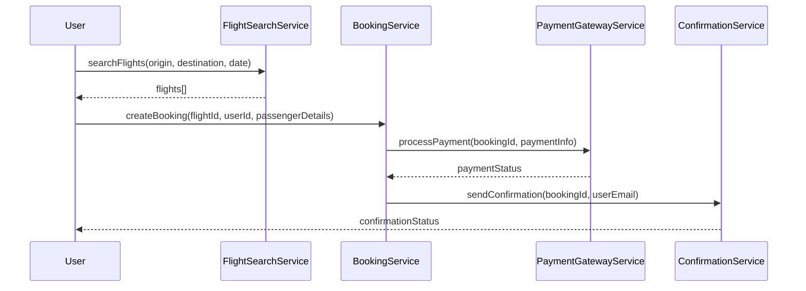

# For User Story Number [1]

1. Objective
This requirement enables travelers to search, select, and book air transport tickets online. It provides options for different airlines, dates, and destinations, and allows secure payment processing. The goal is to offer a convenient and secure booking experience for users.

2. API Model
2.1 Common Components/Services
- FlightSearchService (existing)
- PaymentGatewayService (existing)
- BookingService (new)
- ConfirmationService (new)

2.2 API Details
| Operation | REST Method | Type | URL | Request | Response |
|-----------|-------------|------|-----|---------|----------|
| Search Flights | GET | Success/Failure | /api/flights/search | { "origin": "JFK", "destination": "LAX", "date": "2025-10-15" } | { "flights": [{ "airline": "Delta", "time": "10:00", "price": 320.00 }] } |
| Book Flight | POST | Success/Failure | /api/bookings | { "flightId": "123", "userId": "456", "passengerDetails": {...}, "paymentInfo": {...} } | { "bookingId": "789", "status": "CONFIRMED" } |
| Make Payment | POST | Success/Failure | /api/payments | { "bookingId": "789", "paymentInfo": {...} } | { "paymentStatus": "SUCCESS", "transactionId": "abc123" } |
| Send Confirmation | POST | Success/Failure | /api/confirmations | { "bookingId": "789", "userEmail": "user@example.com" } | { "confirmationStatus": "SENT" } |

2.3 Exceptions
| API | Exception | Description |
|-----|-----------|-------------|
| Search Flights | FlightNotFoundException | No flights found for criteria |
| Book Flight | BookingException | Booking failed due to invalid data |
| Make Payment | PaymentException | Payment failed or declined |
| Send Confirmation | EmailException | Confirmation email could not be sent |

3 Functional Design
3.1 Class Diagram


3.2 UML Sequence Diagram


3.3 Components
| Component Name | Description | Existing/New |
|----------------|-------------|--------------|
| FlightSearchService | Handles flight search using airline APIs | Existing |
| BookingService | Manages booking creation and status | New |
| PaymentGatewayService | Integrates with Stripe/PayPal for payments | Existing |
| ConfirmationService | Sends booking confirmation to user | New |

3.4 Service Layer Logic and Validations
| FieldName | Validation | Error Message | ClassUsed |
|-----------|-----------|--------------|-----------|
| origin, destination, date | Must not be empty | "Search fields cannot be empty" | FlightSearchService |
| date | Must be in the future | "Date must be in the future" | FlightSearchService |
| paymentInfo | Must be valid and securely processed | "Invalid payment information" | PaymentGatewayService |

4 Integrations
| SystemToBeIntegrated | IntegratedFor | IntegrationType |
|---------------------|--------------|-----------------|
| Airline APIs | Flight data retrieval | API |
| Stripe/PayPal | Payment processing | API |

5 DB Details
5.1 ER Model
```mermaid
erDiagram
    USERS ||--o{ BOOKINGS : has
    BOOKINGS ||--|{ PAYMENTS : includes
    BOOKINGS ||--|{ FLIGHTS : contains
    FLIGHTS {
        flightId PK
        airline
        origin
        destination
        date
        time
        price
    }
    BOOKINGS {
        bookingId PK
        userId FK
        flightId FK
        status
        passengerDetails
        createdAt
    }
    PAYMENTS {
        paymentId PK
        bookingId FK
        amount
        status
        transactionId
        processedAt
    }
    USERS {
        userId PK
        name
        email
        passwordHash
    }
```

5.2 DB Validations
- Booking must reference valid flight and user.
- Payment must reference valid booking.

6 Non-Functional Requirements
6.1 Performance
- Search queries must respond in < 2 seconds.
- Caching at API layer for frequent queries.

6.2 Security
6.2.1 Authentication
- OAuth2 authentication for user actions.
- IAM integration for admin operations.
6.2.2 Authorization
- Role-based access for booking and payment endpoints.

6.3 Logging
6.3.1 Application Logging
- DEBUG: API request/response payloads (excluding sensitive data)
- INFO: Successful booking, payment, confirmation events
- ERROR: Exceptions, failed payments, booking errors
- WARN: Suspicious activity or repeated failures
6.3.2 Audit Log
- Audit log for booking creation, payment processing, and confirmation sent events

7 Dependencies
- Airline APIs for flight data
- Stripe/PayPal for payment processing
- Azure SQL Database

8 Assumptions
- All airline APIs are available and reliable
- Payment gateway is PCI DSS compliant
- User email is valid for confirmation
