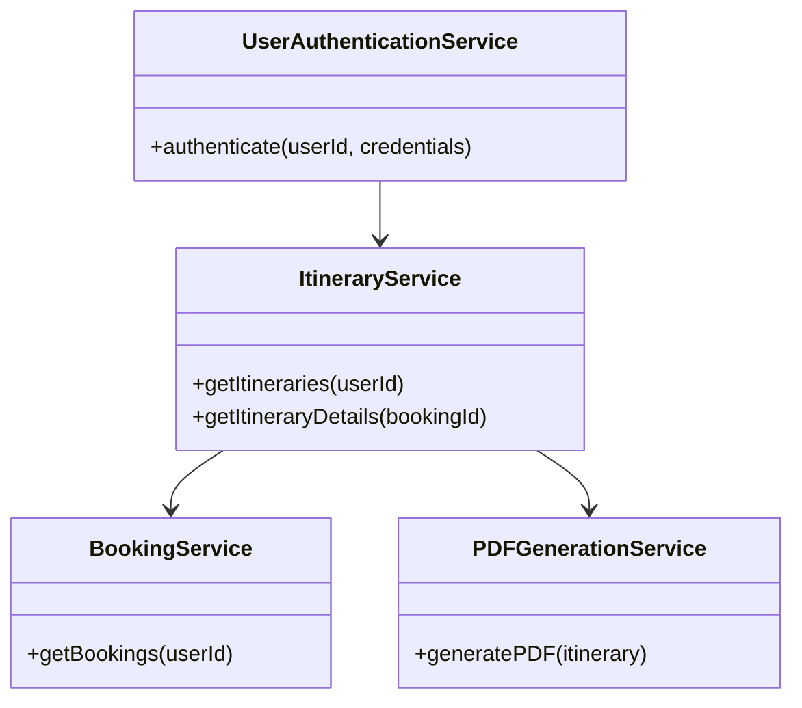
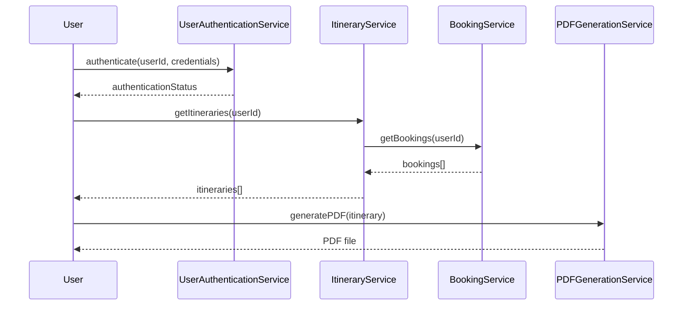

# For User Story Number [2]

1. Objective
This requirement allows travelers to view their air transport itinerary, including flight details, times, and seat information. Users can access this information anytime from their account dashboard and have options to download or print the itinerary. The goal is to provide users with easy access and management of their travel schedules.

2. API Model
2.1 Common Components/Services
- UserAuthenticationService (existing)
- ItineraryService (new)
- BookingService (existing)
- PDFGenerationService (new)

2.2 API Details
| Operation | REST Method | Type | URL | Request | Response |
|-----------|-------------|------|-----|---------|----------|
| Get Itineraries | GET | Success/Failure | /api/itineraries | { "userId": "456" } | { "itineraries": [{ "bookingId": "789", "flight": {...}, "seat": "12A" }] } |
| Download Itinerary | GET | Success/Failure | /api/itineraries/{bookingId}/download | N/A | PDF file |
| Print Itinerary | POST | Success/Failure | /api/itineraries/{bookingId}/print | { "printerId": "123" } | { "printStatus": "SUCCESS" } |

2.3 Exceptions
| API | Exception | Description |
|-----|-----------|-------------|
| Get Itineraries | AuthenticationException | User not authenticated |
| Get Itineraries | ItineraryNotFoundException | No itinerary found for user |
| Download Itinerary | PDFGenerationException | Error generating PDF |
| Print Itinerary | PrintException | Error printing itinerary |

3 Functional Design
3.1 Class Diagram


3.2 UML Sequence Diagram


3.3 Components
| Component Name | Description | Existing/New |
|----------------|-------------|--------------|
| UserAuthenticationService | Handles user authentication | Existing |
| ItineraryService | Manages itinerary retrieval and formatting | New |
| BookingService | Retrieves bookings from database | Existing |
| PDFGenerationService | Generates PDF for itinerary download | New |

3.4 Service Layer Logic and Validations
| FieldName | Validation | Error Message | ClassUsed |
|-----------|-----------|--------------|-----------|
| userId | Must be authenticated | "User not authenticated" | UserAuthenticationService |
| bookingId | Must exist in booking records | "Booking not found" | BookingService |
| itinerary details | Must match booking records | "Itinerary mismatch" | ItineraryService |

4 Integrations
| SystemToBeIntegrated | IntegratedFor | IntegrationType |
|---------------------|--------------|-----------------|
| OAuth2 | User authentication | API |
| PDF Generation Library | Itinerary download/print | Library |

5 DB Details
5.1 ER Model
```mermaid
erDiagram
    USERS ||--o{ BOOKINGS : has
    BOOKINGS ||--|{ ITINERARIES : contains
    ITINERARIES {
        itineraryId PK
        bookingId FK
        flightId FK
        seat
        departureTime
        arrivalTime
    }
    BOOKINGS {
        bookingId PK
        userId FK
        flightId FK
        status
        createdAt
    }
    USERS {
        userId PK
        name
        email
        passwordHash
    }
    FLIGHTS {
        flightId PK
        airline
        origin
        destination
        date
        time
        price
    }
```

5.2 DB Validations
- Itinerary must reference valid booking and flight.
- Booking must reference valid user.

6 Non-Functional Requirements
6.1 Performance
- Dashboard loads within 2 seconds.
- Caching for frequent itinerary queries.

6.2 Security
6.2.1 Authentication
- OAuth2 authentication for dashboard access.
6.2.2 Authorization
- Only authenticated users can access their itineraries.

6.3 Logging
6.3.1 Application Logging
- DEBUG: API request/response payloads (excluding sensitive data)
- INFO: Successful itinerary retrieval, download, print events
- ERROR: Exceptions, failed authentication, PDF generation errors
- WARN: Suspicious access attempts
6.3.2 Audit Log
- Audit log for itinerary access, download, and print events

7 Dependencies
- OAuth2 authentication service
- PDF generation library
- Azure SQL Database

8 Assumptions
- All booking records are accurate and up-to-date
- User email is valid for notifications
- PDF generation library is reliable
