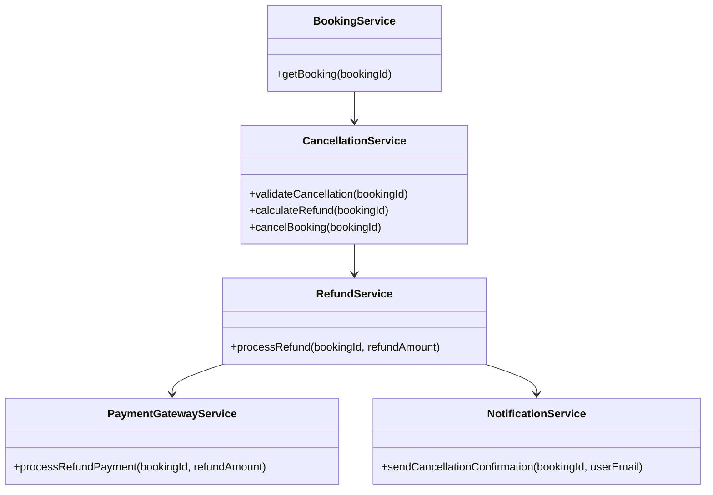
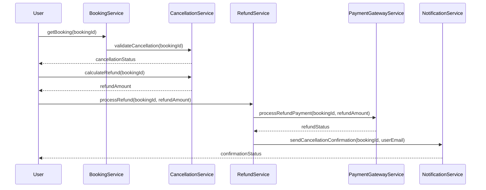

# For User Story Number [3]

1. Objective
This requirement enables travelers to cancel their air transport bookings and request refunds according to airline policies. The system validates cancellation eligibility, calculates the refund, processes the refund, and updates the booking status. The goal is to provide users with a seamless and policy-compliant cancellation and refund experience.

2. API Model
2.1 Common Components/Services
- BookingService (existing)
- CancellationService (new)
- RefundService (new)
- PaymentGatewayService (existing)
- NotificationService (new)

2.2 API Details
| Operation | REST Method | Type | URL | Request | Response |
|-----------|-------------|------|-----|---------|----------|
| Cancel Booking | POST | Success/Failure | /api/bookings/{bookingId}/cancel | { "bookingId": "789", "userId": "456" } | { "cancellationStatus": "ELIGIBLE", "refundAmount": 120.00 } |
| Process Refund | POST | Success/Failure | /api/refunds | { "bookingId": "789", "refundAmount": 120.00 } | { "refundStatus": "SUCCESS", "transactionId": "xyz123" } |
| Send Cancellation Confirmation | POST | Success/Failure | /api/notifications/cancellation | { "bookingId": "789", "userEmail": "user@example.com" } | { "confirmationStatus": "SENT" } |

2.3 Exceptions
| API | Exception | Description |
|-----|-----------|-------------|
| Cancel Booking | CancellationNotAllowedException | Cancellation not allowed by airline policy |
| Process Refund | RefundCalculationException | Refund calculation error |
| Process Refund | PaymentException | Refund payment failed |
| Send Confirmation | EmailException | Confirmation email could not be sent |

3 Functional Design
3.1 Class Diagram


3.2 UML Sequence Diagram


3.3 Components
| Component Name | Description | Existing/New |
|----------------|-------------|--------------|
| BookingService | Retrieves and manages bookings | Existing |
| CancellationService | Validates cancellation and calculates refund | New |
| RefundService | Processes refund transactions | New |
| PaymentGatewayService | Integrates with payment gateway for refunds | Existing |
| NotificationService | Sends cancellation confirmation to user | New |

3.4 Service Layer Logic and Validations
| FieldName | Validation | Error Message | ClassUsed |
|-----------|-----------|--------------|-----------|
| bookingId | Must exist and be eligible for cancellation | "Booking not eligible for cancellation" | CancellationService |
| cancellation window | Must be within allowed time window | "Cancellation not allowed by airline policy" | CancellationService |
| refundAmount | Must follow airline policy | "Refund calculation error" | CancellationService |
| userEmail | Must be valid for confirmation | "Invalid user email" | NotificationService |

4 Integrations
| SystemToBeIntegrated | IntegratedFor | IntegrationType |
|---------------------|--------------|-----------------|
| Airline APIs | Cancellation eligibility and rules | API |
| Payment Gateway | Refund processing | API |

5 DB Details
5.1 ER Model
```mermaid
erDiagram
    USERS ||--o{ BOOKINGS : has
    BOOKINGS ||--|{ REFUNDS : includes
    BOOKINGS {
        bookingId PK
        userId FK
        flightId FK
        status
        createdAt
        cancelledAt
    }
    REFUNDS {
        refundId PK
        bookingId FK
        amount
        status
        transactionId
        processedAt
    }
    USERS {
        userId PK
        name
        email
        passwordHash
    }
    FLIGHTS {
        flightId PK
        airline
        origin
        destination
        date
        time
        price
    }
```

5.2 DB Validations
- Booking must reference valid user and flight.
- Refund must reference valid booking.
- Booking status must be updated to 'Cancelled' after refund.

6 Non-Functional Requirements
6.1 Performance
- Refund processing within 24 hours.
- Monitoring for refund transaction delays.

6.2 Security
6.2.1 Authentication
- OAuth2 authentication for cancellation and refund requests.
6.2.2 Authorization
- Only booking owner can cancel and request refund.

6.3 Logging
6.3.1 Application Logging
- DEBUG: API request/response payloads (excluding sensitive data)
- INFO: Successful cancellation, refund, confirmation events
- ERROR: Exceptions, failed refunds, cancellation errors
- WARN: Suspicious cancellation attempts
6.3.2 Audit Log
- Audit log for cancellation, refund, and confirmation events

7 Dependencies
- Airline APIs for cancellation rules
- Payment gateway for refund processing
- Azure SQL Database

8 Assumptions
- Airline APIs provide up-to-date cancellation rules
- Payment gateway is PCI DSS compliant
- User email is valid for confirmation
